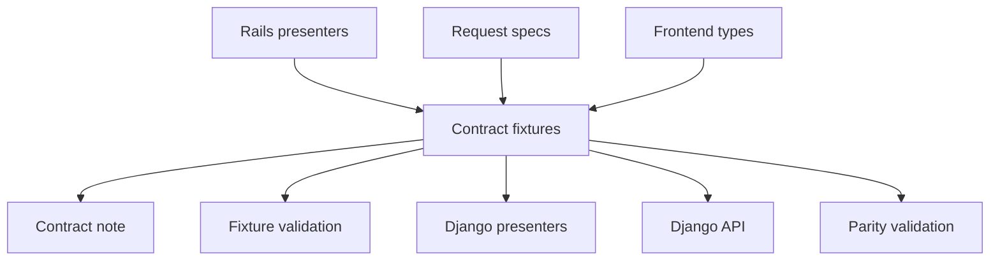
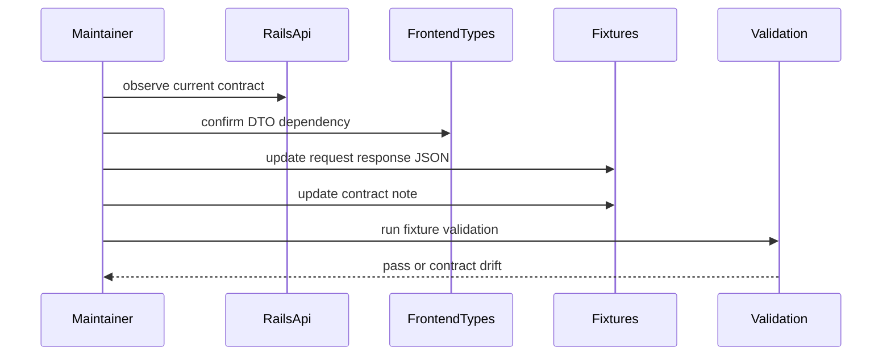
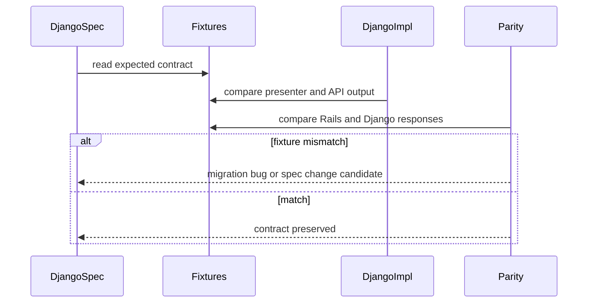
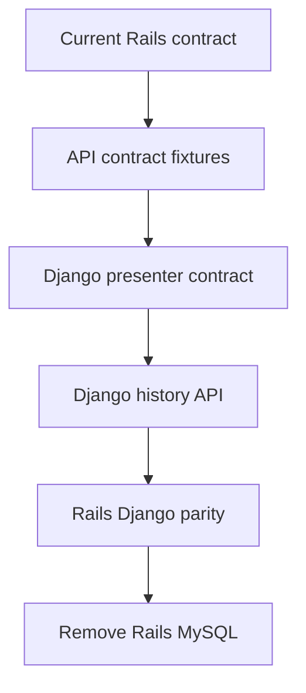

# Design Document

## Overview
この仕様は、Rails / MySQL から Django / BigQuery へ段階移行する前に、現行 frontend が依存する session API contract を代表 JSON fixture と contract note として固定する。対象利用者は、後続 Django presenter / API / parity validation を実装する移行開発者と、`sessionApi.types.ts` の互換性を守る frontend 保守者である。

変更の中心は `.kiro/specs/api-contract-fixtures/` 配下の仕様 artifact である。現行 Rails API や frontend 型を正本として fixture を保存するが、API shape の変更、Django backend 実装、BigQuery schema、reader 移植は扱わない。

### Goals
- `POST /api/history/sync`、`GET /api/sessions`、`GET /api/sessions/:id`、`GET /api/sessions/:id?include_raw=true` の代表 request / response fixture を保存する。
- HTTP status code、error code、frontend 型対応、raw opt-in、degraded / partial result の契約を contract note で一覧化する。
- fixture 更新時に仕様変更候補と移植バグを区別できるレビュー手順を残す。

### Non-Goals
- API endpoint、response shape、status code、error code の変更。
- Django backend、BigQuery repository、Python reader、Rails / MySQL 削除、parity validation runner の実装。
- frontend UI / hook / page の挙動変更。
- OpenAPI / JSON Schema の全面導入。

## Boundary Commitments

### This Spec Owns
- 現行 API と frontend 型を正本にした代表 contract fixture set。
- 対象 endpoint、scenario、HTTP status、success payload / error envelope の inventory。
- fixture fields と `sessionApi.types.ts` の型対応表。
- 現行 API と frontend 型の naming / nullable / field presence 差分を記録する contract note。
- fixture 更新理由、影響 endpoint、影響 frontend 型、status / error code 変更有無を記録するレビュー手順。
- fixture JSON の構文と代表必須 field を確認する軽量 validation test。

### Out of Boundary
- 現行 API shape の変更、新規 endpoint、新規 UI 機能。
- Django views / presenter / repository、BigQuery schema、Python reader 移植。
- Rails request spec や presenter の大規模リファクタリング。
- raw files の保存 schema、sync service、read model payload builder の挙動変更。
- fixture からの OpenAPI 自動生成、contract test server、外部公開向け API versioning。

### Allowed Dependencies
- `frontend/src/features/sessions/api/sessionApi.types.ts` と `sessionApi.ts`。
- Rails presenter contract: `SessionIndexPresenter`、`SessionDetailPresenter`、`HistorySyncPresenter`、`ErrorPresenter`。
- 既存 request / presenter / frontend tests にある HTTP status、error code、raw opt-in、validation query の実例。
- `.kiro/steering/` の raw files 正本、read model、frontend API contract、テストコメント規約。
- 後続 spec はこの fixture set を read-only expectation として参照できる。

### Revalidation Triggers
- `sessionApi.types.ts` の DTO field、enum、nullable、raw payload 扱いが変わる。
- Rails presenter / request spec の response envelope、HTTP status、error code、validation details が変わる。
- `include_raw` query parameter の名前、真偽値解釈、raw payload field の null/実値方針が変わる。
- `GET /api/sessions` の date range、search、empty result、degraded partial result semantics が変わる。
- `POST /api/history/sync` の terminal status、counts、conflict、root failure、persistence failure の shape が変わる。
- 後続 Django / parity validation が fixture を変更しないと通らない差分を検出する。

## Architecture

### Existing Architecture Analysis
現行 session API contract は複数箇所に分散している。frontend の `sessionApi.types.ts` は `SessionIndexResponse`、`SessionDetailResponse`、`HistorySyncResponse`、`ErrorEnvelope` を型として固定し、`sessionApi.ts` は 404 `session_not_found` だけを dedicated not-found state に正規化する。backend presenter は `work_context`、`selected_model`、`conversation`、`activity`、`timeline`、`raw_included` を含む JSON を組み立てる。

request specs は HTTP status、query validation、sync conflict / failure を確認している。一部の DB passthrough spec には旧 `workspace` / `model` payload 例が残るため、この仕様では frontend 型と presenter contract を fixture 期待値の正本にし、差分は `contract.md` に記録する。

### Architecture Pattern & Boundary Map



**Architecture Integration**:
- Selected pattern: JSON fixture + contract note。代表 request / response を scenario 別 fixture にし、詳細な判断根拠と型対応を Markdown に分離する。
- Domain/feature boundaries: `.kiro/specs/api-contract-fixtures/` が契約資料を所有し、Rails / frontend / Django 実装は fixture の upstream / downstream として扱う。
- Existing patterns preserved: API shape の実装責務は既存 backend / frontend に残し、spec artifact は移行前の契約固定に徹する。
- New components rationale: `contract.md` は inventory、型対応、差分 note、更新手順を一箇所に集める。fixture validation spec は JSON 破損と代表必須 field 欠落を早期検出する。
- Steering compliance: raw files は一次ソース、read model は補助層、frontend API contract は維持対象として扱う。

**Dependency Direction**
- Contract source direction: `Rails request specs / presenters + frontend types -> contract fixtures -> downstream Django / parity specs`
- Validation direction: `contract fixtures -> backend fixture validation spec`
- 後続 Django 実装や BigQuery schema の都合を fixture に逆流させない。

### Technology Stack

| Layer | Choice / Version | Role in Feature | Notes |
|-------|------------------|-----------------|-------|
| Documentation | Markdown / JSON | Contract note、scenario fixture、更新手順 | `.kiro/specs/api-contract-fixtures/` に保存 |
| Frontend | TypeScript 6 | fixture field と DTO 型の対応元 | 実装変更なし |
| Backend / Services | Ruby / Rails API / RSpec | 現行 presenter / request spec と fixture validation | 新規 gem なし |
| Infrastructure / Runtime | Docker Compose | 既存 backend test 実行 | 既存 `bundle exec rspec` に乗せる |

## File Structure Plan

### Directory Structure
```text
.kiro/
└── specs/
    └── api-contract-fixtures/
        ├── spec.json
        ├── requirements.md
        ├── research.md
        ├── design.md
        ├── contract.md
        └── fixtures/
            ├── manifest.json
            ├── sessions/
            │   ├── index/
            │   │   ├── list_success.request.json
            │   │   ├── list_success.response.json
            │   │   ├── list_empty.request.json
            │   │   ├── list_empty.response.json
            │   │   ├── list_degraded.response.json
            │   │   ├── list_search.request.json
            │   │   ├── list_search_empty.response.json
            │   │   ├── list_invalid_date_range.request.json
            │   │   ├── list_invalid_date_range.response.json
            │   │   ├── list_invalid_datetime.response.json
            │   │   ├── list_invalid_limit.response.json
            │   │   └── list_invalid_search.response.json
            │   └── show/
            │       ├── detail_success.request.json
            │       ├── detail_success.response.json
            │       ├── detail_without_raw.response.json
            │       ├── detail_with_raw.request.json
            │       ├── detail_with_raw.response.json
            │       ├── detail_not_found.request.json
            │       └── detail_not_found.response.json
            └── history_sync/
                ├── sync_success.request.json
                ├── sync_success.response.json
                ├── sync_completed_with_issues.response.json
                ├── sync_conflict.response.json
                ├── sync_root_failure.response.json
                └── sync_persistence_failure.response.json

backend/
└── spec/
    └── contracts/
        └── api_contract_fixtures_spec.rb
```

### Modified Files
- `.kiro/specs/api-contract-fixtures/spec.json` — design 生成状態と timestamp を更新する。

### New Files
- `.kiro/specs/api-contract-fixtures/research.md` — discovery findings、設計判断、リスクを記録する。
- `.kiro/specs/api-contract-fixtures/design.md` — fixture set と validation の技術設計を記録する。
- `.kiro/specs/api-contract-fixtures/contract.md` — endpoint inventory、status / error code 表、frontend 型対応表、現行差分 note、fixture 更新手順を記録する。
- `.kiro/specs/api-contract-fixtures/fixtures/manifest.json` — scenario ID、endpoint、method、status、request / response fixture path、関連 requirement ID、関連 frontend 型を列挙する。
- `.kiro/specs/api-contract-fixtures/fixtures/**/*.json` — scenario 別 request / response fixture。各 response は代表 field を含み、網羅しない field は `contract.md` の note で対象外 / 別 fixture / 欠落候補を明示する。
- `backend/spec/contracts/api_contract_fixtures_spec.rb` — fixture JSON parse、manifest path 整合、success / error envelope、status / error code、代表 field presence を検証する。

### Referenced Unchanged Files
- `frontend/src/features/sessions/api/sessionApi.types.ts` — DTO 型対応の正本。
- `frontend/src/features/sessions/api/sessionApi.ts` — request path、query parameter、error normalization の正本。
- `backend/lib/copilot_history/api/presenters/session_index_presenter.rb` — list success / degraded fixture の shape 根拠。
- `backend/lib/copilot_history/api/presenters/session_detail_presenter.rb` — detail / raw opt-in fixture の shape 根拠。
- `backend/lib/copilot_history/api/presenters/history_sync_presenter.rb` — sync success / conflict / failure fixture の shape 根拠。
- `backend/lib/copilot_history/api/presenters/error_presenter.rb` — common error envelope の shape 根拠。
- `backend/spec/requests/api/sessions_spec.rb`、`backend/spec/requests/api/history_syncs_spec.rb` — HTTP status と representative request の根拠。

## System Flows





fixture は downstream 実装の入力ではなく期待値である。downstream 側の都合で request / response shape を変更する場合は、この spec の fixture 変更ではなく仕様変更候補として扱う。

## Requirements Traceability

| Requirement | Summary | Components | Interfaces | Flows |
|-------------|---------|------------|------------|-------|
| 1.1 | 対象 endpoint を明示する | FixtureManifest, ContractNotes | manifest endpoint inventory | update flow |
| 1.2 | request、status、payload / error 種別を明示する | FixtureManifest, ScenarioFixtures | request / response fixture | update flow |
| 1.3 | out of scope を明示する | ContractNotes | boundary table | update flow |
| 1.4 | 現行 API と frontend 型の差分を記録する | ContractNotes | drift note | update flow |
| 2.1 | list success の `data` / `meta` を示す | ScenarioFixtures, FixtureValidation | `SessionIndexResponse` | update flow |
| 2.2 | list summary fields を示す | ScenarioFixtures, TypeMapping | `SessionSummary` | update flow |
| 2.3 | empty list の 200 と empty meta を示す | ScenarioFixtures | list empty fixture | update flow |
| 2.4 | degraded list と partial result を示す | ScenarioFixtures | degraded fixture | update flow |
| 2.5 | date range / search request と空成功を示す | ScenarioFixtures | query fixture | update flow |
| 3.1 | detail success の `data` object を示す | ScenarioFixtures | `SessionDetailResponse` | update flow |
| 3.2 | conversation shape を示す | ScenarioFixtures, TypeMapping | `SessionConversation` | update flow |
| 3.3 | activity / timeline shape を示す | ScenarioFixtures, TypeMapping | `SessionActivity`, `SessionTimelineEvent` | update flow |
| 3.4 | raw opt-in の `raw_included` と raw payload を示す | ScenarioFixtures | raw detail fixture | update flow |
| 3.5 | raw 未要求時の null / 非表示相当を示す | ScenarioFixtures, ContractNotes | normal detail fixture | update flow |
| 4.1 | sync success の 200 と data shape を示す | ScenarioFixtures | `HistorySyncResponse` | update flow |
| 4.2 | degraded sync completion を示す | ScenarioFixtures | completed_with_issues fixture | update flow |
| 4.3 | running conflict 409 を示す | ScenarioFixtures, StatusCodeMatrix | error envelope | update flow |
| 4.4 | root failure 503 と run meta を示す | ScenarioFixtures, StatusCodeMatrix | error envelope + meta | update flow |
| 4.5 | persistence failure 500 と run meta を示す | ScenarioFixtures, StatusCodeMatrix | error envelope + meta | update flow |
| 5.1 | common error envelope を示す | ContractNotes, ScenarioFixtures | `ErrorEnvelope` | update flow |
| 5.2 | missing detail 404 を示す | ScenarioFixtures | `session_not_found` | update flow |
| 5.3 | invalid list query 400 を示す | ScenarioFixtures, StatusCodeMatrix | `invalid_session_list_query` | update flow |
| 5.4 | validation details を示す | ScenarioFixtures | `details.field`, `details.reason`, `details.value` | update flow |
| 5.5 | frontend error normalization 根拠を示す | ContractNotes, TypeMapping | status / code matrix | downstream flow |
| 6.1 | list fixture と frontend 型対応を示す | TypeMapping | `SessionIndexResponse`, `SessionSummary` | downstream flow |
| 6.2 | detail fixture と frontend 型対応を示す | TypeMapping | `SessionDetailResponse`, tool call types | downstream flow |
| 6.3 | sync fixture と frontend 型対応を示す | TypeMapping | `HistorySyncResponse` | downstream flow |
| 6.4 | error fixture と frontend normalization 対応を示す | TypeMapping, StatusCodeMatrix | `ErrorEnvelope`, `SessionApiError` | downstream flow |
| 6.5 | fixture にない frontend field の扱いを明示する | ContractNotes | field coverage note | update flow |
| 7.1 | fixture 正本を明示する | ContractNotes | source of truth section | update flow |
| 7.2 | 更新理由、endpoint、型、status 変更有無を記録する | ContractNotes | update procedure | update flow |
| 7.3 | shape / status / code 変更を仕様変更候補にする | ContractNotes | change classification | update flow |
| 7.4 | 後続 spec が同じ fixture を参照する前提を示す | ContractNotes | downstream usage | downstream flow |
| 7.5 | テストコメント規約を示す | FixtureValidation, ContractNotes | RSpec test comments | update flow |

## Components and Interfaces

| Component | Domain/Layer | Intent | Req Coverage | Key Dependencies | Contracts |
|-----------|--------------|--------|--------------|------------------|-----------|
| FixtureManifest | Spec artifact | scenario と fixture path、endpoint、status、型対応を機械可読にする | 1.1, 1.2, 6.1, 6.2, 6.3, 6.4 | ScenarioFixtures P0 | Data |
| ScenarioFixtures | Spec artifact | endpoint / scenario 別の request / response 期待値を保存する | 2.1, 2.2, 2.3, 2.4, 2.5, 3.1, 3.2, 3.3, 3.4, 3.5, 4.1, 4.2, 4.3, 4.4, 4.5, 5.1, 5.2, 5.3, 5.4 | Rails presenters P0, frontend types P0 | Data/API |
| ContractNotes | Spec artifact | inventory、型対応、差分、更新手順、下流利用規約を記録する | 1.3, 1.4, 5.5, 6.5, 7.1, 7.2, 7.3, 7.4, 7.5 | steering P0, ScenarioFixtures P0 | Documentation |
| TypeMapping | Spec artifact | fixture fields と frontend DTO 型の対応を表で固定する | 6.1, 6.2, 6.3, 6.4 | `sessionApi.types.ts` P0 | Documentation |
| StatusCodeMatrix | Spec artifact | HTTP status と error code / frontend error kind の対応を固定する | 4.3, 4.4, 4.5, 5.1, 5.2, 5.3, 5.4, 5.5 | `sessionApi.ts` P0, Rails presenters P0 | Documentation |
| FixtureValidation | Backend test | fixture JSON と代表契約の破損を検出する | 1.1, 1.2, 2.1, 3.1, 4.1, 5.1, 7.5 | FixtureManifest P0, ScenarioFixtures P0 | Test |

### Spec Artifact Layer

#### FixtureManifest

| Field | Detail |
|-------|--------|
| Intent | fixture set 全体の機械可読 index を提供する |
| Requirements | 1.1, 1.2, 6.1, 6.2, 6.3, 6.4 |

**Responsibilities & Constraints**
- scenario ID、method、endpoint、query、expected status、request fixture path、response fixture path、関連 requirement ID、関連 frontend 型を列挙する。
- manifest の path は `.kiro/specs/api-contract-fixtures/fixtures/` からの相対 path に限定する。
- requirement ID は `requirements.md` に存在する numeric ID のみを使う。

**Dependencies**
- Inbound: FixtureValidation — path 整合と scenario metadata 検証に使う (P0)
- Outbound: ScenarioFixtures — request / response JSON の location (P0)
- Outbound: ContractNotes — scenario 説明と型対応の詳細 (P1)

**Contracts**: Service [ ] / API [ ] / Event [ ] / Batch [ ] / State [ ] / Data [x]

##### Data Contract
```json
{
  "version": 1,
  "scenarios": [
    {
      "id": "sessions.index.list_success",
      "method": "GET",
      "endpoint": "/api/sessions",
      "status": 200,
      "request": "sessions/index/list_success.request.json",
      "response": "sessions/index/list_success.response.json",
      "requirements": ["1.1", "2.1", "2.2", "6.1"],
      "frontend_types": ["SessionIndexResponse", "SessionSummary"]
    }
  ]
}
```
- Preconditions: path が存在し、JSON として parse できる。
- Postconditions: downstream spec は manifest 経由で対象 scenario を発見できる。
- Invariants: fixture は downstream implementation の都合で直接変更しない。

#### ScenarioFixtures

| Field | Detail |
|-------|--------|
| Intent | 代表 request / response の期待 JSON を scenario 別に保存する |
| Requirements | 2.1, 2.2, 2.3, 2.4, 2.5, 3.1, 3.2, 3.3, 3.4, 3.5, 4.1, 4.2, 4.3, 4.4, 4.5, 5.1, 5.2, 5.3, 5.4 |

**Responsibilities & Constraints**
- request fixture は method、path、query、body の代表値を持つ。body がない GET / POST は `body: null` を明示する。
- response fixture は `status` と `body` を持ち、success は `data`、error は `error` envelope を含む。
- list / detail / sync の representative field は frontend 型が参照できる形で含める。
- representative fixture に含めない frontend field は `contract.md` の field coverage note で対象外 / 別 fixture / 契約欠落候補に分類する。

**Dependencies**
- Inbound: FixtureManifest — scenario discovery (P0)
- Inbound: ContractNotes — 人間向け説明と差分記録 (P1)
- Outbound: Rails presenters / request specs — 現行 shape の根拠 (P0)
- Outbound: frontend `sessionApi.types.ts` — 型対応の根拠 (P0)

**Contracts**: Service [ ] / API [x] / Event [ ] / Batch [ ] / State [ ] / Data [x]

##### API Contract
| Method | Endpoint | Request Fixture | Response Fixture | Errors |
|--------|----------|-----------------|------------------|--------|
| GET | `/api/sessions` | date range / search query | `SessionIndexResponse` | 400 `invalid_session_list_query` |
| GET | `/api/sessions/:id` | path param | `SessionDetailResponse` without raw | 404 `session_not_found` |
| GET | `/api/sessions/:id?include_raw=true` | path param + raw query | `SessionDetailResponse` with raw payload | 404 `session_not_found` |
| POST | `/api/history/sync` | no body | `HistorySyncResponse` | 409 `history_sync_running`, 503 root failure, 500 `history_sync_failed` |

**Implementation Notes**
- request body は現行 `POST /api/history/sync` で使わないため `null` とする。
- raw payload fixture は null/実値差分を示す最小 payload にする。
- degraded session fixture は session-level `issues` と `meta.partial_results: true` を同時に示す。

#### ContractNotes

| Field | Detail |
|-------|--------|
| Intent | fixture だけでは表現しにくい判断、差分、更新手順を固定する |
| Requirements | 1.3, 1.4, 5.5, 6.5, 7.1, 7.2, 7.3, 7.4, 7.5 |

**Responsibilities & Constraints**
- endpoint inventory、out of scope、source of truth、status / error code matrix、frontend type mapping、field coverage note、update procedure を含む。
- 現行 API と frontend 型に差分がある場合は、fixture がどちらを期待値にしたかと理由を記録する。
- fixture 更新が request shape、response shape、status code、error code を変える場合は仕様変更候補として分類する。
- tests を追加・更新する場合の `概要・目的`、`テストケース`、`期待値` コメント規約を明記する。

**Dependencies**
- Inbound: Maintainer / downstream specs — fixture 利用時の人間向け根拠 (P0)
- Outbound: ScenarioFixtures — scenario 別 artifact (P0)
- Outbound: TypeMapping / StatusCodeMatrix — contract table (P0)

**Contracts**: Service [ ] / API [ ] / Event [ ] / Batch [ ] / State [ ] / Data [x]

##### Documentation Contract
- Source of truth: 現行 Rails API presenter / request specs と frontend `sessionApi.types.ts`。
- Change record fields: 更新日、更新理由、対象 endpoint、対象 scenario、影響 frontend 型、status code 変更有無、error code 変更有無、仕様変更候補かどうか。
- Downstream rule: Django / parity validation は fixture を期待値として読み、差分を fixture 側で吸収しない。

### Validation Layer

#### FixtureValidation

| Field | Detail |
|-------|--------|
| Intent | fixture set の構文破損と代表 contract 欠落を CI で検出する |
| Requirements | 1.1, 1.2, 2.1, 3.1, 4.1, 5.1, 7.5 |

**Responsibilities & Constraints**
- `manifest.json` と参照 JSON を parse し、path の存在、status の一致、success/error envelope の top-level shape を検証する。
- `sessions.index.*` success response は `data` と `meta`、detail success response は `data` object、sync success response は `data.sync_run` と `data.counts` を検証する。
- error response は `error.code`、`error.message`、`error.details` を検証する。sync failure fixture は必要に応じて `meta.sync_run` と `meta.counts` も検証する。
- テストケース直前に `概要・目的`、`テストケース`、`期待値` コメントを置く。

**Dependencies**
- Inbound: backend RSpec runner — existing CI path (P0)
- Outbound: FixtureManifest — scenario list (P0)
- Outbound: ScenarioFixtures — JSON body (P0)

**Contracts**: Service [ ] / API [ ] / Event [ ] / Batch [ ] / State [ ] / Test [x]

##### Test Contract
- Trigger: `bundle exec rspec backend/spec/contracts/api_contract_fixtures_spec.rb`
- Input: `.kiro/specs/api-contract-fixtures/fixtures/manifest.json`
- Output: parse / path / representative field validation pass or failure.
- Invariants: 新規依存を追加しない。完全 JSON Schema validation は範囲外。

## Data Models

### Domain Model
- **ContractFixtureSet**: feature spec が所有する fixture 群。manifest、scenario fixture、contract note、validation test で構成される。
- **Scenario**: endpoint、method、query/body、expected status、success/error category、requirement coverage、frontend type coverage を持つ代表契約。
- **ContractNote**: scenario では表現しない source of truth、差分、field coverage、更新履歴、downstream 利用条件を持つ文書。
- **StatusCodeMapping**: HTTP status、error code、frontend error kind、details 必須 field の対応。

### Logical Data Model

**Manifest Scenario Attributes**
- `id`: string。namespace 付き scenario ID。
- `method`: `"GET" | "POST"`。
- `endpoint`: string。path template または concrete path。
- `status`: integer。期待 HTTP status。
- `request`: string。fixtures root からの相対 path。
- `response`: string。fixtures root からの相対 path。
- `requirements`: numeric ID string array。
- `frontend_types`: string array。

**Response Fixture Attributes**
- `status`: integer。
- `body`: JSON object。
- success body: `data` required。list は `meta` も required。
- error body: `error.code`、`error.message`、`error.details` required。sync root / persistence failure は `meta.sync_run`、`meta.counts` required。

### Data Contracts & Integration

**List Contract**
- `GET /api/sessions` success: `data: SessionSummary[]`、`meta.count`、`meta.partial_results`。
- empty / no match: HTTP 200、`data: []`、`meta.count: 0`、`meta.partial_results: false`。
- degraded: session item の `degraded: true`、`issues[]`、`meta.partial_results: true`。
- invalid query: HTTP 400、`invalid_session_list_query`、`details.field`、`details.reason`、必要に応じて `details.value`。

**Detail Contract**
- normal detail: HTTP 200、`data.raw_included: false`、`message_snapshots[].raw_payload` / `activity.entries[].raw_payload` / `timeline[].raw_payload` は `null`。
- raw opt-in: HTTP 200、`data.raw_included: true`、raw payload field は代表 object を含む。
- missing: HTTP 404、`session_not_found`、`details.session_id`。

**Sync Contract**
- success: HTTP 200、`data.sync_run.status: "succeeded"`、`data.counts`。
- completed with issues: HTTP 200、`data.sync_run.status: "completed_with_issues"`、`data.counts.degraded_count > 0`。
- conflict: HTTP 409、`history_sync_running`、`details.sync_run_id`、`details.started_at`。
- root failure: HTTP 503、root failure code、`details.path`、`meta.sync_run`、`meta.counts`。
- persistence failure: HTTP 500、`history_sync_failed`、`details.sync_run_id`、failure details、`meta.sync_run`、`meta.counts`。

## Error Handling

### Error Strategy
fixture 自体の validation error は test failure として扱う。API error fixture は現行 frontend が期待する error normalization の入力であり、契約資料として変更しない。

### Error Categories and Responses
- **User Errors**: invalid list query は HTTP 400 `invalid_session_list_query`。`details.field` と `details.reason` を必須にし、invalid datetime / invalid limit / overlong search / control character は `details.value` を含む。
- **Not Found**: missing detail は HTTP 404 `session_not_found`。frontend はこの組み合わせだけを `not_found` state に正規化する。
- **Conflict**: running sync は HTTP 409 `history_sync_running`。既存 run の `sync_run_id` と `started_at` を含む。
- **System Errors**: root failure は HTTP 503 root failure code、persistence failure は HTTP 500 `history_sync_failed`。どちらも sync run meta を含む。

### Monitoring
runtime monitoring はこの spec の範囲外である。fixture validation は CI / local RSpec で契約 artifact の破損を検出する。

## Testing Strategy

### Unit / Contract Tests
- `api_contract_fixtures_spec.rb` が `manifest.json` と全 request / response fixture を JSON parse できることを検証する。
- manifest の scenario が requirement ID、method、endpoint、status、request path、response path、frontend type を持つことを検証する。
- success response fixture が endpoint 種別ごとの top-level shape を満たすことを検証する: list は `data` / `meta`、detail は `data`、sync は `data.sync_run` / `data.counts`。
- error response fixture が `error.code`、`error.message`、`error.details` を持ち、status / error code matrix と一致することを検証する。
- テストを追加・更新する際は、各 `it` の直前に `概要・目的`、`テストケース`、`期待値` コメントを置く。

### Integration Tests
- 既存 Rails request specs は現行 API の実装挙動を守る。fixture validation はそれらを置き換えず、契約 artifact の整合性だけを確認する。
- 後続 Django presenter / API spec は `manifest.json` を読み、同じ response fixture を期待値に使う。

### E2E/UI Tests
- この spec では frontend UI を変更しないため新規 E2E は追加しない。
- frontend error normalization は既存 `sessionApi.test.ts` と hook tests を参照し、contract note の status / code matrix に根拠を記録する。

## Security Considerations
- fixture には実ユーザーの raw history、絶対パス、secret、token、個人情報を含めない。
- raw payload は contract shape を示す最小 synthetic object に限定する。
- path details は `/tmp` や `/workspace` など synthetic path に統一する。

## Performance & Scalability
- fixture は小さな代表 JSON とし、大量履歴や full raw payload dump を保存しない。
- validation は JSON parse と軽量 field check に限定し、既存 backend test suite に過剰な実行時間を追加しない。

## Migration Strategy



- Phase 1: この spec で fixture と contract note を作成する。
- Phase 2: `django-presenters-contract` が fixture を presenter output の期待値として参照する。
- Phase 3: `django-history-api` が HTTP response と status code の期待値として参照する。
- Phase 4: parity validation が Rails / Django response diff を fixture と照合し、仕様変更と移植バグを区別する。
