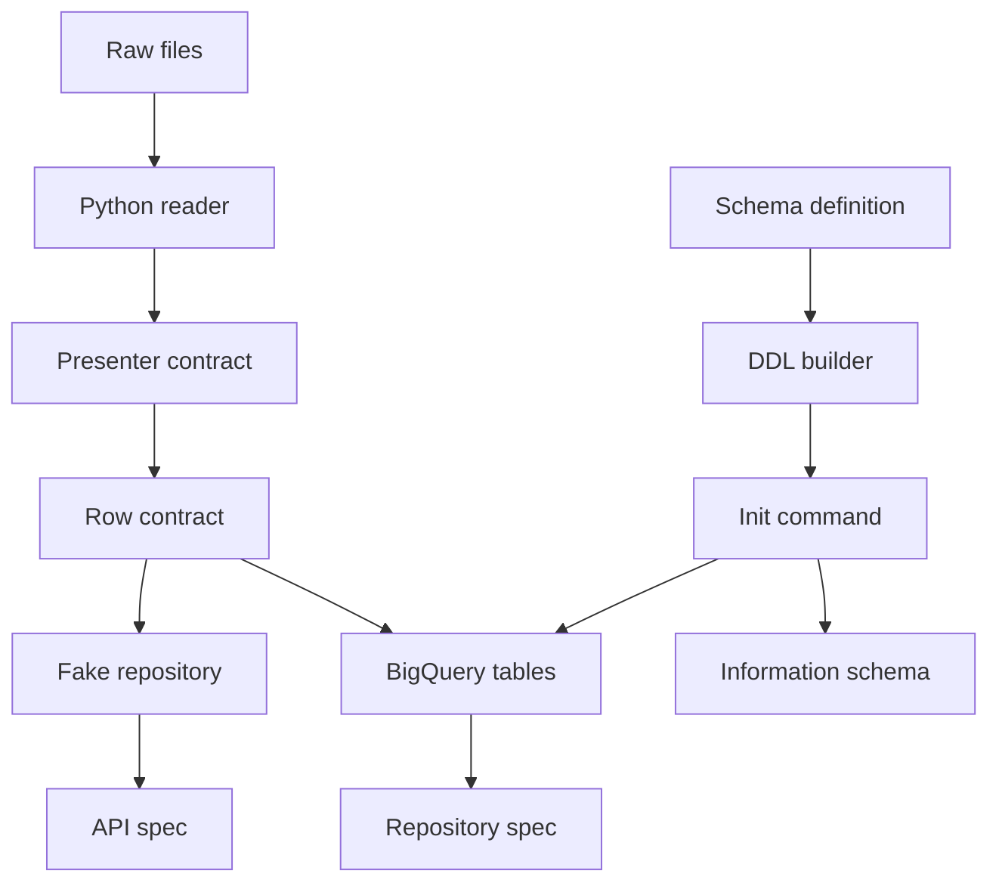
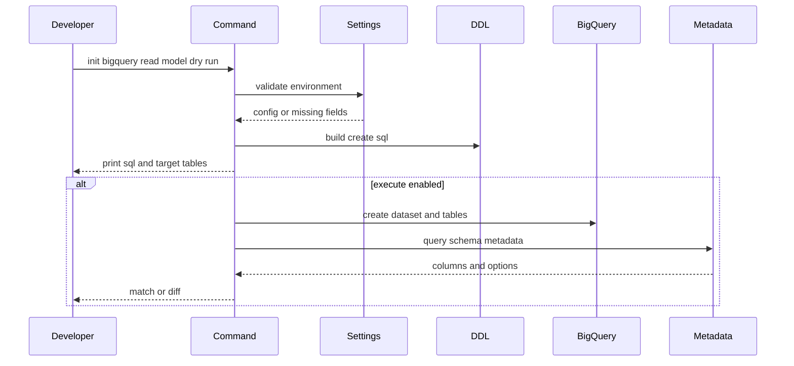
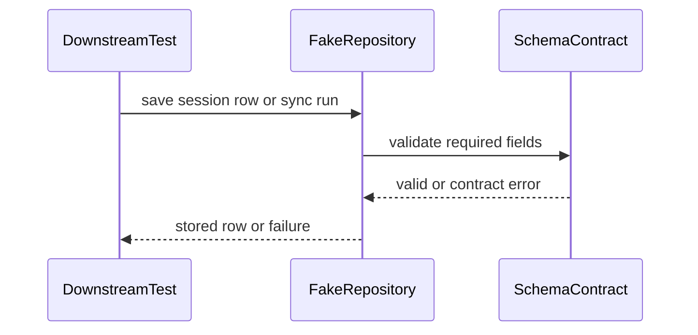
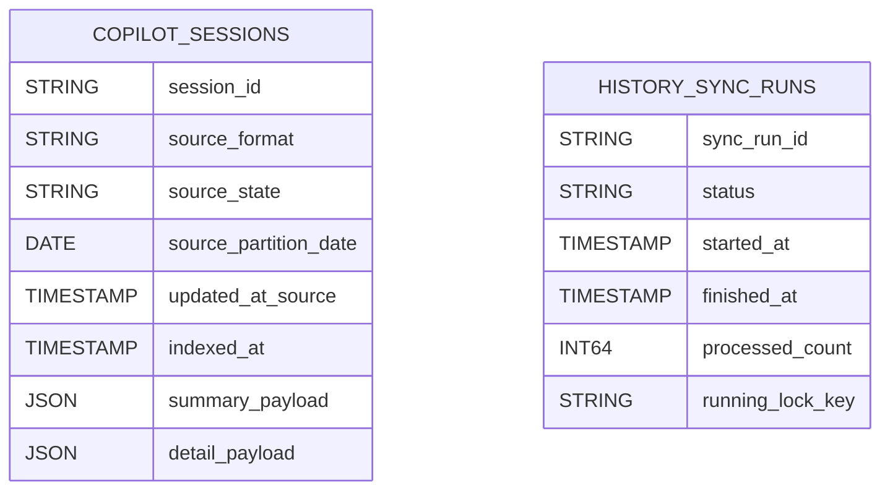
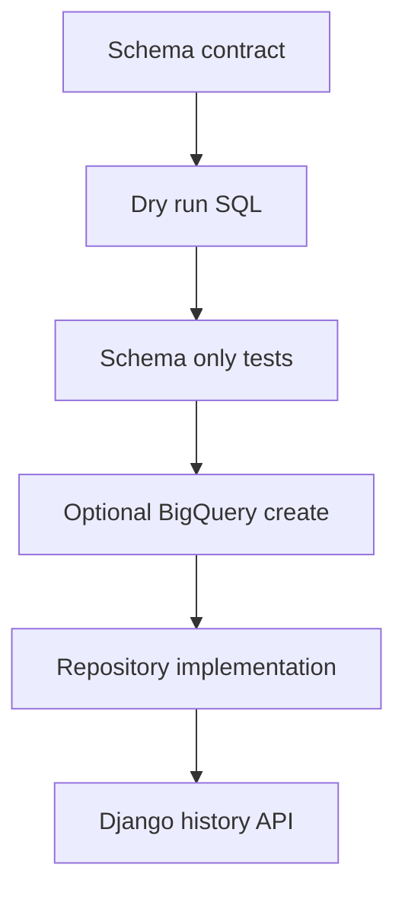

# 設計ドキュメント

## 概要
この仕様は、Rails / MySQL で保持している `copilot_sessions` と `history_sync_runs` の read model 契約を、Django / BigQuery 移行で参照できるデータストア schema として固定する。対象利用者は、後続の BigQuery repository、Django history API、parity validation を実装する移行開発者である。

変更の中心は BigQuery dataset / table 契約、DDL、schema 初期化入口、環境変数 / credentials 手順、実接続なしの schema 検証と fake repository 契約である。BigQuery は Copilot CLI raw files の正本ではなく、明示同期で再生成できる read model として扱う。

### 目的
- `copilot_sessions` と `history_sync_runs` の BigQuery table schema、必須性、型、既定値相当、enum / count / payload 契約を固定する。
- 日付範囲、session lookup、repository / branch、source format / state、sync status の lookup 前提として partition / clustering 方針を定義する。
- 実行前に SQL を提示し、opt-in で dataset / table 作成または既存 schema 照合を行う初期化入口を設計する。
- 通常の unit test と settings import が BigQuery 実接続を要求しない fake repository / schema-only 検証の境界を残す。

### 対象外
- Django ORM migration による BigQuery 管理。
- sessions list / detail query、staging table + MERGE upsert、BigQuery repository 本実装。
- Django API endpoint、request validation、HTTP response、frontend 接続変更。
- Rails / MySQL read model の削除、既存 API contract の変更。
- 高度な本番 GCP 運用設計、Terraform、BI Engine、search index、semantic search。

## 境界の取り決め

### この仕様が所有する範囲
- BigQuery dataset id、location、table names、table prefix の設定契約。
- `copilot_sessions` と `history_sync_runs` の physical schema 契約、partition / clustering、DDL 文字列。
- schema initializer の dry-run SQL 表示、環境変数 validation、create-if-missing、compare-existing の batch 契約。
- `INFORMATION_SCHEMA` による schema / option 照合方針。
- BigQuery 実接続なしで保存契約を検証する fake repository と schema-only tests の期待値。
- 後続 `bigquery-session-repository` が参照する row type / enum / count / payload / partition key 契約。

### 境界外
- BigQuery から sessions list / detail を読む query repository。
- normalized session から BigQuery row へ upsert する staging table + MERGE 実装。
- `summary_payload` / `detail_payload` の presenter JSON shape の再定義。
- raw Copilot history files の reader / normalizer / payload builder 移植。
- Django API route、controller/view、HTTP status、frontend DTO の変更。
- Rails / MySQL stack の削除や production GCP 運用の完成。

### 許可する依存
- `django-backend-foundation` の Python 3.14 / Django 5.2 backend package、pytest、ruff、mypy 入口。
- `api-contract-fixtures` と後続 `django-presenters-contract` が固定する summary / detail payload shape。
- 既存 Rails read model 契約: `backend/db/schema.rb`、`CopilotSession`、`HistorySyncRun`、`SessionRecordBuilder`、`HistorySyncService`。
- BigQuery GoogleSQL DDL、`JSON` 型、partitioned table、clustered table、`INFORMATION_SCHEMA.COLUMNS`、`INFORMATION_SCHEMA.TABLE_OPTIONS`。
- `google-cloud-bigquery>=3.41,<4`。実接続入口だけで import し、settings import では client を作らない。

### 再検証が必要になる変更
- `copilot_sessions` / `history_sync_runs` の column name、type、mode、required field、enum、count invariant が変わる。
- `summary_payload` / `detail_payload` の保存型や payload ownership が変わる。
- Partition key、clustering columns、`require_partition_filter` の有無が変わる。
- BigQuery project / dataset / location / table naming env vars が変わる。
- BigQuery 実接続が通常 unit test、settings import、health endpoint の前提になる。
- 後続 repository が `source_partition_date` filter なしの list query を要求する。

## アーキテクチャ

### 既存アーキテクチャ分析
- 現行 Rails / MySQL read model は `copilot_sessions.session_id` を一意 key とし、source metadata、counts、degraded、search projection、source fingerprint、summary/detail payload を保存している。
- `history_sync_runs` は同期 lifecycle と count fields を保持し、`running_lock_key` で同期中の競合を表す。
- Django foundation は BigQuery を通常 DB として設定せず、SQLite default DB と `/up` のみを提供する。
- Roadmap は BigQuery schema を repository / API より前の datastore 契約 spec として位置づけている。

### アーキテクチャパターンと境界図



**統合方針**:
- 採用パターン: schema definition + DDL builder + opt-in initializer。BigQuery schema を Django migration ではなく、明示的な datastore 契約として管理する。
- 依存方向: `settings/env -> schema definition -> DDL builder -> initializer command -> BigQuery client`。fake repository は `schema definition` に依存し、BigQuery client には依存しない。
- 維持する既存方針: raw files は一次ソース、read model は再生成可能な補助層、通常 API / unit test は外部接続不要という原則を維持する。
- 新規コンポーネントの理由: `history_read_model` package は BigQuery schema と fake 契約を Django foundation から分離し、後続 repository / API specs が同じ row 契約を参照できるようにする。
- Steering 準拠: Docker Compose と pytest / ruff / mypy の既存入口を使い、テスト追加時は各 test case 直前に `概要・目的`、`テストケース`、`期待値` コメントを残す。

### 技術スタック

| 層 | 採用技術 / version | この仕様での役割 | 補足 |
|-------|------------------|-----------------|-------|
| Backend / Services | Python `>=3.14,<3.15`, Django `>=5.2.8,<5.3` | management command、settings env 契約、schema-only tests | Django ORM migration は使わない |
| Backend Dependency | `google-cloud-bigquery>=3.41,<4` | opt-in dataset / table creation と metadata comparison | settings import では client を生成しない |
| Data / Storage | BigQuery GoogleSQL, `JSON`, `TIMESTAMP`, `DATE`, `INT64`, `BOOL`, `STRING` | read model table schema | JSON columns は partition / clustering key にしない |
| Validation | pytest, fake repository, `INFORMATION_SCHEMA` | 実接続なし validation と opt-in integration validation | 実 dataset は env flag 必須 |

## ファイル構成計画

### ディレクトリ構成
```text
backend/
├── pyproject.toml
├── backend_config/
│   └── settings.py
├── history_read_model/
│   ├── __init__.py
│   ├── apps.py
│   ├── bigquery_schema.py
│   ├── bigquery_settings.py
│   ├── ddl.py
│   ├── metadata_comparator.py
│   ├── fake_repository.py
│   └── management/
│       ├── __init__.py
│       └── commands/
│           ├── __init__.py
│           └── init_bigquery_read_model.py
└── tests/
    └── history_read_model/
        ├── __init__.py
        ├── test_bigquery_schema_contract.py
        ├── test_bigquery_ddl.py
        ├── test_metadata_comparator.py
        ├── test_bigquery_settings.py
        ├── test_fake_repository_contract.py
        └── test_init_bigquery_read_model_command.py
```

### 変更する既存ファイル
- `backend/pyproject.toml` — `google-cloud-bigquery>=3.41,<4` を runtime dependency に追加し、package discovery に `history_read_model*` を含める。
- `backend/backend_config/settings.py` — `history_read_model` を `INSTALLED_APPS` に追加して management command を discover 可能にする。BigQuery client を作らず、settings import が外部接続を要求しない状態を保つ。必要なら env helper の import だけを許可する。
- `.kiro/specs/bigquery-read-model-schema/spec.json` — design 生成状態と timestamp を更新する。

### 新規ファイル
- `backend/history_read_model/apps.py` — Django app config を定義し、`init_bigquery_read_model` command を Django の command discovery 対象にする。import 時に BigQuery client は生成しない。
- `backend/history_read_model/bigquery_schema.py` — table names、column definitions、enum values、required fields、partition / clustering、schema version を保持する唯一の schema 契約。
- `backend/history_read_model/bigquery_settings.py` — `BIGQUERY_PROJECT_ID`、`BIGQUERY_DATASET_ID`、`BIGQUERY_LOCATION`、`BIGQUERY_TABLE_PREFIX`、`GOOGLE_APPLICATION_CREDENTIALS` / ADC 利用可否、integration flag の validation。
- `backend/history_read_model/ddl.py` — schema definition から `CREATE SCHEMA IF NOT EXISTS`、`CREATE TABLE IF NOT EXISTS`、comparison query を生成する。
- `backend/history_read_model/metadata_comparator.py` — `INFORMATION_SCHEMA.COLUMNS` / `TABLE_OPTIONS` の結果を SchemaDefinition と比較し、一致・不足・非互換・追加情報へ分類する。
- `backend/history_read_model/fake_repository.py` — BigQuery 実接続なしで `CopilotSessionRow` / `HistorySyncRunRow` の保存契約を検証する in-memory fake。
- `backend/history_read_model/management/commands/init_bigquery_read_model.py` — dry-run SQL 表示、env validation、create-if-missing、compare-existing、diff output を行う Django management command。
- `backend/tests/history_read_model/test_bigquery_schema_contract.py` — required columns、types、modes、enum、count fields、JSON payload columns、partition / clustering 契約を検証する。
- `backend/tests/history_read_model/test_bigquery_ddl.py` — DDL が dataset / table、partition、clustering、`require_partition_filter`、JSON columns を含むことを検証する。
- `backend/tests/history_read_model/test_metadata_comparator.py` — metadata comparator が missing / incompatible / extra informational 差分を分類することを検証する。
- `backend/tests/history_read_model/test_bigquery_settings.py` — 必須 env 欠落が外部接続前に識別され、unit mode では credentials を要求しないことを検証する。
- `backend/tests/history_read_model/test_fake_repository_contract.py` — required fields、status/source enum、count invariant、payload object、search text version を fake repository が検証することを確認する。
- `backend/tests/history_read_model/test_init_bigquery_read_model_command.py` — command が dry-run default で SQL を提示し、integration flag なしで BigQuery client を作らないことを検証する。

## システムフロー





Dry-run は既定動作とし、実 dataset 作成は明示 flag と必要 env が揃った場合だけ実行する。fake repository は BigQuery client の mock ではなく、schema 契約の保存検証器として振る舞う。

## 要件トレーサビリティ

| 要件 | 概要 | コンポーネント | インターフェース | フロー |
|-------------|---------|------------|------------|-------|
| 1.1 | 2 tables の列、型、必須性、既定値相当を確認できる | SchemaDefinition, DDLBuilder, SchemaValidationTests | table schema | init flow |
| 1.2 | `copilot_sessions` の identity / metadata / counts / payload / search を保持する | SchemaDefinition, FakeRepository | `CopilotSessionRow` | fake flow |
| 1.3 | `history_sync_runs` の lifecycle / counts / summaries / lock を保持する | SchemaDefinition, FakeRepository | `HistorySyncRunRow` | fake flow |
| 1.4 | summary/detail payload を JSON shape を失わず保存する | SchemaDefinition, FakeRepository | JSON payload columns | fake flow |
| 1.5 | raw files が一次ソースで read model が補助層であることを明示する | Boundary, Architecture, Documentation | datastore 契約 | none |
| 2.1 | date range の partition filter 前提を明示する | SchemaDefinition, DDLBuilder | `source_partition_date` | init flow |
| 2.2 | session / repository / branch / source lookup の clustering を明示する | SchemaDefinition, DDLBuilder | clustering fields | init flow |
| 2.3 | sync run の直近取得 / status 確認 layout を明示する | SchemaDefinition, DDLBuilder | `history_sync_runs` partition / clustering | init flow |
| 2.4 | date range、session id、search text、sync status の利用前提を提供する | データモデル, 要件トレーサビリティ | row 契約 | fake flow |
| 2.5 | 高度な cost optimization を初期 scope 外にする | 境界, 性能 | 対象外 | なし |
| 3.1 | dataset / table を作成または照合できる | InitCommand, DDLBuilder, MetadataComparator | management command | init flow |
| 3.2 | 既存 schema の一致 / 不足 / 非互換差分を識別できる | InitCommand, MetadataComparator | diff result | init flow |
| 3.3 | 必須 env / credentials 不足を外部接続前に失敗させる | BigQuerySettings, InitCommand | settings validation | init flow |
| 3.4 | Django ORM migration ではなく明示初期化手順にする | Boundary, InitCommand | batch 契約 | init flow |
| 3.5 | 実行前に dataset / table 作成 SQL を提示する | InitCommand, DDLBuilder | dry-run output | init flow |
| 3.6 | query / upsert 実装を要求しない | 境界, ファイル構成計画 | 対象外 | なし |
| 4.1 | project / dataset / table / location / credentials settings を文書化する | BigQuerySettings, Documentation | env contract | init flow |
| 4.2 | unit test / settings import が実接続不要であることを明示する | BigQuerySettings, Tests | no client on import | none |
| 4.3 | integration validation の opt-in 条件を明示する | BigQuerySettings, InitCommand | integration env contract | init flow |
| 4.4 | credentials がなくても fake / schema-only 検証を継続できる | FakeRepository, Tests | fake 契約 | fake flow |
| 4.5 | secrets / credentials を repository に保存しない | セキュリティ考慮事項, BigQuerySettings | env-only secrets | なし |
| 5.1 | fake が required fields / enum / counts / payload を検証する | FakeRepository, SchemaDefinition | fake validation | fake flow |
| 5.2 | schema validation が table schema / partition / clustering / JSON / timestamps / counts を見る | SchemaValidationTests, MetadataComparator | validation report | init flow |
| 5.3 | fake により BigQuery client / dataset なしで保存契約を検証できる | FakeRepository | in-memory store | fake flow |
| 5.4 | fake と BigQuery schema の差分を契約違反にできる | SchemaDefinition, FakeRepository | shared schema source | fake flow |
| 5.5 | API response shape / presenter payload 再定義を含めない | 境界, データ契約 | 対象外 | なし |
| 6.1 | 後続 repository が参照できる dataset / table / env / fake 契約を残す | SchemaDefinition, BigQuerySettings, FakeRepository | row 契約 | fake flow |
| 6.2 | Rails / MySQL 削除を完了条件に含めない | 境界 | 対象外 | なし |
| 6.3 | Django API / frontend 変更を完了条件に含めない | 境界 | 対象外 | なし |
| 6.4 | inclusion / exclusion / adjacent expectations を追跡できる | 境界, トレーサビリティ | design 契約 | なし |
| 6.5 | 現行 API contract と raw file 正本原則を変更しない | Boundary, Architecture | datastore 契約 | none |

## コンポーネントとインターフェース

| コンポーネント | 領域 / 層 | 目的 | 対応要件 | 主な依存 | 契約種別 |
|-----------|--------------|--------|--------------|------------------|-----------|
| SchemaDefinition | Data | BigQuery table / column / partition / clustering 契約を一元化する | 1.1, 1.2, 1.3, 1.4, 2.1, 2.2, 2.3, 5.2, 6.1 | Rails schema P0, BigQuery SQL P0 | Service, State |
| BigQuerySettings | Runtime | BigQuery env と credentials opt-in 条件を外部接続前に検証する | 3.3, 4.1, 4.2, 4.3, 4.5 | Django settings P0, env vars P0 | Service |
| DDLBuilder | Data | SchemaDefinition から create / compare SQL を生成する | 3.1, 3.5, 5.2 | SchemaDefinition P0, GoogleSQL P0 | Service |
| MetadataComparator | Data | BigQuery metadata と SchemaDefinition の差分を分類する | 3.1, 3.2, 5.2, 5.4 | SchemaDefinition P0, `INFORMATION_SCHEMA` P0 | Service |
| InitCommand | Tooling | dry-run SQL 表示、create、compare、diff output を提供する | 3.1, 3.2, 3.3, 3.4, 3.5, 4.3 | DDLBuilder P0, google-cloud-bigquery P1 | Batch |
| FakeRepository | Test Support | BigQuery 実接続なしで row 保存契約を検証する | 4.4, 5.1, 5.3, 5.4, 6.1 | SchemaDefinition P0 | Service, State |
| SchemaValidationTests | Test Support | schema-only と command behavior を pytest で検証する | 5.2, 5.4 | pytest P0, SchemaDefinition P0 | Batch |

### データ契約

#### SchemaDefinition

| 項目 | 詳細 |
|-------|--------|
| 目的 | BigQuery read model の唯一の table schema 契約を提供する |
| 対応要件 | 1.1, 1.2, 1.3, 1.4, 2.1, 2.2, 2.3, 5.2, 6.1 |

**責務と制約**
- `SCHEMA_VERSION` を持ち、table ごとの columns、mode、description、default equivalent、partition、clustering を定義する。
- `source_format` は `current`, `legacy`、`source_state` は `complete`, `workspace_only`, `degraded`、sync `status` は `running`, `succeeded`, `failed`, `completed_with_issues` に限定する。
- Count fields は `INT64 NOT NULL` で 0 以上を fake validation の invariant にする。
- BigQuery の default value に依存せず、row builder / fake は default equivalent を入力補完または validation で扱う。

**依存関係**
- 入力側: DDLBuilder / FakeRepository / SchemaValidationTests — schema 契約参照 (P0)
- 出力側: Existing Rails schema / requirements — column 契約根拠 (P0)
- 外部: BigQuery GoogleSQL type system — physical type 契約 (P0)

**契約種別**: Service [x] / API [ ] / Event [ ] / Batch [ ] / State [x]

##### Service インターフェース
```python
@dataclass(frozen=True)
class BigQueryColumn:
    name: str
    type: str
    mode: Literal["REQUIRED", "NULLABLE"]
    default_equivalent: object | None
    description: str

@dataclass(frozen=True)
class BigQueryTable:
    name: str
    columns: tuple[BigQueryColumn, ...]
    partition_by: str | None
    require_partition_filter: bool
    cluster_by: tuple[str, ...]

def read_model_tables(table_prefix: str = "") -> tuple[BigQueryTable, ...]: ...
```
- 事前条件: `table_prefix` は空文字または BigQuery table id に使える prefix である。
- 事後条件: `copilot_sessions` と `history_sync_runs` の 2 tables を返す。
- 不変条件: JSON payload columns は `JSON`、partition / clustering columns は scalar columns である。

#### BigQuerySettings

| 項目 | 詳細 |
|-------|--------|
| 目的 | BigQuery 初期化に必要な env 契約を外部接続前に検証する |
| 対応要件 | 3.3, 4.1, 4.2, 4.3, 4.5 |

**責務と制約**
- 実行 mode で必須: `BIGQUERY_PROJECT_ID`, `BIGQUERY_DATASET_ID`, `BIGQUERY_LOCATION`。
- 任意: `BIGQUERY_TABLE_PREFIX`。未指定時は prefix なし。
- Credentials は `GOOGLE_APPLICATION_CREDENTIALS` または Application Default Credentials を利用するが、値や鍵ファイル内容は repository に保存しない。
- Unit mode / dry-run mode は credentials を要求しない。

**依存関係**
- 入力側: InitCommand / tests — env validation (P0)
- 出力側: `os.environ` — env source (P0)
- 外部: Google Application Default Credentials — execute mode auth (P1)

**契約種別**: Service [x] / API [ ] / Event [ ] / Batch [ ] / State [ ]

##### Service インターフェース
```python
@dataclass(frozen=True)
class BigQueryReadModelSettings:
    project_id: str
    dataset_id: str
    location: str
    table_prefix: str
    credentials_path: str | None

class BigQuerySettingsError(Exception):
    missing_keys: tuple[str, ...]

def load_bigquery_settings(require_credentials: bool) -> BigQueryReadModelSettings: ...
```
- 事前条件: execute mode は required env が設定済みである。
- 事後条件: 不足項目は BigQuery client 生成前に `BigQuerySettingsError` として返る。
- 不変条件: settings import 自体では BigQuery client を生成しない。

#### DDLBuilder

| 項目 | 詳細 |
|-------|--------|
| 目的 | Dataset / table 作成 SQL と metadata comparison SQL を生成する |
| 対応要件 | 3.1, 3.5, 5.2 |

**責務と制約**
- `CREATE SCHEMA IF NOT EXISTS` と `CREATE TABLE IF NOT EXISTS` を生成する。
- `copilot_sessions` は `PARTITION BY source_partition_date OPTIONS(require_partition_filter = TRUE)`、`CLUSTER BY session_id, repository, branch, source_format` を持つ。BigQuery の clustering columns 上限に合わせて 4 列以内に収め、`source_state` は clustering ではなく通常 filter と schema 契約で扱う。
- `history_sync_runs` は `PARTITION BY DATE(started_at) OPTIONS(require_partition_filter = FALSE)`、`CLUSTER BY status, started_at, running_lock_key` を持つ。
- JSON columns を partition / clustering key にしない。

**依存関係**
- 入力側: InitCommand / tests — SQL generation (P0)
- 出力側: SchemaDefinition — table 契約 (P0)
- 外部: BigQuery GoogleSQL DDL — syntax (P0)

**契約種別**: Service [x] / API [ ] / Event [ ] / Batch [ ] / State [ ]

##### Service インターフェース
```python
def build_create_dataset_sql(settings: BigQueryReadModelSettings) -> str: ...
def build_create_table_sql(settings: BigQueryReadModelSettings, table: BigQueryTable) -> str: ...
def build_schema_metadata_sql(settings: BigQueryReadModelSettings) -> str: ...
```
- 事前条件: settings values は検証済みで、identifier として安全に escape されている。
- 事後条件: SQL は実行前に表示でき、tests で決定的に検証できる。
- 不変条件: SQL generation は BigQuery client を生成しない。

#### InitCommand

| 項目 | 詳細 |
|-------|--------|
| 目的 | BigQuery schema 初期化を dry-run first で実行する |
| 対応要件 | 3.1, 3.2, 3.3, 3.4, 3.5, 4.3 |

**責務と制約**
- 既定は dry-run で、target dataset / tables と作成 SQL を stdout に出す。
- `--execute` が指定された場合のみ BigQuery client を作り、dataset / tables を作成または存在確認する。
- `--compare` は `INFORMATION_SCHEMA.COLUMNS` / `TABLE_OPTIONS` を読み、missing / incompatible / extra informational fields を分類する。
- 後続 repository query / upsert を呼び出さない。

**依存関係**
- 入力側: Developer / CI opt-in — management command 実行 (P0)
- 出力側: BigQuerySettings / DDLBuilder / SchemaDefinition — validation と SQL (P0)
- 外部: `google-cloud-bigquery` — execute / compare mode only (P1)

**契約種別**: Service [ ] / API [ ] / Event [ ] / Batch [x] / State [ ]

##### Batch / Job 契約
- 起動条件: `python manage.py init_bigquery_read_model`。
- 入力 / validation: dry-run は credentials 不要。`--execute` / `--compare` は required env と credentials availability を外部接続前に検証する。
- 出力 / destination: stdout に SQL、target、result summary、diff details を出す。成功時は dataset / tables が存在し schema が一致する。
- 冪等性 / recovery: `CREATE IF NOT EXISTS` を使い、既存 table は destructive change しない。非互換差分は failure として報告し、自動 ALTER は行わない。

#### MetadataComparator

| 項目 | 詳細 |
|-------|--------|
| 目的 | 既存 BigQuery tables の metadata を schema 契約と比較する |
| 対応要件 | 3.1, 3.2, 5.2, 5.4 |

**責務と制約**
- `INFORMATION_SCHEMA.COLUMNS` の column name、data type、is nullable を SchemaDefinition と比較する。
- `INFORMATION_SCHEMA.TABLE_OPTIONS` の partition / clustering related options を schema 契約と比較する。
- Missing required column、type mismatch、mode mismatch、partition / clustering mismatch は incompatible diff として扱う。
- SchemaDefinition にない extra column は informational に分類し、自動削除や失敗にはしない。

**依存関係**
- 入力側: InitCommand / tests — metadata diff generation (P0)
- 出力側: SchemaDefinition — expected 契約 (P0)
- 外部: BigQuery `INFORMATION_SCHEMA` query result shape — actual metadata source (P0)

**契約種別**: Service [x] / API [ ] / Event [ ] / Batch [ ] / State [ ]

##### Service インターフェース
```python
@dataclass(frozen=True)
class SchemaDiff:
    missing: tuple[str, ...]
    incompatible: tuple[str, ...]
    extra: tuple[str, ...]

    @property
    def compatible(self) -> bool: ...

def compare_metadata(
    expected: tuple[BigQueryTable, ...],
    actual_columns: Sequence[Mapping[str, object]],
    actual_options: Sequence[Mapping[str, object]],
) -> SchemaDiff: ...
```
- 事前条件: actual metadata rows は target dataset の `INFORMATION_SCHEMA` views から取得されている。
- 事後条件: diff categories は決定的で、InitCommand から表示できる。
- 不変条件: missing または incompatible entries がある場合、compatible は false である。

#### FakeRepository

| 項目 | 詳細 |
|-------|--------|
| 目的 | BigQuery 実接続なしで datastore 保存契約を後続 tests に提供する |
| 対応要件 | 4.4, 5.1, 5.3, 5.4, 6.1 |

**責務と制約**
- `CopilotSessionRow` は `session_id` 一意、required fields、enum、count fields、JSON object payload、`search_text` non-null、`search_text_version >= 0` を検証する。
- `HistorySyncRunRow` は status lifecycle、terminal status の `finished_at`、running status の `running_lock_key`、`saved_count == inserted_count + updated_count` を検証する。
- 実 BigQuery API の job / SQL behavior は mock しない。

**依存関係**
- 入力側: downstream repository / API unit tests — fake persistence (P0)
- 出力側: SchemaDefinition — required field and enum 契約 (P0)

**契約種別**: Service [x] / API [ ] / Event [ ] / Batch [ ] / State [x]

##### Service インターフェース
```python
@dataclass(frozen=True)
class CopilotSessionRow:
    session_id: str
    source_format: Literal["current", "legacy"]
    source_state: Literal["complete", "workspace_only", "degraded"]
    source_partition_date: date
    indexed_at: datetime
    search_text: str
    search_text_version: int
    summary_payload: Mapping[str, object]
    detail_payload: Mapping[str, object]

@dataclass(frozen=True)
class HistorySyncRunRow:
    sync_run_id: str
    status: Literal["running", "succeeded", "failed", "completed_with_issues"]
    started_at: datetime

class FakeBigQueryReadModelRepository:
    def save_session(self, row: CopilotSessionRow) -> None: ...
    def save_sync_run(self, row: HistorySyncRunRow) -> None: ...
    def get_session(self, session_id: str) -> CopilotSessionRow | None: ...
```
- 事前条件: row values は SchemaDefinition の invariants を満たす。
- 事後条件: valid rows は memory に保存され、invalid rows は契約エラーを送出する。
- 不変条件: fake validation rules と SchemaDefinition は drift を避けるため同じ package に置く。

## データモデル

### ドメインモデル
- `CopilotSessionReadModel`: 保存済み session ごとに 1 row を持つ。Raw files が正本であり、この row は再生成可能な projection である。
- `HistorySyncRunReadModel`: sync attempt ごとに 1 row を持つ。個別 session 変更ではなく、lifecycle と aggregate counts を記録する。
- `ReadModelSchema`: 後続 repository と fake が参照する versioned 契約。

### 論理データモデル



`copilot_sessions` と `history_sync_runs` は外部 key で結合しない。sync run は同期全体の集計であり、session row の所有者ではない。

### 物理データモデル

#### `copilot_sessions`

| 列 | BigQuery 型 | Mode | 既定値相当 | 契約 |
|--------|---------------|------|--------------------|----------|
| `session_id` | `STRING` | REQUIRED | none | session lookup key。fake では一意 |
| `source_format` | `STRING` | REQUIRED | none | `current` / `legacy` |
| `source_state` | `STRING` | REQUIRED | none | `complete` / `workspace_only` / `degraded` |
| `created_at_source` | `TIMESTAMP` | NULLABLE | null | raw source created timestamp |
| `updated_at_source` | `TIMESTAMP` | NULLABLE | null | list ordering / range semantic source |
| `source_partition_date` | `DATE` | REQUIRED | derived | partition filter key |
| `cwd` | `STRING` | NULLABLE | null | workspace current directory |
| `git_root` | `STRING` | NULLABLE | null | git root path |
| `repository` | `STRING` | NULLABLE | null | repository filter metadata |
| `branch` | `STRING` | NULLABLE | null | branch filter metadata |
| `selected_model` | `STRING` | NULLABLE | null | selected model metadata |
| `event_count` | `INT64` | REQUIRED | 0 | non-negative |
| `message_snapshot_count` | `INT64` | REQUIRED | 0 | non-negative |
| `issue_count` | `INT64` | REQUIRED | 0 | non-negative |
| `message_count` | `INT64` | REQUIRED | 0 | non-negative |
| `activity_count` | `INT64` | REQUIRED | 0 | non-negative |
| `degraded` | `BOOL` | REQUIRED | false | session has issues or degraded source |
| `conversation_preview` | `STRING` | NULLABLE | null | list preview |
| `source_paths` | `JSON` | REQUIRED | `{}` | source role to path object |
| `source_fingerprint` | `JSON` | REQUIRED | `{}` | regeneration / skip comparison object |
| `summary_payload` | `JSON` | REQUIRED | none | presenter summary payload object |
| `detail_payload` | `JSON` | REQUIRED | none | presenter detail payload object |
| `search_text` | `STRING` | REQUIRED | empty string allowed | saved search projection |
| `search_text_version` | `INT64` | REQUIRED | 0 | non-negative projection version |
| `indexed_at` | `TIMESTAMP` | REQUIRED | now at sync | read model generation timestamp |

物理 layout:
- `PARTITION BY source_partition_date`
- `OPTIONS(require_partition_filter = TRUE)`
- `CLUSTER BY session_id, repository, branch, source_format`
- `source_state` は clustering key には含めず、列契約と後続 query の通常 filter 条件として扱う。

#### `history_sync_runs`

| 列 | BigQuery 型 | Mode | 既定値相当 | 契約 |
|--------|---------------|------|--------------------|----------|
| `sync_run_id` | `STRING` | REQUIRED | generated | run identity for BigQuery rows |
| `status` | `STRING` | REQUIRED | none | `running` / `succeeded` / `failed` / `completed_with_issues` |
| `started_at` | `TIMESTAMP` | REQUIRED | now at start | lifecycle start |
| `finished_at` | `TIMESTAMP` | NULLABLE | null | required for terminal statuses |
| `processed_count` | `INT64` | REQUIRED | 0 | non-negative |
| `inserted_count` | `INT64` | REQUIRED | 0 | non-negative |
| `updated_count` | `INT64` | REQUIRED | 0 | non-negative |
| `saved_count` | `INT64` | REQUIRED | 0 | must equal inserted + updated |
| `skipped_count` | `INT64` | REQUIRED | 0 | non-negative |
| `failed_count` | `INT64` | REQUIRED | 0 | non-negative |
| `degraded_count` | `INT64` | REQUIRED | 0 | non-negative |
| `failure_summary` | `STRING` | NULLABLE | null | root / persistence failure summary |
| `degradation_summary` | `STRING` | NULLABLE | null | degraded session summary |
| `running_lock_key` | `STRING` | NULLABLE | null | required only for running |
| `indexed_at` | `TIMESTAMP` | REQUIRED | now at write | read model write timestamp |

物理 layout:
- `PARTITION BY DATE(started_at)`
- `OPTIONS(require_partition_filter = FALSE)`
- `CLUSTER BY status, started_at, running_lock_key`

### データ契約と連携
- Dataset env: `BIGQUERY_PROJECT_ID`, `BIGQUERY_DATASET_ID`, `BIGQUERY_LOCATION`, optional `BIGQUERY_TABLE_PREFIX`。
- Table names: default `copilot_sessions`, `history_sync_runs`; prefix がある場合は `<prefix>copilot_sessions`, `<prefix>history_sync_runs`。
- Credentials: `GOOGLE_APPLICATION_CREDENTIALS` または ADC。credentials content は repository に保存しない。
- `summary_payload` / `detail_payload` は JSON object として保存する。API response shape の正本は `api-contract-fixtures` と `django-presenters-contract` に残る。
- `search_text` は saved projection。BigQuery search index や semantic search は初期 scope 外である。

## エラーハンドリング

### エラー方針
- Env missing: `BigQuerySettingsError` として missing keys を列挙し、BigQuery client 生成前に終了する。
- Credentials missing in execute mode: actionable error として `GOOGLE_APPLICATION_CREDENTIALS` または ADC 設定不足を示す。
- Schema diff: missing columns、type / mode mismatch、partition / clustering mismatch を failure として報告する。extra columns は informational とし、自動削除しない。
- BigQuery API failure: command は non-zero exit と summary を返す。retry / backoff の高度設計は後続 repository / operations scope に残す。

### 監視
初期化 command は stdout / stderr の人間向け report を主 output とする。Django API health や application metrics には接続しない。

## テスト戦略

### 単体テスト
- `bigquery_schema.py` が `copilot_sessions` / `history_sync_runs` の required columns、JSON payload columns、enum、count fields、partition / clustering を返すことを検証する。
- `ddl.py` が `CREATE SCHEMA IF NOT EXISTS`、`CREATE TABLE IF NOT EXISTS`、`PARTITION BY source_partition_date`、`CLUSTER BY`、`require_partition_filter = TRUE` を含む SQL を生成することを検証する。
- `metadata_comparator.py` が missing column、type mismatch、mode mismatch、partition / clustering mismatch を incompatible とし、extra column を informational として扱うことを検証する。
- `bigquery_settings.py` が dry-run では credentials を要求せず、execute / compare では required env 欠落を外部接続前に列挙することを検証する。
- `fake_repository.py` が invalid enum、negative counts、missing JSON object payload、missing search text、invalid sync lifecycle を契約違反として拒否することを検証する。

### 結合テスト
- `init_bigquery_read_model` command が `history_read_model` app 登録により Django command として discover でき、default dry-run で SQL を提示し、BigQuery client を import / instantiate しないことを検証する。
- fake client を注入した command test で create / compare path が expected SQL と metadata comparator を呼ぶことを検証する。
- Optional integration: `BIGQUERY_READ_MODEL_INTEGRATION=1` と required env / credentials が揃った場合だけ、実 dataset の `INFORMATION_SCHEMA` で schema / options を照合する。

### E2E / UI テスト
該当なし。この spec は Django API endpoint と frontend UI を変更しない。

### 性能 / 負荷
- 初期 layout は date range scan を `source_partition_date` partition に寄せる。
- session lookup / repository / branch / source format filter は clustering 候補で支える。`source_state` filter は列契約として維持し、初期 scope では clustering 対象にしない。
- 高度な cost optimization、search index、materialized view、BI Engine は後続の query 実測後に別 spec で扱う。

## セキュリティ考慮事項
- Credentials file content、service account key、ADC token、GCP project secret は repository に保存しない。
- Dry-run / unit tests は credentials を要求しない。
- Command output は project / dataset / table names と SQL を表示するが、credential path の内容や token は表示しない。
- `summary_payload` / `detail_payload` には local path や会話内容が含まれ得るため、BigQuery dataset は local /検証用途の access control を前提にし、外部共有はこの spec の対象外とする。

## 性能とスケーラビリティ
- `copilot_sessions` は `source_partition_date` filter を要求し、後続 list query が日付 range を必須条件として使えるようにする。
- Clustering order は session lookup を最優先し、次に repository / branch / source format / state の絞り込みを支える。
- `history_sync_runs` は started_at partition と status clustering で直近 run / status 確認を支える。
- JSON payload は保存互換を優先し、JSON column 上の高度な検索最適化は初期 scope 外にする。

## 移行戦略



この spec は Rails / MySQL からデータを移行しない。実装完了条件は BigQuery schema 契約と opt-in 初期化入口が用意され、後続 repository が参照できる状態である。

## 参考資料
- [BigQuery JSON data](https://docs.cloud.google.com/bigquery/docs/json-data) — `JSON` columns と JSON 型制約。
- [BigQuery partitioned tables](https://docs.cloud.google.com/bigquery/docs/creating-partitioned-tables) — TIMESTAMP / DATE partition DDL。
- [BigQuery clustered tables](https://docs.cloud.google.com/bigquery/docs/clustered-tables) — clustering と block pruning。
- [BigQuery INFORMATION_SCHEMA](https://docs.cloud.google.com/bigquery/docs/information-schema-intro) — metadata validation。
- [BigQuery TABLE_OPTIONS](https://docs.cloud.google.com/bigquery/docs/information-schema-table-options) / [COLUMNS](https://docs.cloud.google.com/bigquery/docs/information-schema-columns) — schema / option comparison。
- [google-cloud-bigquery PyPI](https://pypi.org/project/google-cloud-bigquery/) — Python BigQuery client dependency。
