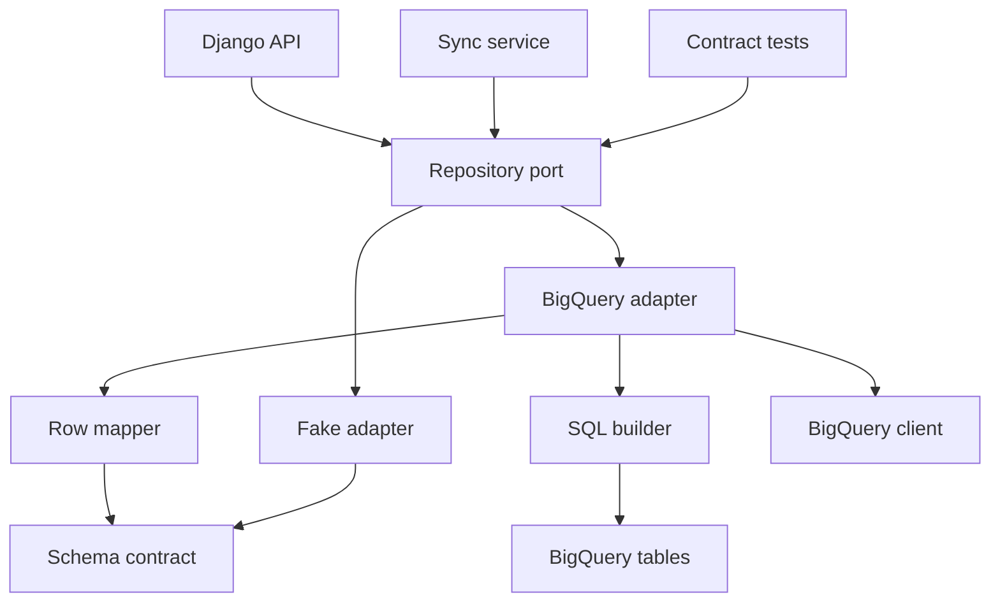
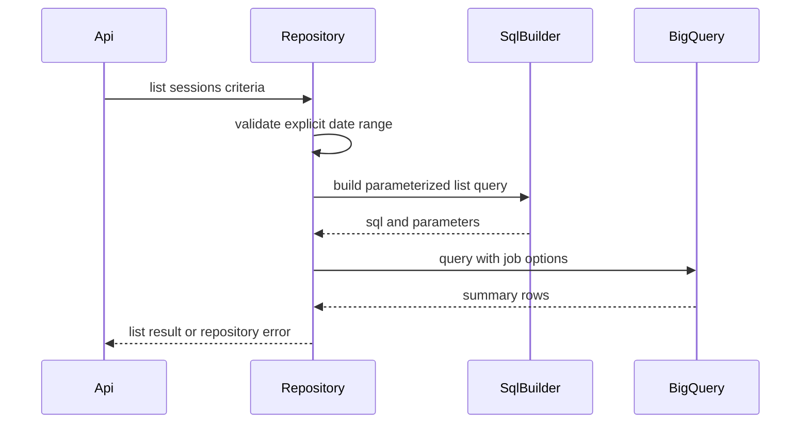
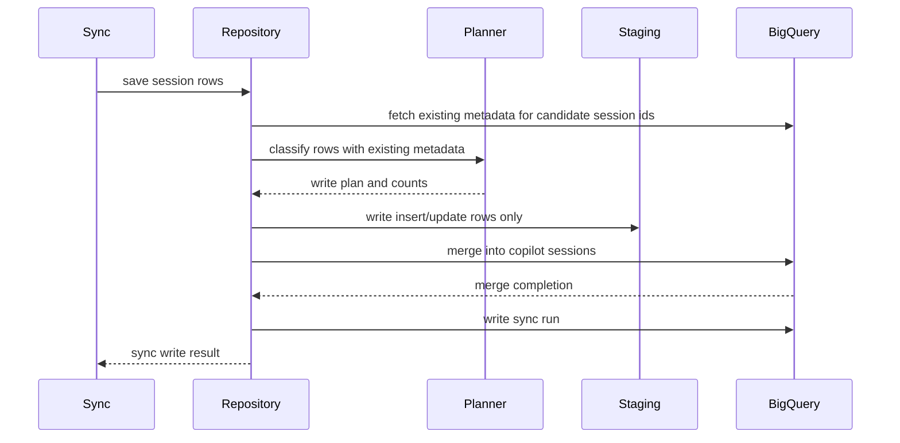

# 設計ドキュメント

## 概要
この仕様は、Django backend が BigQuery read model を一覧・詳細・同期保存・sync run 保存の共通 repository 契約として利用できるようにする。対象利用者は、Django session API、明示同期処理、parity validation、repository contract test を実装する開発者である。

変更の中心は `history_read_model` package に置く typed repository port、BigQuery adapter、fake adapter、query / write result、error 分類、contract tests である。BigQuery は raw files の正本ではなく、明示同期で再生成できる read model として扱う。

### 目的
- 保存済み `copilot_sessions` から date range / search / limit 条件で summary payload を返す。
- `session_id` による detail payload lookup を raw files なしで提供する。
- normalized session 由来の read model rows と sync run rows を BigQuery に一括反映できる repository 契約を定義する。
- dry run、`maximum_bytes_billed`、partition filter 必須化、error 分類により BigQuery 実行を制御する。
- fake repository と shared contract tests により、実 BigQuery 接続なしで主要契約を検証できるようにする。

### 対象外
- Django URL / view / serializer / HTTP status mapping。
- `summary_payload` / `detail_payload` の presenter shape 再定義。
- raw file reader、normalizer、payload builder の実装変更。
- BigQuery dataset / table schema 初期化。
- Search Index、semantic search、background job 化、production GCP operation policy。
- Rails / MySQL stack 削除。

## 境界の取り決め

### この仕様が所有する範囲
- `SessionReadModelRepository` port と read / write / sync run operation の typed result contract。
- BigQuery `copilot_sessions` への session list query、session detail lookup、staging + MERGE sync write。
- BigQuery `history_sync_runs` への sync run start / finish 保存、running sync 検出。
- list query の date range 必須 validation、display time 判定、search literal matching、stable ordering、limit 適用。
- dry run、maximum bytes billed、query parameters、BigQuery error 分類。
- fake repository の query / write 振る舞い拡張と BigQuery adapter との shared contract tests。
- opt-in BigQuery integration test の gating contract。

### 境界外
- Django endpoint、request parameter validation、HTTP error envelope、frontend 表示。
- presenter payload の field 追加・削除・変換。
- Copilot CLI raw files の探索、current / legacy parser、workspace only 判定ロジックの生成元。
- `bigquery-read-model-schema` が所有する table schema、DDL、dataset initializer。
- Rails / MySQL の既存 query / sync service 削除。
- 長期運用の IAM 設計、Terraform、監視、Search Index、semantic search。

### 許可する依存
- `bigquery-read-model-schema` の `history_read_model.bigquery_schema`、`bigquery_settings`、row dataclass、fake 保存契約。
- `django-presenters-contract` の presenter-compatible `summary_payload` / `detail_payload` shape。
- `copilot_history.types.NormalizedSession` と既存 Python reader / projector が作る source metadata。
- `google-cloud-bigquery>=3.41,<4` の Python client、GoogleSQL named parameters、dry run、`maximum_bytes_billed`、DML `MERGE`。
- pytest、mypy strict、ruff、Django settings import no-client 方針。

### 再検証が必要になる変更
- `copilot_sessions` / `history_sync_runs` の column、partition key、cluster key、enum、count invariant が変わる。
- `summary_payload` / `detail_payload` の ownership または JSON object contract が変わる。
- search target が `search_text OR cwd` から変わる、または repository metadata を検索対象に追加する。
- list query が explicit date range なしで呼ばれる API 契約に変わる。
- BigQuery client dependency、credentials strategy、integration test opt-in env が変わる。
- sync lifecycle status、running lock、count semantics が変わる。

## アーキテクチャ

### 既存アーキテクチャ分析
- Rails 版 `SessionIndexQuery` は DB 保存済み `summary_payload` を返し、display time を `updated_at_source` 優先・`created_at_source` fallback として候補選定する。
- Rails 版 `SessionDetailQuery` は `session_id` lookup で保存済み `detail_payload` を返し、raw files を読まない。
- Rails 版 `HistorySyncService` は `session_id` identity、source fingerprint、search projection version、workspace only 除外、degraded count、running lock を同期契約として持つ。
- Python 側には `history_read_model` schema / fake と、`copilot_history.api` presenter contract があり、repository はこの間の persistence port として追加される。

### アーキテクチャパターンと境界図



**統合方針**:
- 採用パターン: repository port + BigQuery adapter + fake adapter。API / sync は repository port に依存し、BigQuery SQL と job option は adapter 内に閉じる。
- 依存方向: `schema/settings -> repository types -> fake/sql builder/row mapper -> BigQuery adapter -> Django API/sync callers`。schema と presenter は repository から下流へ逆依存しない。
- 維持する既存方針: raw files は一次ソース、read model は再生成可能、通常 unit test は BigQuery 実接続不要、payload shape は presenter contract に属する。
- 新規コンポーネントの理由: BigQuery cost guardrail、parameterized SQL、staging + MERGE、error 分類を呼び出し側へ漏らさないため repository adapter が必要である。

### 技術スタック

| 層 | 採用技術 / version | この仕様での役割 | 補足 |
|-------|------------------|-----------------|-------|
| Backend / Services | Python `>=3.14,<3.15`, Django `>=5.2.8,<5.3` | repository port、typed result、test entrypoint | Django ORM は BigQuery に使わない |
| Backend Dependency | `google-cloud-bigquery>=3.41,<4` | query job、dry run、maximum bytes billed、MERGE | import / client 生成は BigQuery adapter 内 |
| Data / Storage | BigQuery GoogleSQL | list / detail query、staging + MERGE、sync run 保存 | `source_partition_date` filter を list query に必須化 |
| Validation | pytest, mypy strict, ruff | fake / SQL builder / shared contract / opt-in integration tests | test case 直前コメント規約を守る |

## ファイル構成計画

### ディレクトリ構成
```text
backend/
├── history_read_model/
│   ├── repository.py                    # repository port、criteria、execution options、result/error dataclass
│   ├── repository_rows.py               # NormalizedSession と presenter payload から row input を組み立てる境界
│   ├── repository_write_planner.py       # sync write の insert/update/skip/workspace_only/invalid 分類
│   ├── fake_repository.py               # 既存 row validation に list/detail/write/sync run contract を追加
│   ├── bigquery_repository.py           # BigQuery client adapter、job config、error mapping
│   ├── bigquery_sql.py                  # parameterized SELECT、staging、MERGE、sync run SQL を生成する
│   └── bigquery_errors.py               # BigQuery exception を RepositoryError.kind へ分類する
└── tests/
    └── history_read_model/
        ├── test_repository_contract.py              # fake と adapter 共通の read/write contract
        ├── test_repository_write_planner.py         # sync write 分類と counts の単体検証
        ├── test_fake_repository_query_contract.py   # fake の list/detail/search/sync lifecycle
        ├── test_bigquery_sql.py                     # SQL と query parameter / partition filter 検証
        ├── test_bigquery_repository_errors.py       # credentials/schema/cost/query error 分類
        └── test_bigquery_repository_integration.py  # opt-in 実 BigQuery 検証
```

### 変更する既存ファイル
- `backend/history_read_model/fake_repository.py` — `FakeBigQueryReadModelRepository` に repository port 相当の `list_sessions`, `get_session_detail`, `save_sessions`, `save_sync_run`, `find_running_sync_run` を追加し、既存 schema validation を再利用する。
- `backend/history_read_model/bigquery_settings.py` — 必要に応じて repository 用 env `BIGQUERY_MAX_BYTES_BILLED_DEFAULT` と integration flag helper を追加する。settings import で BigQuery client は作らない。
- `backend/pyproject.toml` — 原則変更しない。`google-cloud-bigquery>=3.41,<4` と `history_read_model*` は既に定義済みである。
- `.kiro/specs/bigquery-session-repository/spec.json` — design 生成状態、requirements approval、timestamp を更新する。

### 新規ファイル
- `backend/history_read_model/repository.py` — `SessionReadModelRepository` Protocol、`SessionListCriteria`、`RepositoryExecutionOptions`、`SessionListResult`、`SessionDetailResult`、`SyncWriteResult`、`SyncRunResult`、`RepositoryError` を定義する。
- `backend/history_read_model/repository_rows.py` — `NormalizedSession`、`summary_payload`、`detail_payload`、`source_fingerprint`、`indexed_at` から `CopilotSessionRow` を作る。workspace only は保存対象外として分類する。
- `backend/history_read_model/repository_write_planner.py` — 保存候補 row と既存 row metadata を比較し、`insert`, `update`, `skip`, `workspace_only`, `invalid` の分類と `SyncWriteResult` counts を BigQuery / fake 共通で算出する。
- `backend/history_read_model/bigquery_sql.py` — list / detail / staging / MERGE / sync run query text と named parameters を生成する。user input を SQL 文字列へ直接埋め込まない。
- `backend/history_read_model/bigquery_repository.py` — `google.cloud.bigquery.Client` を受け取り、job config、dry run、maximum bytes billed、row mapping、MERGE 実行、error mapping を行う。
- `backend/history_read_model/bigquery_errors.py` — credentials、permission、schema mismatch、cost limit、query failure、validation failure を `RepositoryError.kind` へ分類する。
- `backend/tests/history_read_model/test_repository_contract.py` — fake と BigQuery adapter の代表挙動を同じ fixture / assertion で検証する shared contract。
- `backend/tests/history_read_model/test_repository_write_planner.py` — sync write の insert/update/skip/workspace_only/invalid 分類と count invariant を BigQuery 非依存で検証する。
- `backend/tests/history_read_model/test_fake_repository_query_contract.py` — display time fallback、search literal、empty result、not found、sync count、running lock を fake で検証する。
- `backend/tests/history_read_model/test_bigquery_sql.py` — `source_partition_date` predicate、display time expression、named parameters、wildcard escape、limit、MERGE の構造を検証する。
- `backend/tests/history_read_model/test_bigquery_repository_errors.py` — BigQuery client exception と job result failure を repository error kind に分類する。
- `backend/tests/history_read_model/test_bigquery_repository_integration.py` — `BIGQUERY_READ_MODEL_INTEGRATION` が truthy で必要 env が揃う場合だけ実 dataset で代表 list/detail/write を検証する。

## システムフロー





List flow は explicit date range がない場合に BigQuery job を作らない。Dry run は既存 metadata lookup、query / write plan、validation result だけを返し、staging write と MERGE mutation を実行しない。

## 要件トレーサビリティ

| 要件 | 概要 | コンポーネント | インターフェース | フロー |
|-------------|---------|------------|------------|-------|
| 1.1 | list/detail/session save/sync run save を同一契約で提供する | RepositoryPort, BigQueryRepository, FakeRepository | `SessionReadModelRepository` | list/write flows |
| 1.2 | raw files 正本と read model 補助層を維持する | Boundary, RepositoryRows | row input | write flow |
| 1.3 | schema spec の 2 tables に適合する data を扱う | RepositoryRows, FakeRepository, BigQueryRepository | `CopilotSessionRow`, `HistorySyncRunRow` | write flow |
| 1.4 | summary/detail payload shape を再定義しない | RepositoryPort, RowMapper | `Mapping[str, object]` payload | list/detail flows |
| 1.5 | endpoint/raw/schema init を責務外にする | Boundary, File Structure Plan | out-of-boundary | none |
| 2.1 | date range で候補を絞る | SQLBuilder, FakeRepository | `SessionListCriteria` | list flow |
| 2.2 | updated source time を display time に使う | SQLBuilder, FakeRepository | display time expression | list flow |
| 2.3 | updated 欠落時に created source time を使う | SQLBuilder, FakeRepository | display time expression | list flow |
| 2.4 | display time 欠落 row を候補外にする | SQLBuilder, FakeRepository | candidate filter | list flow |
| 2.5 | search_text または cwd に検索語一致する row を候補にする | SQLBuilder, FakeRepository | search criteria | list flow |
| 2.6 | date range と search を AND 合成する | SQLBuilder, ContractTests | list query | list flow |
| 2.7 | display time desc / session id asc で安定順序にする | SQLBuilder, FakeRepository | order contract | list flow |
| 2.8 | limit を条件・並び順後に適用する | SQLBuilder, FakeRepository | limit parameter | list flow |
| 2.9 | 一致なしを空 list success にする | RepositoryPort, FakeRepository | `SessionListResult` | list flow |
| 3.1 | existing session id で detail payload を返す | BigQueryRepository, FakeRepository | `get_session_detail` | detail flow |
| 3.2 | 保存済み detail payload を失わせない | RowMapper, RepositoryPort | payload passthrough | detail flow |
| 3.3 | current/legacy を同一 lookup 契約にする | RepositoryPort | `session_id` lookup | detail flow |
| 3.4 | not found を識別可能 result にする | RepositoryPort, FakeRepository | `SessionDetailResult` | detail flow |
| 3.5 | detail lookup で raw files を読まない | Boundary, BigQueryRepository | BigQuery only | detail flow |
| 4.1 | 渡された sessions を read model 最新結果にする | BigQueryRepository, FakeRepository | `save_sessions` | write flow |
| 4.2 | 新規 session を inserted として返す | SyncWritePlanner, FakeRepository | `SyncWriteResult` | write flow |
| 4.3 | 既存 session を重複させず updated として返す | SyncWritePlanner, BigQueryRepository | MERGE | write flow |
| 4.4 | fingerprint と search projection 一致で skip する | SyncWritePlanner, FakeRepository | skip classifier | write flow |
| 4.5 | workspace only を表示用 read model に保存しない | RepositoryRows, SyncWritePlanner | excluded result | write flow |
| 4.6 | degraded 状態と issue 情報を payload として保持する | RepositoryRows, FakeRepository | payload passthrough | write flow |
| 4.7 | processed/inserted/updated/saved/skipped/failed/degraded を返す | RepositoryPort | `SyncWriteResult` | write flow |
| 4.8 | sync run lifecycle と counts を保存する | BigQueryRepository, FakeRepository | `save_sync_run` | write flow |
| 4.9 | 未完了 sync run を識別する | BigQueryRepository, FakeRepository | `find_running_sync_run` | write flow |
| 5.1 | partition 前提の日付条件で list query を絞る | SQLBuilder | `source_partition_date` predicate | list flow |
| 5.2 | date range 欠落を repository error にする | RepositoryPort, BigQueryRepository | `RepositoryError` | list flow |
| 5.3 | dry run で実 data 変更を行わない | BigQueryRepository | `RepositoryExecutionOptions` | list/write flows |
| 5.4 | maximum bytes billed 超過を成功扱いにしない | BigQueryRepository, ErrorMapper | job config | list/detail/write flows |
| 5.5 | credentials/permission/schema/cost/query failure を分類する | ErrorMapper | `RepositoryError.kind` | all flows |
| 5.6 | Search Index 等を scope 外にする | Boundary | out-of-boundary | none |
| 6.1 | 実 BigQuery client なしの fake repository を提供する | FakeRepository | fake adapter | contract tests |
| 6.2 | fake が row contract 違反を検出する | FakeRepository, RepositoryRows | schema validation | contract tests |
| 6.3 | fake と BigQuery repository の代表挙動を比較する | RepositoryContractTests | shared tests | contract tests |
| 6.4 | 実 BigQuery integration test を opt-in にする | IntegrationTests, BigQuerySettings | env gate | contract tests |
| 6.5 | credentials なしでも unit test を継続する | FakeRepository, SQLBuilderTests | no-client tests | contract tests |
| 6.6 | test case 直前コメント規約を守る | Test Files | pytest comments | contract tests |

## コンポーネントとインターフェース

| Component | Domain/Layer | Intent | Req Coverage | Key Dependencies | Contracts |
|-----------|--------------|--------|--------------|------------------|-----------|
| RepositoryPort | Domain port | read model repository の typed contract を固定する | 1.1, 1.4, 2.9, 3.4, 4.7, 5.2, 5.3, 5.5 | schema rows P0 | Service |
| RepositoryRows | Mapping | normalized session と payload から schema row input を作る | 1.2, 1.3, 4.5, 4.6, 6.2 | presenter payload P0, schema P0 | Service |
| SyncWritePlanner | Domain service | BigQuery / fake 共通の sync write 分類と counts を算出する | 4.2, 4.3, 4.4, 4.5, 4.7, 6.3 | schema rows P0 | Service |
| SQLBuilder | Data access | BigQuery GoogleSQL と named parameters を生成する | 2.1, 2.2, 2.3, 2.4, 2.5, 2.6, 2.7, 2.8, 5.1, 5.4 | BigQuery SQL P0 | Service |
| BigQueryRepository | Data adapter | BigQuery client を使って repository port を実装する | 1.1, 3.1, 3.2, 3.3, 3.4, 3.5, 4.1, 4.2, 4.3, 4.4, 4.5, 4.6, 4.7, 4.8, 4.9, 5.3, 5.4, 5.5 | google-cloud-bigquery P0 | Service, Batch |
| FakeRepository | Test adapter | 実接続なしで同じ repository 契約を検証する | 6.1, 6.2, 6.5 | schema fake P0 | Service, State |
| ErrorMapper | Error handling | BigQuery / validation failure を repository error に分類する | 5.4, 5.5 | BigQuery exceptions P1 | Service |
| RepositoryContractTests | Test support | fake と BigQuery adapter の代表挙動 drift を検出する | 6.3, 6.4, 6.6 | pytest P0 | Batch |

### Repository Layer

#### RepositoryPort

| Field | Detail |
|-------|--------|
| Intent | API と sync service が BigQuery 詳細を知らずに read model を扱うための port |
| Requirements | 1.1, 1.4, 2.9, 3.4, 4.7, 5.2, 5.3, 5.5 |

**責務と制約**
- HTTP status、error envelope、presenter shape を所有しない。
- `summary_payload` / `detail_payload` は `Mapping[str, object]` として透過的に返す。
- date range 欠落、invalid limit、dry run result、BigQuery failure を discriminated result として返す。

**依存関係**
- Inbound: Django API / SyncService — repository operation を呼ぶ (P0)
- Outbound: BigQueryRepository / FakeRepository — port 実装 (P0)
- External: なし。port 自体は BigQuery client に依存しない (P0)

**契約種別**: Service [x] / API [ ] / Event [ ] / Batch [ ] / State [ ]

##### Service インターフェース
```python
type RepositoryErrorKind = Literal[
    "validation_error",
    "missing_date_range",
    "credentials_error",
    "permission_denied",
    "schema_mismatch",
    "cost_limit_exceeded",
    "query_failed",
]

@dataclass(frozen=True)
class SessionListCriteria:
    from_datetime: datetime | None
    to_datetime: datetime | None
    search_term: str | None = None
    limit: int | None = None

@dataclass(frozen=True)
class RepositoryExecutionOptions:
    dry_run: bool = False
    maximum_bytes_billed: int | None = None

class SessionReadModelRepository(Protocol):
    def list_sessions(
        self,
        criteria: SessionListCriteria,
        options: RepositoryExecutionOptions,
    ) -> SessionListResult: ...

    def get_session_detail(
        self,
        session_id: str,
        options: RepositoryExecutionOptions,
    ) -> SessionDetailResult: ...

    def save_sessions(
        self,
        rows: Sequence[CopilotSessionWriteInput],
        options: RepositoryExecutionOptions,
    ) -> SyncWriteResult: ...

    def save_sync_run(
        self,
        row: HistorySyncRunRow,
        options: RepositoryExecutionOptions,
    ) -> SyncRunResult: ...

    def find_running_sync_run(
        self,
        options: RepositoryExecutionOptions,
    ) -> SyncRunLookupResult: ...
```
- Preconditions: list success には `criteria.from_datetime` と `criteria.to_datetime` が必須であり、両方がある場合は `criteria.from_datetime <= criteria.to_datetime`、`limit` は `None` または正数、`session_id` は空文字不可。
- Postconditions: success result は保存済み payload を返し、error result は `RepositoryError.kind` を持つ。
- Invariants: repository は raw files を読まない。payload shape を変換しない。

#### BigQueryRepository

| Field | Detail |
|-------|--------|
| Intent | `google-cloud-bigquery` client と GoogleSQL により repository port を実装する |
| Requirements | 1.1, 3.1, 3.2, 3.3, 3.5, 4.1, 4.2, 4.3, 4.4, 4.7, 4.8, 4.9, 5.3, 5.4, 5.5 |

**責務と制約**
- `QueryJobConfig` に named parameters、dry run、maximum bytes billed、location を設定する。
- list query は `source_partition_date` predicate なしでは実行しない。
- write dry run では row validation と query plan だけを返し、staging table / MERGE / sync run mutation を実行しない。
- BigQuery exception と job failure を `RepositoryError` へ分類する。

**依存関係**
- Inbound: RepositoryPort callers — repository operation (P0)
- Outbound: SQLBuilder / ErrorMapper / SchemaDefinition — SQL と error / row contract (P0)
- External: `google.cloud.bigquery.Client` — query job / DML execution (P0)

**契約種別**: Service [x] / API [ ] / Event [ ] / Batch [x] / State [ ]

##### Batch / Job 契約
- Trigger: Django API の list/detail、sync service の save operation、contract / integration tests。
- Input / validation: repository criteria、row input、execution options。validation failure では BigQuery job を作らない。
- Output / destination: success result、dry-run plan result、または `RepositoryError`。write success は `copilot_sessions` / `history_sync_runs` に反映する。
- Idempotency & recovery: `SyncWritePlanner` の分類結果に基づく `session_id` identity の MERGE で重複 row を作らない。sync run は `sync_run_id` identity と running lock lookup で競合を識別する。

#### SyncWritePlanner

| Field | Detail |
|-------|--------|
| Intent | BigQuery adapter と fake adapter が同じ保存分類・件数契約を共有するための domain service |
| Requirements | 4.2, 4.3, 4.4, 4.5, 4.7, 6.3 |

**責務と制約**
- 保存候補 row と、既存 `session_id` ごとの `source_fingerprint` / `search_text_version` metadata を入力にする。
- `source_state == "workspace_only"` の row は `workspace_only` として分類し、`copilot_sessions` への staging / MERGE 対象にしない。
- 既存 row がない保存可能 row は `insert`、既存 row があり fingerprint または search projection version が異なる row は `update`、既存 row があり fingerprint と search projection version が一致する row は `skip` に分類する。
- row contract validation で保存不能な row は `invalid` として分類し、`failed_count` に含める。BigQuery job 全体の失敗、credentials、permission、schema、cost、query failure は per-row `failed_count` ではなく `RepositoryError` として返す。
- `saved_count = inserted_count + updated_count` を常に維持し、`processed_count` は入力候補数、`skipped_count` は `skip + workspace_only` の合計として扱う。`degraded_count` は保存対象または skip 対象の degraded row 数であり、invalid row は含めない。

**依存関係**
- Inbound: BigQueryRepository / FakeRepository — save operation の前処理 (P0)
- Outbound: SchemaDefinition / row validation — 保存可能性と sync count invariant (P0)
- External: なし。BigQuery job statistics や DML affected rows に分類を依存させない (P0)

**契約種別**: Service [x] / API [ ] / Event [ ] / Batch [ ] / State [ ]

#### SQLBuilder

| Field | Detail |
|-------|--------|
| Intent | BigQuery GoogleSQL を repository criteria から安全に生成する |
| Requirements | 2.1, 2.2, 2.3, 2.4, 2.5, 2.6, 2.7, 2.8, 5.1, 5.4 |

**責務と制約**
- user input は named parameter にし、table / dataset identifier は settings validation 済み値だけを quote する。
- list query は `source_partition_date BETWEEN @from_date AND @to_date` と display time expression の両方を含む。
- search は escaped literal pattern を `search_text` と `cwd` に適用し、`repository` は検索対象にしない。
- sync write 前の metadata lookup は候補 `session_id` だけを named parameter array で取得し、返す field は `session_id`, `source_fingerprint`, `search_text_version` に限定する。
- MERGE は `session_id` を key とし、partitioned table DML の pruning を妨げない source filter を含める。

**依存関係**
- Inbound: BigQueryRepository — query text generation (P0)
- Outbound: SchemaDefinition / BigQuerySettings — table names and columns (P0)
- External: BigQuery GoogleSQL — syntax target (P0)

**契約種別**: Service [x] / API [ ] / Event [ ] / Batch [ ] / State [ ]

#### FakeRepository

| Field | Detail |
|-------|--------|
| Intent | BigQuery 実接続なしで repository contract を検証する |
| Requirements | 6.1, 6.2, 6.5 |

**責務と制約**
- 既存 `ReadModelContractError` validation を使い、row contract 違反を保存前に検出する。
- BigQuery adapter と同じ display time、search、ordering、limit、not found、sync count、running lock semantics を実装する。
- BigQuery SQL syntax や job config の完全 mock にはしない。

**依存関係**
- Inbound: unit tests / API tests — fake repository injection (P0)
- Outbound: SchemaDefinition / row dataclass — validation (P0)
- External: なし (P0)

**契約種別**: Service [x] / API [ ] / Event [ ] / Batch [ ] / State [x]

## データモデル

### Domain Model
- `SessionListCriteria`: 明示 date range、任意 search term、任意 positive limit。
- `RepositoryExecutionOptions`: dry run と maximum bytes billed を全 operation へ適用する実行制御。
- `CopilotSessionWriteInput`: `CopilotSessionRow` と sync classification metadata。workspace only は保存対象外 classification とする。
- `ExistingSessionMetadata`: `session_id`, `source_fingerprint`, `search_text_version` のみを持つ保存分類用 metadata。
- `SyncWritePlan`: `insert_rows`, `update_rows`, `skipped_session_ids`, `workspace_only_session_ids`, `invalid_rows`, `counts` を持ち、BigQuery / fake adapter が同じ分類結果を使う。
- `SyncWriteResult`: `processed_count`, `inserted_count`, `updated_count`, `saved_count`, `skipped_count`, `failed_count`, `degraded_count`, `dry_run_plan`。
- `RepositoryError`: 呼び出し側が失敗種別を識別できる discriminated error。

### Logical Data Model
- `copilot_sessions.session_id` は session identity であり、MERGE key と detail lookup key である。
- `source_partition_date` は BigQuery scan 範囲を絞る required date。display time は `updated_at_source` 優先、欠落時 `created_at_source` fallback である。
- `summary_payload` / `detail_payload` は presenter-compatible JSON object として保存され、repository は内部 field を所有しない。
- `source_fingerprint` と `search_text_version` は sync write の skip 判定に使う既存 metadata であり、payload 全体比較や BigQuery DML affected rows には分類を依存させない。
- `history_sync_runs.running_lock_key` は未完了 sync run の識別に使う。terminal status では `finished_at` が必須で、`saved_count = inserted_count + updated_count` を維持する。

### Physical Data Model
- 物理 schema は `bigquery-read-model-schema` が所有する。この仕様では既存 `BigQueryTable` contract を参照し、DDL を変更しない。
- List query は partitioned `copilot_sessions` に対して `source_partition_date` filter を必須化し、`session_id`, `repository`, `branch`, `source_format` clustering を lookup 補助として使う。
- Detail lookup は `session_id` cluster に依存し、必要に応じて `maximum_bytes_billed` で scan cost を制御する。
- Sync write は metadata lookup で分類した insert/update rows だけを scoped staging rows に投入し、target table の `MERGE` を実行する。skip、workspace only、invalid rows は target に投入しない。

## エラー処理

| Error kind | Trigger | Caller handling |
|------------|---------|-----------------|
| `missing_date_range` | list criteria に明示 date range がない | Django API が validation error へ写す |
| `validation_error` | limit、session_id、row contract、sync lifecycle が不正 | 呼び出し側 input 修正 |
| `credentials_error` | credentials / ADC が利用できない | 環境設定修正 |
| `permission_denied` | BigQuery dataset / table 権限不足 | GCP 権限修正 |
| `schema_mismatch` | required table / column / JSON contract が合わない | schema initializer / migration spec 再確認 |
| `cost_limit_exceeded` | maximum bytes billed 超過 | 条件見直しまたは上限変更 |
| `query_failed` | BigQuery query / DML が失敗 | retry または実装調査 |

## テスト戦略

- `test_fake_repository_query_contract.py`: 2.1, 2.2, 2.3, 2.4, 2.5, 2.6, 2.7, 2.8, 2.9, 3.1, 3.2, 3.3, 3.4, 4.2, 4.3, 4.4, 4.5, 4.6, 4.7, 4.8, 4.9 を fake で検証する。各 pytest test case の直前に `概要・目的`、`テストケース`、`期待値` コメントを置く。
- `test_repository_write_planner.py`: 4.2, 4.3, 4.4, 4.5, 4.7 を planner 単体で検証し、新規、更新、skip、workspace only、invalid、job-level error 非混入、`saved_count = inserted + updated` を確認する。
- `test_bigquery_sql.py`: 5.1、5.3、5.4 を SQL text / parameters / job option の単体検証で確認する。metadata lookup が candidate session ids の named parameter array を使うことと、user input が SQL へ直埋めされないことを含める。
- `test_repository_contract.py`: 6.3 として fake と BigQuery adapter の代表 list/detail/write/not found/degraded/sync run behavior を同じ assertion で検証する。write contract は planner が算出した counts と adapter が返す counts の一致を確認する。
- `test_bigquery_repository_errors.py`: 5.5 の credentials、permission、schema mismatch、cost limit、query failure 分類を確認する。
- `test_bigquery_repository_integration.py`: 6.4 として env flag と必要 BigQuery env が揃う場合だけ実 dataset で list/detail/MERGE 代表ケースを実行する。credentials がない通常環境では skip し、unit tests は継続する。

## セキュリティと性能

- BigQuery credentials は環境または ADC から読み、repository file / test fixture に秘密情報を保存しない。
- search term、date range、limit、session_id は named parameters にし、SQL injection risk を repository 内で抑える。
- List query は明示 date range と `source_partition_date` filter を必須にし、partition pruning を前提にする。
- `maximum_bytes_billed` が指定された operation は上限超過を success にしない。
- dry run は実 data mutation を禁止し、実行予定 SQL / bytes estimate / row validation result を返す。

## 実装・移行メモ

- 実装順は repository types、repository write planner、fake query/write behavior、SQL builder、BigQuery adapter、shared contract、opt-in integration の順にする。
- 既存 Rails / MySQL API はこの仕様では削除しない。Django API spec が repository port を採用するまで並存する。
- schema 初期化は `bigquery-read-model-schema` の management command を前提にし、この仕様では table 作成を再実装しない。
- BigQuery 実接続は通常 unit test、Django settings import、health endpoint の前提にしない。
