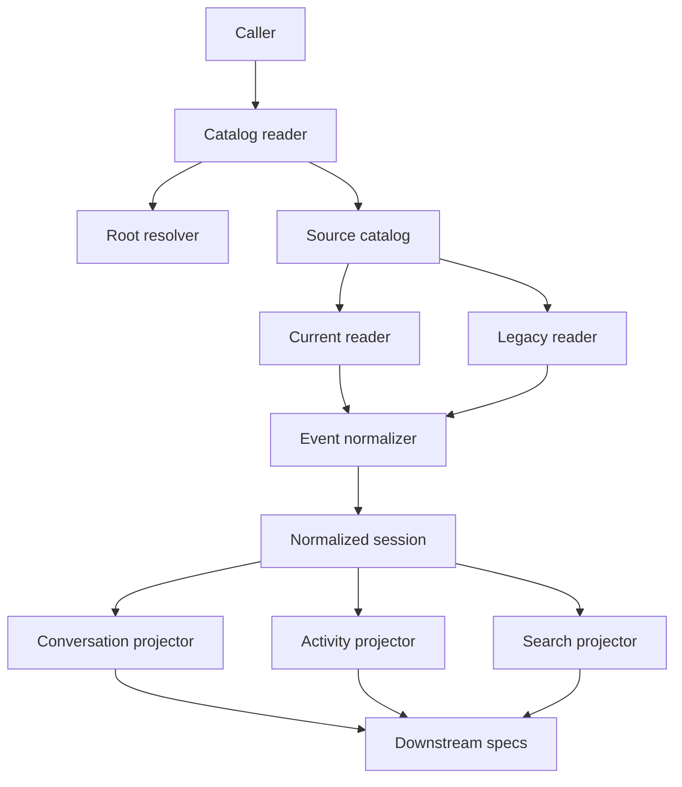
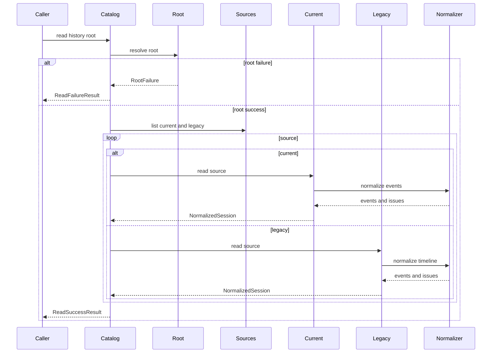
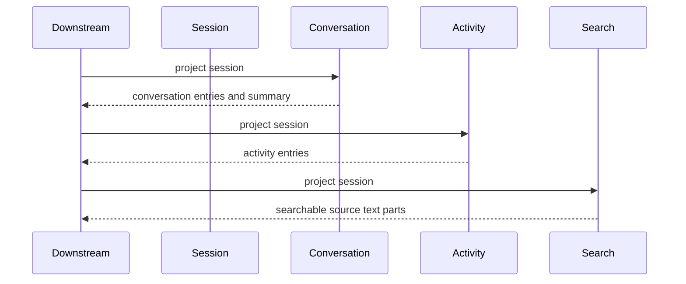
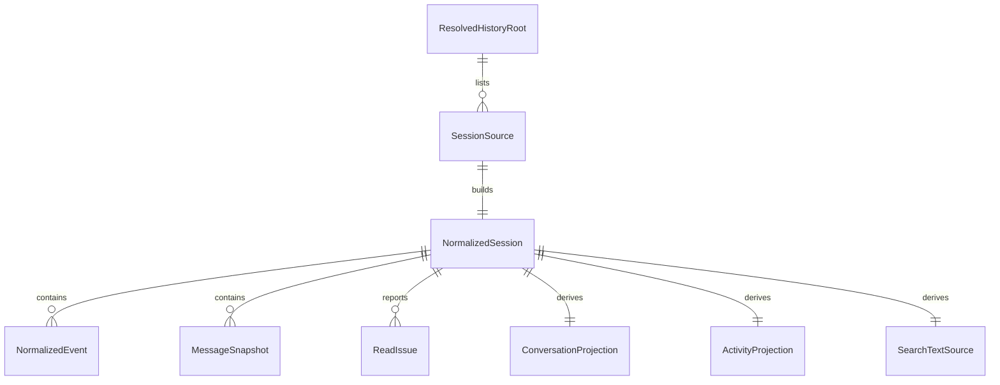

# 設計ドキュメント

## 概要
この feature は、Python backend で GitHub Copilot CLI のローカル履歴ファイルを読み、current `session-state` と legacy `history-session-state` を同じ normalized session contract へ変換する。対象利用者は、後続の Django presenter、BigQuery repository、history API、parity validation を実装する移行開発者である。

変更の中心は `backend/copilot_history/` の pure Python reader package、型定義、event normalizer、conversation / activity / search projection、fixture ベースの unit tests である。この spec は raw file reader と normalized data を所有し、HTTP response、BigQuery 保存、frontend 表示は所有しない。

### 目的
- 履歴 root から current / legacy の session source を列挙し、root failure と session degraded issue を区別して返す。
- current `workspace.yaml` / `events.jsonl` と legacy JSON を、同じ `NormalizedSession`、`NormalizedEvent`、`ReadIssue` contract へ写像する。
- unknown / partial event の raw traceability を失わず、conversation、activity、search text source の基礎情報を生成する。
- Rails 版 `backend/lib/copilot_history/` と API contract fixtures を参照して、後続移行で parity を検証できる Python unit tests を用意する。

### 対象外
- Django view、URL route、HTTP status、error envelope、session list/detail response shape。
- BigQuery row builder、staging / MERGE upsert、同期 endpoint、read model query。
- frontend 表示、semantic search、ranking、外部 index 更新。
- Rails / MySQL stack の削除、Copilot CLI raw format の将来変更対応そのもの。

## 境界の取り決め

### この仕様が所有する範囲
- `COPILOT_HOME` または明示指定された履歴 root の read-only 解決と access failure 分類。
- `session-state/<session-id>` と `history-session-state/*.json` の source descriptor 列挙。
- current reader、legacy reader、event normalizer、issue code、normalized session / event / projection 型。
- session 単位の degraded issue と root failure を区別する public result union。
- conversation entry、activity entry、conversation summary、search text source の基礎 projection。
- Python unit tests と representative fixtures による current / legacy / degraded / root failure の検証。

### 境界外
- API presenter の最終 JSON payload、HTTP error envelope、request validation。
- BigQuery schema、row persistence、source fingerprint、sync run lifecycle、同期 lock。
- frontend DTO、UI component、date range / search query UI。
- file watch、自動監視、外部送信、Copilot CLI の起動や resume 操作。
- Rails 実装の削除や Ruby code の変更。

### 許可する依存
- `django-backend-foundation` の Python `>=3.14,<3.15`、pytest、ruff、mypy strict、Django project package。
- Python 標準 library: `dataclasses`、`datetime`、`json`、`pathlib`、`os`、`stat`、`typing`。
- `PyYAML>=6.0.3,<7`。current `workspace.yaml` の読取だけに使い、`yaml.safe_load` 以外の任意 object 復元 API は使わない。
- 既存 Rails reader と API contract fixtures は互換期待値の参照元として使う。
- `backend/tests/` の pytest convention と test case 直前コメント規約。
- ローカル filesystem の read-only access。外部 network と BigQuery client は不要。

### 再検証が必要になる変更
- `NormalizedSession`、`NormalizedEvent`、`ReadIssue`、projection dataclass の field 名、enum、意味が変わる。
- `source_format`、`source_state`、issue code、severity、root failure code が変わる。
- current / legacy source discovery の path convention が変わる。
- search text source に含める入力範囲が変わる。
- reader が Django view、BigQuery repository、HTTP presenter、frontend DTO に依存し始める。
- Copilot CLI の `workspace.yaml`、`events.jsonl`、legacy JSON の代表 schema が変わる。

## アーキテクチャ

### 既存アーキテクチャ分析
- Rails 側 `backend/lib/copilot_history/` は reader pipeline、types、errors、projections、persistence、API presenter を同一 namespace に持つ。
- Python backend はすでに Django foundation と `history_read_model` package を持ち、strict mypy、pytest、ruff を `backend/pyproject.toml` で管理している。
- BigQuery schema は downstream read model contract を固定しているが、raw reader 自体は DB へ依存しない。
- 既存 Python tests は `backend/tests/` 配下に置き、test case の直前に `概要・目的`、`テストケース`、`期待値` コメントを残す。

### アーキテクチャパターンと境界図



**統合方針**:
- 採用パターン: reader pipeline。root 解決、source discovery、format reader、event normalization、projection を分け、公開境界は `SessionCatalogReader.read()` の result union に集約する。
- 依存方向: `errors/types -> root/source -> normalizer -> readers -> catalog -> projectors -> tests`。projector は reader に依存してよいが、reader は projector、Django view、BigQuery repository に依存しない。
- 維持する既存方針: raw files を一次ソースとし、read model と API は後続で再生成可能な補助層として扱う。
- 新規コンポーネントの理由: Python migration では Rails の value object を dataclass に置き換え、mypy strict で downstream contract drift を検出できるようにする。
- Steering 準拠: ローカル履歴参照に閉じ、current / legacy 共存、degraded data の明示、テストコメント規約を維持する。

### 技術スタック

| 層 | 採用技術 / version | この仕様での役割 | 補足 |
|-------|------------------|-----------------|-------|
| Backend / Services | Python `>=3.14,<3.15` | reader package、dataclass contract、filesystem read | Django app ではなく pure package として実装する |
| Backend Quality | pytest, mypy strict, ruff | unit tests、型検査、lint | 既存 `backend/bin/*` 入口を使う |
| Data / Storage | Local filesystem, JSON, JSON Lines, PyYAML safe loader | Copilot CLI raw file source | DB 永続化はしない。YAML は `workspace.yaml` 読取に限定する |
| Infrastructure / Runtime | Docker Compose backend | 後続検証の標準 runtime | network / BigQuery 接続不要 |

## ファイル構成計画

### ディレクトリ構成
```text
backend/
├── pyproject.toml
├── copilot_history/
│   ├── __init__.py                         # Python reader package の公開 marker
│   ├── errors.py                           # root failure / session issue code と severity の Literal 定義
│   ├── types.py                            # normalized session、event、issue、result、projection dataclass
│   ├── root_resolver.py                    # 履歴 root を解決し root failure を分類する
│   ├── source_catalog.py                   # current / legacy source descriptor を列挙する
│   ├── event_normalizer.py                 # raw event を message / detail / unknown に正規化する
│   ├── current_reader.py                   # workspace.yaml と events.jsonl から current session を作る
│   ├── legacy_reader.py                    # history-session-state JSON から legacy session を作る
│   ├── catalog_reader.py                   # root 解決から format reader 呼び出しまでを束ねる公開 entrypoint
│   └── projections.py                      # conversation、activity、search text source を派生する
└── tests/
    └── copilot_history/
        ├── fixtures/
        │   ├── current_valid/session-state/current-valid/
        │   ├── current_invalid_workspace/session-state/current-invalid-workspace/
        │   ├── current_invalid_events/session-state/current-invalid-events/
        │   ├── current_workspace_only/session-state/current-workspace-only/
        │   ├── legacy_valid/history-session-state/legacy-valid.json
        │   ├── legacy_invalid/history-session-state/legacy-invalid.json
        │   └── mixed_root/
        ├── test_types_contract.py          # enum、immutability、result union、issue validation を検証する
        ├── test_source_catalog.py          # current / legacy source discovery と root access failure を検証する
        ├── test_current_reader.py          # current metadata、events、selected model、degraded issue を検証する
        ├── test_legacy_reader.py           # legacy JSON、timeline、chat messages、parse failure を検証する
        ├── test_event_normalizer.py        # known / partial / unknown event mapping を検証する
        ├── test_projections.py             # conversation、activity、summary、search source を検証する
        └── test_catalog_reader.py          # root failure と mixed current / legacy result を検証する
```

### 変更する既存ファイル
- `backend/pyproject.toml` — runtime dependencies に `PyYAML>=6.0.3,<7` を追加し、package discovery に `copilot_history*` を追加する。
- `.kiro/specs/copilot-history-python-reader/spec.json` — design 生成状態、requirements approval、timestamp を更新する。

## システムフロー





root failure は session 列挙に進まず `ReadFailureResult` で終了する。source 列挙後の file 欠損、parse failure、unknown event は `NormalizedSession.issues` に保持し、他 session の読取を継続する。

## 要件トレーサビリティ

| 要件 | 概要 | コンポーネント | インターフェース | フロー |
|-------------|---------|------------|------------|-------|
| 1.1 | raw files を一次ソースとして扱う | RootResolver, SourceCatalog | root path, source descriptor | read flow |
| 1.2 | current / legacy を同じ root から列挙する | SourceCatalog | `SessionSource` | read flow |
| 1.3 | source metadata を後続が識別できる | SourceCatalog, Types | `session_id`, `source_format`, `source_paths` | read flow |
| 1.4 | root failure を session success と区別する | RootResolver, CatalogReader | `ReadFailureResult` | read flow |
| 1.5 | local read-only に限定する | Boundary, RootResolver | local path contract | read flow |
| 2.1 | current metadata と event log を同一 source とする | CurrentReader, SourceCatalog | current `SessionSource` | read flow |
| 2.2 | current workspace metadata を返す | CurrentReader, Types | `NormalizedSession` | read flow |
| 2.3 | current event order を保持する | CurrentReader, EventNormalizer | `NormalizedEvent.sequence` | read flow |
| 2.4 | workspace 欠損や parse failure を issue 化する | CurrentReader, Errors | `ReadIssue` | read flow |
| 2.5 | JSONL parse failure でも読める event を保持する | CurrentReader, EventNormalizer | partial session | read flow |
| 2.6 | legacy reader を後退させない | CatalogReader, LegacyReader, tests | mixed fixture | read flow |
| 3.1 | legacy JSON を読取対象にする | SourceCatalog, LegacyReader | legacy `SessionSource` | read flow |
| 3.2 | legacy fields を normalized session へ対応付ける | LegacyReader, EventNormalizer | `NormalizedSession` | read flow |
| 3.3 | current / legacy を同種 contract で返す | CatalogReader, Types | `ReadSuccessResult.sessions` | read flow |
| 3.4 | legacy parse failure でも他 session を継続する | LegacyReader, CatalogReader | degraded issue | read flow |
| 3.5 | legacy raw payload 由来情報を保持する | LegacyReader, Types | `MessageSnapshot`, `raw_payload` | read flow |
| 4.1 | known event に kind、role、content、tool、traceability を含める | EventNormalizer, Types | `NormalizedEvent` | read flow |
| 4.2 | unknown event の raw content を保持する | EventNormalizer | unknown event | read flow |
| 4.3 | partial event の解釈済み属性と raw を保持する | EventNormalizer, Errors | partial mapping issue | read flow |
| 4.4 | session contract に source、context、counts、issues を含める | Types, Projections | `NormalizedSession`, projections | read and projection flows |
| 4.5 | HTTP / storage / frontend shape と同一視しない | Boundary, Components | pure dataclass contract | none |
| 5.1 | conversation entry の元データを返す | ConversationProjector | `ConversationProjection` | projection flow |
| 5.2 | tool-only assistant を空会話にしない | ConversationProjector, ActivityProjector | projection rules | projection flow |
| 5.3 | system/tool/hook/unknown を activity として区別する | ActivityProjector | `ActivityProjection` | projection flow |
| 5.4 | conversation summary を返す | ConversationProjector | `ConversationSummary` | projection flow |
| 5.5 | search projection の基礎情報をまとめる | SearchProjector | `SearchTextSource` | projection flow |
| 5.6 | semantic search と index 更新を含めない | Boundary, SearchProjector | out-of-scope contract | none |
| 6.1 | 部分破損時に session と issue を同時に返す | CurrentReader, LegacyReader, Types | degraded session | read flow |
| 6.2 | root failure を session degraded と分ける | RootResolver, CatalogReader | `ReadFailureResult` | read flow |
| 6.3 | Rails / API fixtures と互換検証できる | tests, fixtures, Types | representative fixture assertions | read and projection flows |
| 6.4 | test comment rule に従う | tests | pytest comments | quality flow |
| 6.5 | presenter、BigQuery、HTTP、frontend、Rails 削除を含めない | Boundary | non-goals | none |

## コンポーネントとインターフェース

| Component | Domain/Layer | Intent | Req Coverage | Key Dependencies | Contracts |
|-----------|--------------|--------|--------------|------------------|-----------|
| Type Contracts | Domain | reader と downstream が共有する immutable value contract | 1.3, 1.4, 4.4, 6.1, 6.2 | Python dataclasses P0 | Service, State |
| RootResolver | Filesystem | history root を解決し fatal failure を分類する | 1.1, 1.4, 1.5, 6.2 | local filesystem P0 | Service |
| SourceCatalog | Discovery | current / legacy source descriptor を列挙する | 1.2, 1.3, 2.1, 3.1 | RootResolver P0 | Service |
| EventNormalizer | Mapping | raw event を known / partial / unknown event に写像する | 2.3, 4.1, 4.2, 4.3 | Type Contracts P0 | Service |
| CurrentReader | Parser | current metadata と events から normalized session を作る | 2.1, 2.2, 2.3, 2.4, 2.5, 6.1 | EventNormalizer P0 | Service, State |
| LegacyReader | Parser | legacy JSON から normalized session を作る | 3.1, 3.2, 3.3, 3.4, 3.5, 6.1 | EventNormalizer P0 | Service, State |
| CatalogReader | Orchestration | root 解決、source 列挙、format reader 呼び出しを束ねる | 1.4, 2.6, 3.3, 3.4, 6.2 | RootResolver P0, SourceCatalog P0, readers P0 | Service |
| Projectors | Projection | conversation、activity、search text source を派生する | 5.1, 5.2, 5.3, 5.4, 5.5, 5.6 | NormalizedSession P0 | Service |

### Domain Types

#### Type Contracts

| Field | Detail |
|-------|--------|
| Intent | raw format 非依存の session、event、issue、result、projection contract を固定する |
| Requirements | 1.3, 1.4, 4.4, 6.1, 6.2 |

**Responsibilities & Constraints**
- `source_format` は `"current" | "legacy"`、`source_state` は `"complete" | "workspace_only" | "degraded"` に限定する。
- root failure と session issue は同じ code set を共有しても、result union では fatal / degraded を分ける。
- `raw_payload` は lossless traceability のため保持するが、HTTP response に含めるかは downstream presenter が決める。
- dataclass は frozen とし、collection fields は tuple または read-only mapping として扱う。
- `event_count`、`message_snapshot_count`、`issue_count`、`degraded` は constructor field ではなく public read-only property として `events`、`message_snapshots`、`issues`、`source_state` から派生させる。これにより downstream は typed field として参照でき、重複保持による不整合を避ける。
- `created_at` と `updated_at` は source timestamp contract である。current は workspace metadata と events mtime / event timestamp 補正から、legacy は payload の開始時刻と timeline timestamp から導出する。

**Dependencies**
- Inbound: all reader / projector components — contract construction (P0)
- Outbound: Python standard typing and dataclasses — value modeling (P0)

**Contracts**: Service [x] / API [ ] / Event [ ] / Batch [ ] / State [x]

##### Service Interface
```python
type SourceFormat = Literal["current", "legacy"]
type SourceState = Literal["complete", "workspace_only", "degraded"]
type EventKind = Literal["message", "detail", "unknown"]
type MappingStatus = Literal["complete", "partial"]
type IssueSeverity = Literal["warning", "error"]

@dataclass(frozen=True)
class NormalizedSession:
    session_id: str
    source_format: SourceFormat
    source_state: SourceState
    cwd: str | None
    git_root: str | None
    repository: str | None
    branch: str | None
    created_at: datetime | None
    updated_at: datetime | None
    selected_model: str | None
    events: tuple[NormalizedEvent, ...]
    message_snapshots: tuple[MessageSnapshot, ...]
    issues: tuple[ReadIssue, ...]
    source_paths: Mapping[str, str]

    @property
    def event_count(self) -> int: ...

    @property
    def message_snapshot_count(self) -> int: ...

    @property
    def issue_count(self) -> int: ...

    @property
    def degraded(self) -> bool: ...
```
- Preconditions: public dataclass の enum fields は定義済み literal のみを受け付ける。
- Postconditions: downstream は dict shape ではなく typed fields / properties で session、counts、degraded state を参照する。
- Invariants: HTTP payload field、DB primary key、BigQuery partition key を持たない。

### Filesystem Boundary

#### RootResolver

| Field | Detail |
|-------|--------|
| Intent | 履歴 root を解決し、root 全体を読めない状態を fatal failure として返す |
| Requirements | 1.1, 1.4, 1.5, 6.2 |

**Responsibilities & Constraints**
- 明示 root が渡された場合はそれを優先し、未指定時は `COPILOT_HOME`、次に `~/.copilot` を候補にする。
- root が存在しない、directory でない、read / execute 権限がない場合は `ReadFailureResult` に変換可能な `RootFailure` を返す。
- root 解決は local filesystem に限定し、network path の特別処理や外部送信をしない。

**Dependencies**
- Inbound: CatalogReader — root resolution request (P0)
- Outbound: `pathlib.Path`, `os`, `stat` — filesystem metadata (P0)

**Contracts**: Service [x] / API [ ] / Event [ ] / Batch [ ] / State [ ]

##### Service Interface
```python
class RootResolver:
    def resolve(self, root: str | Path | None = None) -> ResolvedHistoryRoot | RootFailure: ...
```
- Preconditions: `root` は local path として解釈できる文字列または `Path` である。
- Postconditions: success は current root と legacy root の候補 path を含む。failure は root failure code、path、message を含む。
- Invariants: session 単位の issue を生成しない。

#### SourceCatalog

| Field | Detail |
|-------|--------|
| Intent | current / legacy source を同じ descriptor contract で列挙する |
| Requirements | 1.2, 1.3, 2.1, 3.1 |

**Responsibilities & Constraints**
- current は `session-state/<session-id>/` directory を session source とし、`workspace.yaml` と `events.jsonl` の artifact path を付与する。
- legacy は `history-session-state/*.json` を session source とし、file stem を session id fallback とする。
- source directory の access failure は root failure として catalog caller へ返す。

**Dependencies**
- Inbound: CatalogReader — resolved root からの source discovery (P0)
- Outbound: Type Contracts — `SessionSource` construction (P0)

**Contracts**: Service [x] / API [ ] / Event [ ] / Batch [ ] / State [ ]

##### Service Interface
```python
class SourceCatalog:
    def list_sources(self, root: ResolvedHistoryRoot) -> tuple[SessionSource, ...]: ...
```
- Preconditions: `root` は RootResolver が成功として返した path set である。
- Postconditions: sources は deterministic order で返る。
- Invariants: file content を parse しない。

### Reader Pipeline

#### EventNormalizer

| Field | Detail |
|-------|--------|
| Intent | raw event を normalized event と event-level issue に変換する |
| Requirements | 2.3, 4.1, 4.2, 4.3 |

**Responsibilities & Constraints**
- user / assistant message、system message、tool execution、hook / skill / detail 系 event を分類する。
- 既知 event で必要属性が不足する場合は `mapping_status="partial"` と `event.partial_mapping` issue を返す。
- 未知 shape は `kind="unknown"` とし、raw payload を保持する。
- sequence は reader から渡された source order をそのまま使う。
- Rails 互換の event 分類、tool call preview、redaction rule は下表の互換ルールで固定し、実装者判断で分類を増減しない。

**Rails 互換 event mapping**

| Source | Raw type / condition | Normalized result | Notes |
|--------|----------------------|-------------------|-------|
| current | `user.message`, `assistant.message`, `system.message` | `kind="message"` | role は `data.role` を優先し、欠損時は raw type prefix から補完する |
| current | legacy-compatible `user_message`, `assistant_message`, `system_message` | `kind="message"` | legacy normalizer と同じ field mapping を使う |
| current | `assistant.turn_*` | `kind="detail"`, `detail.category="assistant_turn"` | `detail.body` は `data.turnId` |
| current | `tool.execution_*` | `kind="detail"`, `detail.category="tool_execution"` | `detail.body` は `data.toolName` と `data.toolCallId` の join |
| current | `hook.*` | `kind="detail"`, `detail.category="hook"` | `detail.body` は `data.hookEventName` と `data.matcher` の join |
| current | `skill.invoked` | `kind="detail"`, `detail.category="skill"` | `detail.body` は `data.skillName` と `data.toolName` の join |
| legacy | `user_message`, `assistant_message`, `system_message` | `kind="message"` | `role`、`content`、`timestamp` を直接読む |
| any | 上記に一致しない shape | `kind="unknown"` | raw payload を保持し、`event.unknown_shape` warning を返す |

**Tool call compatibility**
- current message の `data.toolRequests` が array の場合、各 entry を `NormalizedToolCall` に変換する。
- `name` 欠損、`arguments` 欠損、または array 以外の `toolRequests` は `mapping_status="partial"` と `event.partial_mapping` warning にする。
- `arguments` は JSON 文字列化し、240 文字を超える場合は切り詰めて `is_truncated=True` にする。
- `token`、`secret`、`password`、`authorization`、`cookie` を含む key は recursive に `"[REDACTED]"` へ置換する。

**Dependencies**
- Inbound: CurrentReader / LegacyReader — raw event normalization (P0)
- Outbound: Type Contracts, Errors — event and issue construction (P0)

**Contracts**: Service [x] / API [ ] / Event [ ] / Batch [ ] / State [x]

##### Service Interface
```python
class EventNormalizer:
    def normalize(
        self,
        raw_event: Mapping[str, object] | object,
        *,
        source_format: SourceFormat,
        sequence: int,
        source_path: str,
    ) -> NormalizationResult: ...
```
- Preconditions: `sequence` は 1 以上の source order である。
- Postconditions: 必ず `NormalizedEvent` を 1 件返し、必要に応じて issue を同梱する。
- Invariants: raw payload を破棄しない。

#### CurrentReader

| Field | Detail |
|-------|--------|
| Intent | current `session-state` の metadata と events を単一 normalized session にする |
| Requirements | 2.1, 2.2, 2.3, 2.4, 2.5, 6.1 |

**Responsibilities & Constraints**
- `workspace.yaml` から session id、cwd、git context、created / updated timestamps を読む。
- `events.jsonl` を line order で読み、parse 可能な event を保持する。
- selected model は Rails 互換の優先順位を固定し、同じ優先度が複数ある場合は source order が後の候補を採用する。
- workspace parse failure は degraded、events missing は workspace_only、event parse failure は degraded として issue 化する。
- `workspace.yaml` は `yaml.safe_load` で読む。YAML payload が mapping でない、safe load できない、または file として読めない場合は `current.workspace_parse_failed` または `current.workspace_unreadable` にする。

**Selected model priority**

| Priority | Source | Field |
|----------|--------|-------|
| 3 | `session.shutdown` | `data.currentModel` |
| 2 | `tool.execution_complete` | `data.model` |
| 1 | `assistant.usage` | `data.model` |
| 0 | any event | top-level `model` |

**Dependencies**
- Inbound: CatalogReader — current source read (P0)
- Outbound: EventNormalizer — event mapping (P0)
- External: local filesystem, JSON Lines, PyYAML safe loader — raw source read and workspace metadata parsing (P0)

**Contracts**: Service [x] / API [ ] / Event [ ] / Batch [ ] / State [x]

##### Service Interface
```python
class CurrentReader:
    def read(self, source: SessionSource) -> NormalizedSession: ...
```
- Preconditions: `source.source_format == "current"`。
- Postconditions: file が一部壊れていても可能な範囲で `NormalizedSession` を返す。
- Invariants: legacy source を読まない。API summary/detail を生成しない。

#### LegacyReader

| Field | Detail |
|-------|--------|
| Intent | legacy `history-session-state` JSON を current と同じ session contract に変換する |
| Requirements | 3.1, 3.2, 3.3, 3.4, 3.5, 6.1 |

**Responsibilities & Constraints**
- `sessionId`、`startTime`、`selectedModel`、`timeline`、`chatMessages` を対応付ける。
- `timeline` は normalized events、`chatMessages` は message snapshots として保持する。
- JSON 欠損、空、parse failure は対象 session の issue として返し、catalog 全体を止めない。
- current-only field が存在しない場合は `None` として扱い、raw traceability を失わない。

**Dependencies**
- Inbound: CatalogReader — legacy source read (P0)
- Outbound: EventNormalizer — timeline event mapping (P0)
- External: local filesystem, JSON — raw source read (P0)

**Contracts**: Service [x] / API [ ] / Event [ ] / Batch [ ] / State [x]

##### Service Interface
```python
class LegacyReader:
    def read(self, source: SessionSource) -> NormalizedSession: ...
```
- Preconditions: `source.source_format == "legacy"`。
- Postconditions: legacy payload の追跡可能情報を `NormalizedSession` に保持する。
- Invariants: current workspace metadata を要求しない。

#### CatalogReader

| Field | Detail |
|-------|--------|
| Intent | root 解決から current / legacy reader 呼び出しまでの公開 entrypoint |
| Requirements | 1.4, 2.6, 3.3, 3.4, 6.2 |

**Responsibilities & Constraints**
- root failure 時は `ReadFailureResult` を返し、source 列挙や session read へ進まない。
- source 列挙後の current / legacy session は同じ `ReadSuccessResult.sessions` にまとめる。
- 個別 session の degraded issue は root failure へ昇格させない。

**Dependencies**
- Inbound: downstream sync / validation services — normalized session read (P0)
- Outbound: RootResolver, SourceCatalog, CurrentReader, LegacyReader (P0)

**Contracts**: Service [x] / API [ ] / Event [ ] / Batch [ ] / State [ ]

##### Service Interface
```python
class SessionCatalogReader:
    def read(self, root: str | Path | None = None) -> ReadSuccessResult | ReadFailureResult: ...
```
- Preconditions: caller は local filesystem read を許可された環境で実行する。
- Postconditions: success は root と sessions を含み、failure は root failure だけを含む。
- Invariants: DB 保存、HTTP status、frontend DTO を返さない。

### Projection

#### Projectors

| Field | Detail |
|-------|--------|
| Intent | normalized session から conversation、activity、search text source を派生する |
| Requirements | 5.1, 5.2, 5.3, 5.4, 5.5, 5.6 |

**Responsibilities & Constraints**
- conversation は user / assistant の非空本文を持つ message event を source order で返す。
- assistant の tool-only event は空 conversation entry にせず、tool context を activity または event raw traceability で追えるようにする。
- system、tool、hook、skill、unknown、非会話 event は activity entry として区別する。
- search text source は conversation content、preview、issue message を候補として返し、ranking や index update はしない。

**Dependencies**
- Inbound: downstream presenters / repositories — projection request (P1)
- Outbound: Type Contracts — projection dataclass construction (P0)

**Contracts**: Service [x] / API [ ] / Event [ ] / Batch [ ] / State [ ]

##### Service Interface
```python
class ConversationProjector:
    def project(self, session: NormalizedSession) -> ConversationProjection: ...

class ActivityProjector:
    def project(self, session: NormalizedSession) -> ActivityProjection: ...

class SearchTextProjector:
    def project(self, session: NormalizedSession) -> SearchTextSource: ...
```
- Preconditions: input session は reader が返した `NormalizedSession` である。
- Postconditions: projections は source order と issue traceability を保持する。
- Invariants: HTTP response shape、BigQuery row、semantic search score を作らない。

## データモデル

### ドメインモデル
- `ResolvedHistoryRoot`: requested root、current root、legacy root を保持する filesystem boundary value。
- `SessionSource`: session id、source format、source path、artifact paths、metadata を保持する discovery value。
- `NormalizedSession`: format 非依存の session aggregate。events、message snapshots、issues、source paths を所有する。
- `NormalizedEvent`: sequence、kind、mapping status、raw type、occurred_at、role、content、tool calls、detail、raw payload を保持する。
- `ReadIssue`: code、message、source path、sequence、severity を保持する session-level issue。
- `ReadFailureResult`: root 単位の fatal failure。session degraded とは別 union branch。
- `ConversationProjection` / `ActivityProjection` / `SearchTextSource`: downstream 用の派生 value。保存 schema や HTTP DTO ではない。

### 論理データモデル


**整合性と制約**:
- `NormalizedEvent.sequence` は session 内で source order を表し、current は JSONL line number、legacy は timeline index + 1 を使う。
- `source_state == "complete"` は session issue がない状態、`workspace_only` は current events missing で metadata のみ読めた状態、`degraded` は workspace_only 以外の error または warning issue がある状態を表す。
- `NormalizedSession.degraded` は `source_state == "degraded"` の場合だけ `True` を返す。`workspace_only` は degraded ではなく、明示的な `current.events_missing` warning と state で表す。
- `NormalizedSession.event_count`、`message_snapshot_count`、`issue_count` は各 tuple の長さを返し、constructor から上書きできない。
- `ReadFailureResult` は root failure のみを表し、session list を持たない。
- `source_paths` は local path 文字列の mapping とし、downstream が raw traceability を参照できる。

## エラー処理

- Root failure code: `root_missing`、`root_permission_denied`、`root_unreadable`。
- Session issue code: `current.workspace_unreadable`、`current.workspace_parse_failed`、`current.events_missing`、`current.events_unreadable`、`current.event_parse_failed`、`legacy.source_unreadable`、`legacy.json_parse_failed`、`event.partial_mapping`、`event.unknown_shape`。
- Severity: 読取不能や parse failure は原則 `error`、unknown shape や missing events のうち継続可能なものは `warning`。
- root failure は `ReadFailureResult`、session issue は `NormalizedSession.issues` に閉じ込める。

## テスト戦略

- 1.1, 1.2, 1.3, 1.4, 1.5: `test_source_catalog.py` と `test_catalog_reader.py` で missing root、unreadable root、mixed current / legacy discovery、source paths を検証する。
- 2.1, 2.2, 2.3, 2.4, 2.5, 2.6: `test_current_reader.py` で workspace metadata、PyYAML safe load、events order、selected model 優先順位、workspace parse failure、JSONL line failure、workspace_only を検証する。
- 3.1, 3.2, 3.3, 3.4, 3.5: `test_legacy_reader.py` で legacy field mapping、timeline event、chat message snapshot、invalid JSON、mixed root 継続を検証する。
- 4.1, 4.2, 4.3, 4.4, 4.5: `test_event_normalizer.py` と `test_types_contract.py` で known / partial / unknown event、tool call redaction / preview、raw payload、enum validation、count / degraded property、HTTP / DB field 不在を検証する。
- 5.1, 5.2, 5.3, 5.4, 5.5, 5.6: `test_projections.py` で conversation entries、tool-only assistant 除外、activity classification、summary、search text source、semantic search 非実装境界を検証する。
- 6.1, 6.2, 6.3, 6.4, 6.5: fixture comparison tests で degraded session と root failure の分離、Rails/API fixture 互換の代表 shape、test comment rule、対象外責務の未混入を検証する。
- すべての新規 pytest test case の直前に `概要・目的`、`テストケース`、`期待値` コメントを置く。

## セキュリティ・性能

- Reader は local filesystem の read-only 参照に限定し、外部送信、file watch、background sync を行わない。
- `workspace.yaml` の YAML 読取は `yaml.safe_load` に限定し、Python object の任意復元や custom constructor は使わない。
- raw payload は memory 上の traceability として保持するが、HTTP 返却や永続化の可否は downstream が決める。
- source discovery は deterministic sort を使い、初期実装では全件読取とする。増分 scan や fingerprint skip は同期 / repository spec の責務である。
- parse failure は例外を外へ漏らさず issue 化し、読める session の処理を継続する。

## 実装・移行メモ

- 実装順序は `types/errors`、`root/source`、`event_normalizer`、`current_reader`、`legacy_reader`、`catalog_reader`、`projections`、fixtures/tests が自然な依存順である。
- Rails code は参照実装として残し、この spec では変更しない。
- `backend/pyproject.toml` の runtime dependency 更新は `workspace.yaml` 読取に、package discovery 更新は reader package import に必要な最小変更である。
- 後続 `django-presenters-contract`、`bigquery-session-repository`、`django-history-api` は `NormalizedSession` と projection dataclass を入力として再検証する。
