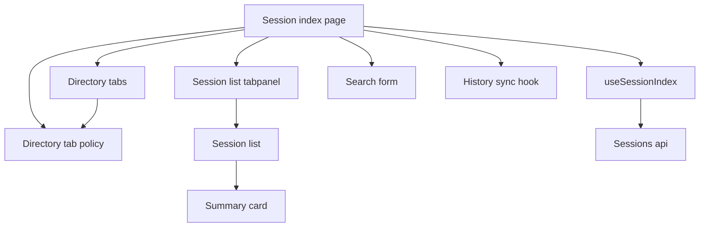
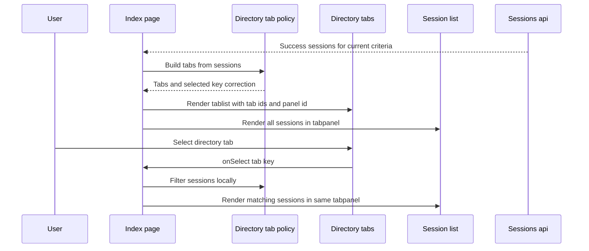

# 設計書

## 概要
この feature は、GitHub Copilot CLI のローカル会話履歴を読み返す利用者に、現在の日付範囲と検索語で取得済みのセッション集合を作業ディレクトリ別に切り替える一覧タブを提供する。利用者は複数プロジェクトの履歴が同じ一覧に混在していても、API 再取得なしで目的の作業ディレクトリへ表示を絞れる。

変更は frontend のセッション一覧成功表示に限定する。`GET /api/sessions` の query / response shape、backend の `cwd` 検索互換性、同期 API、DB schema は変更せず、既存の `SessionSummary.work_context.cwd` を唯一の cwd 根拠として扱う。

### 目標
- 一覧成功状態に `すべて`、作業ディレクトリ別、`ディレクトリ未設定` のタブを表示する。
- タブ切替で取得済み `SessionSummary[]` だけを local filtering し、日付範囲・検索語・一覧取得要求を変更しない。
- `cwd` の trim、欠損値、タブ主ラベルの basename 表示、選択中タブの完全 path 表示、同一 basename の最短一意 context、多数タブを識別可能かつ overflow-safe に扱う。
- クリック / タップ / 左右キー操作、件数を含むアクセシビリティ名、tab と tabpanel の関連付けを提供する。
- 検索 UI の補助説明を、作業ディレクトリは一覧タブで切り替える文脈に更新する。

### 非目標
- backend endpoint、DB schema、API response shape、server-side aggregation、directory summary API の追加・変更。
- cwd 専用 query param、pagination、repository / branch / model 専用 filter、並び替え UI、検索結果スコアリング、検索語ハイライト。
- raw files から新しい cwd 推測値を作ること、legacy session へ cwd を補完すること。
- backend の既存 `cwd` 検索互換性を削除すること。
- タブ選択の URL / localStorage / backend 永続化。

## 境界コミットメント

### この spec が責務を持つもの
- frontend 一覧成功状態の `SessionSummary[]` から作業ディレクトリ別 tab model を導出する presentation utility。
- `cwd?.trim()` 後の値を canonical cwd とし、`null` / 空白値を `ディレクトリ未設定` にまとめる分類規則。
- 選択中 tab key に応じて `SessionList` へ渡す sessions を切り替える page-local state。
- 新しい成功結果で tab を再構築し、選択中 tab が存在しない場合に `すべて` へ補正する state rule。
- タブ列の click / tap / 左右キー操作、選択表示、`tablist` / `tab` / `tabpanel` のアクセシビリティ契約。
- タブ主ラベルは絶対パスではなく `cwd` の最後のディレクトリ名にし、同一 basename は最短一意な親 path context で区別し、選択中タブの完全 path は一覧上部の補助行でも確認できる表示契約。
- 長い path、多い tab、同一 basename でもページ全体の横スクロールやテキスト重なりを起こさない表示契約。
- 検索フォーム補助説明と成功時説明文を、作業ディレクトリ切替タブの文脈に合わせること。
- frontend tests による local filtering、tab accessibility、検索・日付・同期契約維持の回帰防止。

### 境界外
- `GET /api/sessions` の parser / query / presenter / response envelope。
- `CopilotSession` read model、`summary_payload.work_context.cwd`、同期保存契約。
- backend の `search` param が cwd を含む既存互換性の削除または意味変更。
- server-side cwd 集計、cwd filter endpoint、pagination-aware tab summary。
- 検索語や日付範囲の URL persistence、tab state persistence、詳細画面への tab state 伝播。
- session card の metadata 表示方針そのものの再設計。

### 許可する依存
- frontend `SessionSummary` / `WorkContext` 型と `work_context.cwd`。
- `useSessionIndex` が返す `state.status === 'success'` の `sessions`、`appliedRange`、`appliedSearchTerm`。
- `SessionIndexPage`、`SessionList`、`SessionSearchForm`、`SessionEmptyState`、`StatusPanel`。
- 既存 date / search presentation helpers と criteria label。
- React 19、TypeScript 6、Tailwind CSS 4、Vitest / Testing Library。新規外部依存は追加しない。

### 再検証トリガー
- `SessionSummary.work_context.cwd` の field 名、nullable semantics、trim 方針、basename 抽出方針、または API response shape が変わる。
- `GET /api/sessions` に pagination、server-side cwd filter、directory summary endpoint が追加される。
- 検索条件を URL / localStorage / backend に永続化する設計が追加される。
- タブ選択を route state、detail link、または共有 URL と連動させる要求が追加される。
- `SessionList` の表示順、sorting、virtualization、または grouping 方針が変わる。
- frontend design system に tabs component が導入され、ARIA tabs 実装を共通化する場合。

## アーキテクチャ

### 既存アーキテクチャ分析
`useSessionIndex` は日付範囲と検索語を applied criteria として保持し、`fetchSessionIndex` へ `from` / `to` / `search` を渡す。成功時だけ `state.sessions` を返し、loading / empty / error では session list data を持たない。同期後 refresh は `useHistorySync({ reloadSessions })` が現在の criteria を維持して再取得する。

`SessionIndexPage` は date form、search form、sync control、state panel、`SessionList` を統合している。既存 `SessionList` は受け取った `SessionSummary[]` の順序を保って card を描画するだけなので、作業ディレクトリ別の表示切替は page で選択 state を持ち、presentation utility で filtered sessions を導出する構成が既存責務に合う。

### アーキテクチャパターンと境界マップ



**アーキテクチャ統合**:
- 採用パターン: frontend local projection。取得済み `SessionSummary[]` から tab model と表示対象 sessions を導出する。
- 依存方向:
  - `sessionApi.types` → `sessionDirectoryTabs` → `SessionDirectoryTabs` → `SessionIndexPage` → `SessionList`
  - `sessionIndexCriteria` / `sessionDateFilter` → `SessionIndexPage` → `SessionSearchForm`
- 維持する既存パターン: API client と hook は date/search criteria の所有に集中し、presentation-only tab selection を API criteria に混ぜない。
- 新規 component rationale: `sessionDirectoryTabs.ts` は分類・label・件数・filtering contract を testable にし、`SessionDirectoryTabs.tsx` は ARIA tabs と keyboard interaction に責務を限定する。tab と list 領域の関連付けは `SessionIndexPage` が安定 id を渡し、filtered `SessionList` を `tabpanel` 領域内に置くことで担う。
- ステアリング適合: frontend sessions feature slice 内に閉じ、新規 backend 依存や外部 UI library を増やさない。

### 技術スタック

| レイヤー | 選択 / バージョン | feature での役割 | 備考 |
|----------|--------------------|------------------|------|
| Frontend UI | React 19 / TypeScript 6 | selected tab state、tab component、success-state composition | `any` は使わない |
| Presentation | TypeScript utility | cwd 正規化、tab model、filtered sessions 導出 | 新規外部依存なし |
| Styling | Tailwind CSS 4 | tablist local scroll、truncate、selected state、focus ring | ページ全体の横スクロールを避ける |
| Backend / API | 既存 Rails API response | `work_context.cwd` の提供元 | endpoint / shape 変更なし |
| Tests | Vitest / Testing Library | utility、component、page behavior の固定 | test case 直前コメント規約を守る |

## ファイル構成計画

### ディレクトリ構成
```text
frontend/
├── src/
│   └── features/
│       └── sessions/
│           ├── presentation/
│           │   └── sessionDirectoryTabs.ts             # cwd 正規化、basename label、tab model、filtering を定義する
│           ├── components/
│           │   ├── SessionDirectoryTabs.tsx            # ARIA tablist、click、左右キー、overflow-safe 表示を担う
│           │   ├── SessionSearchForm.tsx               # 検索補助説明を cwd tab 文脈へ更新する
│           │   └── SessionList.tsx                     # filtered sessions を既存順で描画する
│           └── pages/
│               └── SessionIndexPage.tsx                # success state で tab model を導出し selected tab を補正する
└── tests/
    └── features/
        └── sessions/
            ├── presentation/
            │   └── sessionDirectoryTabs.test.ts        # basename label、tab grouping、未設定、同一 basename、filtering を検証する
            ├── components/
            │   ├── SessionDirectoryTabs.test.tsx       # 操作、選択状態、アクセシビリティ名、長い path 表示を検証する
            │   └── SessionSearchForm.test.tsx          # 検索補助説明の文脈を検証する
            └── pages/
                └── SessionIndexPage.test.tsx           # no-fetch tab switching、条件変更後補正、empty/error 非表示を検証する
```

### 変更対象ファイル
- `frontend/src/features/sessions/pages/SessionIndexPage.tsx` — success state で `buildSessionDirectoryTabs(state.sessions)` を呼び、selected tab key を page-local state として保持する。新しい成功結果で選択 key が消えた場合は `all` に補正し、`getSessionsForDirectoryTab()` の結果を `SessionList` へ渡す。filtered `SessionList` は `role="tabpanel"` の領域に置き、選択中 tab の `id` と `aria-labelledby` で関連付ける。選択中 tab が directory の場合は、list 上部に完全 path を表示する補助行を置く。loading / empty / error では `SessionDirectoryTabs` を描画しない。検索成功時の説明文には「作業ディレクトリは一覧タブで切り替えられる」文脈を含める。
- `frontend/src/features/sessions/components/SessionSearchForm.tsx` — 補助説明から「実行ディレクトリを検索対象」とする案内を外し、検索結果を一覧タブで作業ディレクトリ別に切り替える案内へ更新する。
- `frontend/tests/features/sessions/pages/SessionIndexPage.test.tsx` — success state で tabs と件数が表示されること、tab click が追加 fetch / search / range apply を呼ばず list だけを切り替えること、検索語ありの success でも検索済み集合から tabs を作ること、選択中 tab が新しい成功結果にない場合 `すべて` に補正されること、tab と tabpanel が id / aria で関連付くこと、選択中 directory の完全 path 補助行が表示されること、loading / empty / error では tabs を表示しないことを検証する。
- `frontend/tests/features/sessions/components/SessionSearchForm.test.tsx` — 検索補助説明が cwd を検索対象として案内せず、作業ディレクトリ切替は一覧タブで行う文脈になっていることを検証する。

### 作成するファイル
- `frontend/src/features/sessions/presentation/sessionDirectoryTabs.ts` — `SessionDirectoryTab`、`SessionDirectoryTabKey`、`buildSessionDirectoryTabs()`、`getSessionsForDirectoryTab()`、`coerceDirectoryTabKey()` を定義する。`cwd?.trim()` を canonical cwd とし、directory tab の主 `label` は canonical cwd の最後のディレクトリ名にする。`null` / 空白は `unset` にまとめる。directory tab は現在の sessions に初出した順で並べ、`all` を先頭、`unset` を最後に置く。同一 basename の directory tabs には、重複 group 内で `contextLabel + "/" + label` が一意になる最短の親 path suffix を `contextLabel` として付与する。
- `frontend/tests/features/sessions/presentation/sessionDirectoryTabs.test.ts` — `すべて` 件数、trim 後 cwd の grouping、未設定 grouping、同一 basename の最短一意 context、既存相対順を保つ filtering、存在しない selected key の `all` 補正を検証する。
- `frontend/src/features/sessions/components/SessionDirectoryTabs.tsx` — `tabs`、`selectedKey`、`panelId`、`getTabId`、`onSelect` を props とする presentational component。`role="tablist"`、各 button の `role="tab"`、安定した `id`、`aria-selected`、`aria-controls={panelId}`、件数入り `aria-label`、左右キー selection、selected tab への focus を扱う。tablist container は local horizontal scroll を持つ。
- `frontend/tests/features/sessions/components/SessionDirectoryTabs.test.tsx` — click / tap 相当、ArrowRight / ArrowLeft、selected visual state、`aria-selected`、tablist label、`aria-controls`、長い path の `title` / `aria-label`、未設定 tab の accessible name を検証する。

## システムフロー



この flow では tab selection は API に戻らない。日付範囲、検索語、同期後 refresh によって `Api-->>Page` の成功 sessions が入れ替わった場合だけ、page が tab model を再導出する。

## 要件トレーサビリティ

| Requirement | Summary | Components | Interfaces | Flows |
|-------------|---------|------------|------------|-------|
| 1.1 | 成功状態で `すべて` と cwd 別 tabs を表示 | `SessionIndexPage`, `SessionDirectoryTabs`, `sessionDirectoryTabs` | Tab state | Success tab rendering |
| 1.2 | `すべて` は全 sessions を既存順で表示 | `sessionDirectoryTabs`, `SessionList` | Filter contract | Local filtering |
| 1.3 | cwd tab は該当 sessions を相対順維持で表示 | `sessionDirectoryTabs`, `SessionList` | Filter contract | Local filtering |
| 1.4 | `null` / 空白 cwd を未設定 tab に含める | `sessionDirectoryTabs`, `SessionDirectoryTabs` | Tab model | Tab build |
| 1.5 | 各 tab に件数を表示 | `sessionDirectoryTabs`, `SessionDirectoryTabs` | Tab model | Tab rendering |
| 2.1 | 前後空白を除いた cwd で扱う | `sessionDirectoryTabs` | Normalization contract | Tab build |
| 2.2 | 同じ normalized cwd を 1 tab にまとめる | `sessionDirectoryTabs` | Tab model | Tab build |
| 2.3 | タブ主ラベルは最後のディレクトリ名を表示し full path も確認可能 | `sessionDirectoryTabs`, `SessionDirectoryTabs`, `SessionIndexPage` | Label / aria / selected summary contract | Tab rendering |
| 2.4 | 同一 basename を区別できる文脈を提供 | `sessionDirectoryTabs`, `SessionDirectoryTabs` | Shortest unique context contract | Tab rendering |
| 2.5 | 未設定 tab の表示名とアクセシビリティ名 | `sessionDirectoryTabs`, `SessionDirectoryTabs` | Label / aria contract | Tab rendering |
| 3.1 | tab 切替は条件変更・追加 fetch なし | `SessionIndexPage`, `SessionDirectoryTabs` | Page state | Local filtering |
| 3.2 | 日付 / 検索適用後に tabs 再構築 | `SessionIndexPage`, `sessionDirectoryTabs` | Success state | Success rebuild |
| 3.3 | 同期後 refresh 成功で tabs 再構築 | `SessionIndexPage`, `useSessionIndex` | Success state | Success rebuild |
| 3.4 | 選択中 tab が消えたら `すべて` へ補正 | `SessionIndexPage`, `sessionDirectoryTabs` | Coercion contract | Success rebuild |
| 3.5 | loading / empty / error では tabs 非表示 | `SessionIndexPage` | State rendering | State branch |
| 4.1 | click / tap で tab 選択 | `SessionDirectoryTabs`, `SessionIndexPage` | `onSelect` | Tab interaction |
| 4.2 | 左右キーで隣接 tab へ移動 | `SessionDirectoryTabs` | Keyboard contract | Tab interaction |
| 4.3 | 視覚と支援技術へ選択状態を伝達 | `SessionDirectoryTabs`, `SessionIndexPage` | `aria-selected`, tabpanel relation | Tab rendering |
| 4.4 | tablist と tab に範囲・件数の accessible name | `SessionDirectoryTabs`, `SessionIndexPage` | Aria contract, tabpanel label relation | Tab rendering |
| 4.5 | 長い path / 多い tabs で横スクロールや重なりを防ぐ | `SessionDirectoryTabs` | Layout contract | Tab rendering |
| 5.1 | 検索結果集合だけから tabs 構築 | `SessionIndexPage`, `sessionDirectoryTabs` | Success state | Success rebuild |
| 5.2 | 検索中 `すべて` は検索結果全件 | `SessionIndexPage`, `sessionDirectoryTabs` | Filter contract | Local filtering |
| 5.3 | 検索中 cwd tab は検索結果内の該当 sessions | `SessionIndexPage`, `sessionDirectoryTabs` | Filter contract | Local filtering |
| 5.4 | 検索補助説明を cwd tab 文脈へ更新 | `SessionSearchForm` | Copy contract | Search UI |
| 5.5 | 検索 empty は既存 empty 表示で tabs 非表示 | `SessionIndexPage`, `SessionEmptyState` | State rendering | State branch |
| 6.1 | date/search/sync/loading/empty/error 契約維持 | `SessionIndexPage`, `useSessionIndex` | State contract | State branch |
| 6.2 | API response shape を変更しない | `sessionDirectoryTabs`, `SessionIndexPage` | `SessionSummary` input | Success rebuild |
| 6.3 | summary endpoint / server aggregation / pagination 不要 | `SessionIndexPage` | No API contract | Local filtering |
| 6.4 | `work_context.cwd` を唯一の cwd 根拠にする | `sessionDirectoryTabs` | Normalization contract | Tab build |
| 6.5 | backend 検索契約を frontend で変更しない | `SessionSearchForm`, `SessionIndexPage` | Search criteria contract | Search UI |

## コンポーネントとインターフェース

| Component | Domain / Layer | Intent | Req Coverage | Key Dependencies | Contracts |
|-----------|----------------|--------|--------------|------------------|-----------|
| `sessionDirectoryTabs` | Presentation utility | 成功 sessions から tab model と filtered sessions を導出する | 1.1, 1.2, 1.3, 1.4, 1.5, 2.1, 2.2, 2.3, 2.4, 2.5, 3.2, 3.3, 3.4, 5.1, 5.2, 5.3, 6.2, 6.3, 6.4 | `SessionSummary` P0 | Service |
| `SessionDirectoryTabs` | UI component | ARIA tabs と keyboard / overflow-safe 表示を提供する | 1.1, 1.5, 2.3, 2.4, 2.5, 4.1, 4.2, 4.3, 4.4, 4.5 | `sessionDirectoryTabs` P0 | State |
| `SessionIndexPage` | Page orchestration | success state だけで tabs を表示し、selected key を補正して list を切り替える | 1.1, 1.2, 1.3, 1.4, 1.5, 3.1, 3.2, 3.3, 3.4, 3.5, 5.1, 5.2, 5.3, 5.4, 5.5, 6.1, 6.2, 6.3, 6.4, 6.5 | `useSessionIndex` P0, `SessionDirectoryTabs` P0, `SessionList` P0 | State |
| `SessionSearchForm` | UI component | 検索説明を cwd tab 文脈へ合わせる | 5.4, 6.5 | `sessionIndexCriteria` P1 | Presentation |

### Presentation

#### `sessionDirectoryTabs`

| Field | Detail |
|-------|--------|
| Intent | `SessionSummary[]` を作業ディレクトリ別 tabs と表示対象 sessions に変換する |
| Requirements | 1.1, 1.2, 1.3, 1.4, 1.5, 2.1, 2.2, 2.4, 2.5, 3.2, 3.3, 3.4, 5.1, 5.2, 5.3, 6.2, 6.3, 6.4 |

**Responsibilities & Constraints**
- `work_context.cwd` だけを cwd 根拠として読み、`trim()` 後の空文字は未設定として扱う。
- `all` tab を常に先頭に置く。directory tabs は現在の sessions に初出した normalized cwd の順で並べる。`unset` tab は未設定 sessions がある場合だけ最後に置く。
- filtered sessions は input sessions の相対順を維持する。
- directory tab の `label` は canonical cwd の最後のディレクトリ名とし、`/Users/osabekenta/myStudy/copilot-cli-history` は `copilot-cli-history` と表示する。
- 同一 basename が複数ある場合、tab model に識別用の親 path context を含める。`contextLabel` は重複 basename group の中で `contextLabel + "/" + label` が一意になる最短の親 path suffix とする。1 segment で一意にならない場合は 2 segment、3 segment と増やし、親 path が尽きる場合は full parent path を使う。
- API request、URL mutation、localStorage mutation は行わない。

**Contracts**: Service [x] / API [ ] / Event [ ] / Batch [ ] / State [ ]

##### Service Interface
```typescript
type SessionDirectoryTabKey = 'all' | 'unset' | `cwd:${string}`

interface SessionDirectoryTab {
  key: SessionDirectoryTabKey
  kind: 'all' | 'directory' | 'unset'
  label: string
  contextLabel: string | null
  fullPath: string | null
  count: number
}

interface SessionDirectoryTabBuildResult {
  tabs: readonly SessionDirectoryTab[]
}

function buildSessionDirectoryTabs(
  sessions: readonly SessionSummary[],
): SessionDirectoryTabBuildResult

function getSessionsForDirectoryTab(
  sessions: readonly SessionSummary[],
  selectedKey: SessionDirectoryTabKey,
): readonly SessionSummary[]

function coerceDirectoryTabKey(
  selectedKey: SessionDirectoryTabKey,
  tabs: readonly SessionDirectoryTab[],
): SessionDirectoryTabKey
```
- Preconditions: `sessions` は現在の成功状態に対応する `SessionSummary[]` である。
- Postconditions: `tabs[0].key === 'all'`、`all.count === sessions.length`、存在しない selected key は `coerceDirectoryTabKey()` で `all` になる。
- Invariants: `null` / 空白 cwd は `unset` に含まれる。directory key は normalized cwd ごとに一意である。directory tab の `label` は full path ではなく basename である。basename が重複しない directory tab の `contextLabel` は `null`、重複する directory tab の `contextLabel` は同一 basename group 内で一意な親 path suffix である。

### UI

#### `SessionDirectoryTabs`

| Field | Detail |
|-------|--------|
| Intent | tab model を操作可能な作業ディレクトリ別 tablist として描画する |
| Requirements | 1.1, 1.5, 2.3, 2.4, 2.5, 4.1, 4.2, 4.3, 4.4, 4.5 |

**Responsibilities & Constraints**
- `role="tablist"` に、現在の一覧範囲と総件数が分かる `aria-label` を付ける。
- 各 tab は `role="tab"`、安定した `id`、`aria-selected`、`aria-controls`、`tabIndex` を持つ button として描画する。
- click / tap と ArrowLeft / ArrowRight は `onSelect(nextKey)` を呼ぶ。左右キーは端で循環する。
- visible label は basename である `label`、件数、必要に応じて `contextLabel` を表示する。full path は `title` と `aria-label` に含める。ただし `title` だけに依存せず、選択中 directory の full path は parent の tabpanel 直前の補助行にも表示する。
- tablist は `max-w-full overflow-x-auto` を持つ local scroll 領域にし、button 内 label は truncate / max width で重なりを防ぐ。

**Contracts**: Service [ ] / API [ ] / Event [ ] / Batch [ ] / State [x]

##### State Management
- State model: selected key は parent の `SessionIndexPage` が所有する。
- Persistence & consistency: URL、localStorage、backend へ永続化しない。
- Concurrency strategy: `tabs` prop が変わった場合、存在しない selected key の補正は parent が行う。

##### Component Interface
```typescript
interface SessionDirectoryTabsProps {
  tabs: readonly SessionDirectoryTab[]
  selectedKey: SessionDirectoryTabKey
  panelId: string
  getTabId: (key: SessionDirectoryTabKey) => string
  onSelect: (key: SessionDirectoryTabKey) => void
}
```
- `panelId` は `SessionIndexPage` が所有する stable id であり、全 tab の `aria-controls` と tabpanel の `id` を一致させる。
- `getTabId(selectedKey)` は選択中 tab の `id` を返し、tabpanel の `aria-labelledby` と一致させる。

#### `SessionIndexPage`

| Field | Detail |
|-------|--------|
| Intent | 一覧成功状態で cwd tabs を統合し、表示対象 sessions を切り替える |
| Requirements | 1.1, 1.2, 1.3, 1.4, 1.5, 3.1, 3.2, 3.3, 3.4, 3.5, 5.1, 5.2, 5.3, 5.5, 6.1, 6.2, 6.3, 6.5 |

**Responsibilities & Constraints**
- `state.status === 'success'` のときだけ tabs を導出・表示する。
- `selectedDirectoryTabKey` を page-local state として保持し、success sessions が変わったら `coerceDirectoryTabKey()` で補正する。
- `SessionList` には selected key に対応する filtered sessions を渡す。
- filtered sessions 領域は `role="tabpanel"`、安定した `id`、`aria-labelledby={getTabId(selectedDirectoryTabKey)}` を持つ wrapper で包む。
- selected tab が directory の場合、tabpanel の直前に `作業ディレクトリ: {fullPath}` を表示する補助行を置く。`all` の場合は現在条件の全件表示、`unset` の場合は未設定 directory の表示であることを示し、directory full path と誤認させない。
- tab selection では `applyRange`、`applySearch`、`reloadSessions`、`fetchSessionIndex` を呼ばない。
- loading / empty / error の既存状態表示、検索 empty 表示、検索条件 error 表示を維持する。

**Contracts**: Service [ ] / API [ ] / Event [ ] / Batch [ ] / State [x]

##### State Management
- State model: `selectedDirectoryTabKey: SessionDirectoryTabKey`。初期値は `all`。
- Persistence & consistency: 成功結果ごとに tabs を再構築し、key が存在しない場合は `all` へ戻す。
- Concurrency strategy: API request の stale handling は既存 `useSessionIndex` に委譲し、page は最新の success state だけを使う。

## データモデル

### Domain Model
- `SessionSummary`: API 由来の既存 read-only summary。変更しない。
- `SessionDirectoryTab`: frontend presentation value object。basename の tab 表示名、件数、full path、同一 basename 用の最短一意 `contextLabel`、内部 key を持つ。
- `SessionDirectoryTabKey`: page-local selection key。API query には含めない。

### Data Contracts & Integration
- API request / response contract は変更しない。
- cwd の根拠は `SessionSummary.work_context.cwd` のみである。
- `cwd` 正規化は frontend 表示用の `trim()` に限定し、backend read model の値を書き換えない。

## エラーハンドリング

### Error Strategy
- loading / empty / error は既存 `SessionIndexPage` の状態分岐を維持し、tabs を表示しない。
- `SessionDirectoryTabs` に空 tabs は渡さない。success state で sessions が存在する場合、少なくとも `all` tab が存在する。
- selected key が tabs に存在しない場合は user-facing error にせず、`all` へ補正する。

### Monitoring
この feature は frontend local state のみで動作し、新しい backend logging や monitoring は追加しない。回帰検知は Vitest / Testing Library による utility、component、page tests で行う。

## テスト戦略

### Unit Tests
- `sessionDirectoryTabs.test.ts`: `cwd` 前後空白を trim し、同じ normalized cwd を 1 tab にまとめることを検証する。対象: 2.1, 2.2。
- `sessionDirectoryTabs.test.ts`: `null` / 空白 cwd を `ディレクトリ未設定` tab に含め、全件 tab と件数を正しく出すことを検証する。対象: 1.4, 1.5, 2.5。
- `sessionDirectoryTabs.test.ts`: `/Users/osabekenta/myStudy/copilot-cli-history` の tab label が `copilot-cli-history` になることを検証する。対象: 2.3。
- `sessionDirectoryTabs.test.ts`: 同一 basename の異なる path に最短一意の `contextLabel` を付け、1 segment で衝突する場合は必要な親 segment 数を増やし、filtered sessions の相対順を維持することを検証する。対象: 1.3, 2.4。
- `sessionDirectoryTabs.test.ts`: 存在しない selected key が `all` へ補正されることを検証する。対象: 3.4。

### Component Tests
- `SessionDirectoryTabs.test.tsx`: click / tap 相当で selected tab が切り替わり、`aria-selected`、`aria-controls`、visual class が更新されることを検証する。対象: 4.1, 4.3。
- `SessionDirectoryTabs.test.tsx`: ArrowRight / ArrowLeft で隣接 tab へ選択が移り、端では循環することを検証する。対象: 4.2。
- `SessionDirectoryTabs.test.tsx`: visible label には basename と必要な `contextLabel`、accessible name には対象範囲、full path、件数が含まれることを検証する。対象: 2.3, 2.4, 4.4。
- `SessionDirectoryTabs.test.tsx`: 長い path は `title` / truncate 用 class を持ち、未設定 tab は未設定状態が分かる名前を持つことを検証する。対象: 2.3, 2.5, 4.5。
- `SessionSearchForm.test.tsx`: 補助説明が実行ディレクトリ検索ではなく、一覧タブでの作業ディレクトリ切替を案内することを検証する。対象: 5.4, 6.5。

### Page / Integration Tests
- `SessionIndexPage.test.tsx`: success state で tabs が表示され、`すべて` は全 sessions、cwd tab は該当 sessions だけを既存順で表示し、tabpanel が選択中 tab の `id` で label 付けされることを検証する。対象: 1.1, 1.2, 1.3, 4.3, 4.4。
- `SessionIndexPage.test.tsx`: tab 切替時に `applyRange`、`applySearch`、`reloadSessions` が呼ばれず、日付範囲と検索語の表示が変わらず、選択中 directory の完全 path 補助行が更新されることを検証する。対象: 2.3, 3.1, 6.1。
- `SessionIndexPage.test.tsx`: 検索語が適用された success state では検索済み sessions だけから tabs が作られ、`すべて` と cwd tab が検索結果内で切り替わることを検証する。対象: 5.1, 5.2, 5.3。
- `SessionIndexPage.test.tsx`: 新しい success state で選択中 tab が存在しない場合、`すべて` に補正されることを検証する。対象: 3.2, 3.3, 3.4。
- `SessionIndexPage.test.tsx`: loading / empty / error と検索 empty では tabs が表示されず、既存 state panel / empty state が維持されることを検証する。対象: 3.5, 5.5, 6.1。

## セキュリティ考慮
- cwd は既存 API が返すローカル path metadata であり、本 feature は新しい送信先や永続化先を追加しない。
- full path は既存一覧 card と同じ画面内で表示・aria 化する。外部共有、clipboard、自動送信は追加しない。

## パフォーマンスとスケーラビリティ
- tab 構築は現在取得済み `SessionSummary[]` に対する O(n) 処理である。タブ切替時の filtering も O(n) で、追加 network / DB 負荷はない。
- 多数 tabs は tablist 内 local horizontal scroll で扱う。pagination や virtualization が導入された場合は、取得済み集合だけを対象にする現設計を再検証する。
