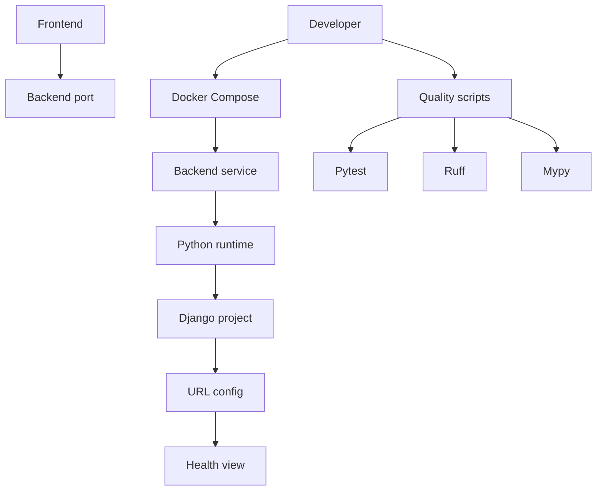
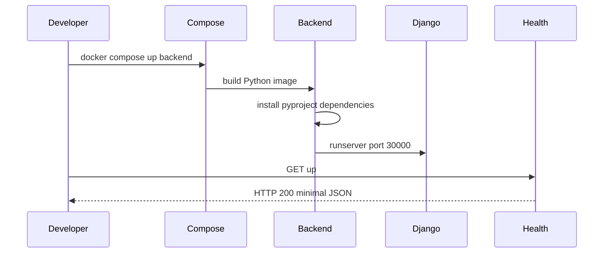
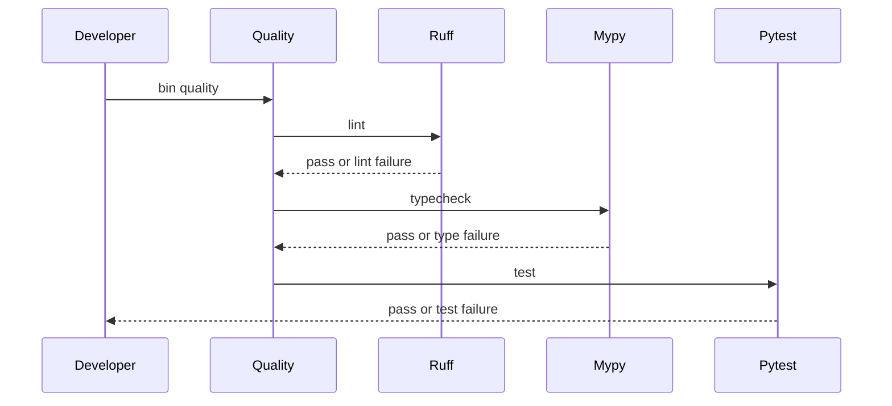
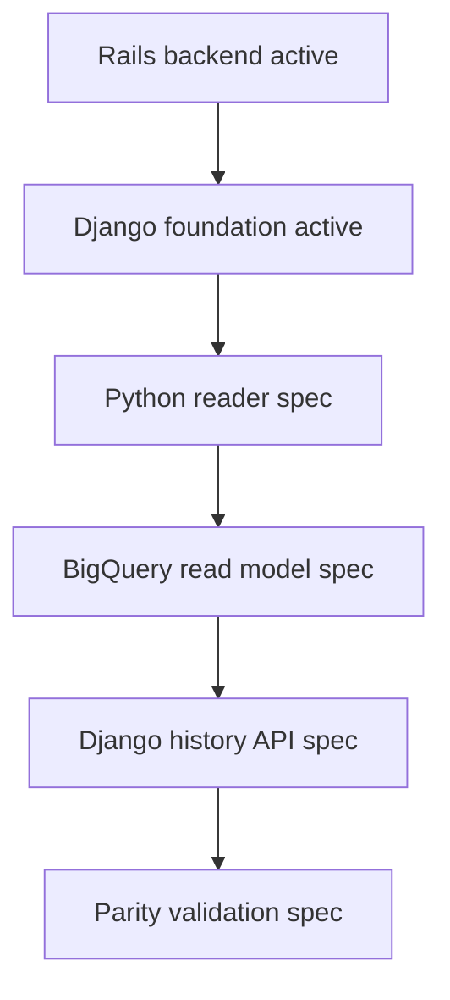

# Design Document

## Overview
この feature は、Rails API + MySQL から Django / BigQuery へ段階移行するために、`backend/` の active runtime を Django 5.2 / Python 3.14 の開発基盤へ切り替える。対象利用者は、後続の Python reader、BigQuery read model、Django history API を実装する移行開発者である。

変更の中心は Docker Compose の backend service、Django project の最小構成、`GET /up` health endpoint、Python dependency / settings / routing / pytest / ruff / mypy / docs の入口である。この spec は runtime foundation を所有し、履歴同期 API、セッション API、BigQuery 接続、Rails / MySQL stack の全面削除は所有しない。

### Goals
- `docker compose up --build backend` で Python 3.14 / Django 5.2 系の backend を `localhost:30000` に起動する。
- `GET /up` で backend 詳細やローカル履歴情報を含まない最小 health response を返す。
- `backend/pyproject.toml` と `backend/bin/*` に dependency、test、lint、type check、quality check の標準入口を置く。
- 後続 Django specs が追加先として使える project package、settings、URLconf、pytest-django 設定を用意する。

### Non-Goals
- BigQuery schema、BigQuery client、Django ORM 永続化先としての BigQuery 設定。
- Copilot 履歴 reader の Python 移植。
- `POST /api/history/sync`、`GET /api/sessions`、`GET /api/sessions/:id` の Django 実装。
- Rails / MySQL stack の全面削除、既存 read model migration、既存 API parity validation。
- Django admin、auth、session middleware を使う user-facing 機能。

## Boundary Commitments

### This Spec Owns
- Docker Compose の backend service が Django backend として起動する active runtime。
- Python 3.14 / Django 5.2.8+ の dependency 宣言、インストール入口、runtime 識別入口。
- Django project package、development / test settings、root URLconf、WSGI / ASGI module の最小構成。
- `GET /up` の route、view、HTTP 200、最小 JSON response contract。
- pytest / pytest-django、ruff、mypy / django-stubs、quality wrapper の設定と実行入口。
- backend 起動、health check、test、lint、type check、quality check、対象外 API を説明する docs。

### Out of Boundary
- BigQuery を Django の database backend または通常永続化先として設定すること。
- raw Copilot 履歴 files の読取、正規化、同期、検索、read model 更新。
- history sync / sessions API の route、view、presenter、contract 移植。
- frontend の機能改修、API base URL の変更、UI の compatibility shim。
- MySQL service、Rails files、既存 schema の完全撤去を移行完了として扱うこと。
- 認証、認可、Django admin、外部公開向け hardening。

### Allowed Dependencies
- Docker / Docker Compose をローカル開発の正本として使う。
- Python 3.14 系 Docker image と `pip` / `pyproject.toml` による backend dependency install。
- Django `>=5.2.8,<5.3`、pytest、pytest-django、ruff、mypy、django-stubs。
- 既存 frontend の `VITE_API_BASE_URL=http://localhost:30000` と backend host port `30000`。
- `.kiro/steering/` の raw files 正本、段階移行、テストコメント規約。

### Revalidation Triggers
- backend host port、health path、health response shape、Compose service name が変わる。
- Python major/minor、Django minor、dependency manager、quality command 名が変わる。
- Django settings module 名、project package path、URLconf の配置が変わる。
- `/up` 以外の API をこの foundation spec に追加する。
- backend が MySQL / BigQuery / raw files を runtime 必須条件にする。

## Architecture

### Existing Architecture Analysis
- 現行 backend は Rails API mode、Ruby 4、Rails 8.1、RSpec、MySQL 接続を前提にしている。
- `docker-compose.yml` の backend service は `localhost:30000` を公開し、frontend は `VITE_API_BASE_URL=http://localhost:30000` に接続する。
- 既存 Rails route は `/up`、`POST /api/history/sync`、`GET /api/sessions`、`GET /api/sessions/:id` を持つが、この spec では `/up` だけを Django foundation の完了条件にする。
- backend tests には test case 直前の `概要・目的`、`テストケース`、`期待値` コメント規約が既に適用されている。

### Architecture Pattern & Boundary Map



**Architecture Integration**:
- Selected pattern: minimal Django foundation。Django project package と health app だけを作り、API domain や persistence abstraction は後続 spec まで導入しない。
- Dependency direction: `pyproject.toml` → `backend_config.settings` → `backend_config.urls` → `health.views` → `tests` / `bin`。Django app code は Compose や shell wrapper に依存しない。
- Existing patterns preserved: Docker Compose を開発の正本にし、frontend API base URL と backend port を維持する。
- New components rationale: `health` app は `/up` の contract を隔離し、後続 history API app と混ぜない。`bin/*` は品質入口の名前と失敗種別を固定する。
- Steering compliance: raw files は一次ソースのまま扱い、この spec では読取も DB 化もしない。仕様駆動の段階移行境界を維持する。

### Technology Stack

| Layer | Choice / Version | Role in Feature | Notes |
|-------|------------------|-----------------|-------|
| Backend / Services | Python `>=3.14,<3.15`, Django `>=5.2.8,<5.3` | Django backend runtime、settings、routing、health view | Django 5.2 の Python 3.14 対応下限を反映 |
| Backend Quality | pytest, pytest-django, ruff, mypy, django-stubs | test、Django integration test、lint、型チェック | `backend/pyproject.toml` に設定集約 |
| Data / Storage | SQLite development / test default | Django system check と test DB の最小構成 | BigQuery / MySQL はこの spec の永続化先にしない |
| Infrastructure / Runtime | Docker Compose, `Dockerfile.backend`, host port `30000` | backend service 起動と検証入口 | frontend の API base URL を維持 |

## File Structure Plan

### Directory Structure
```text
backend/
├── pyproject.toml                         # Python dependency、pytest-django、ruff、mypy 設定を集約する
├── manage.py                              # Django management command entrypoint
├── README.md                              # backend 起動、health、test、lint、typecheck、quality、対象外範囲を説明する
├── bin/
│   ├── test                               # python -m pytest の標準入口
│   ├── lint                               # ruff check の標準入口
│   ├── typecheck                          # mypy の標準入口
│   └── quality                            # lint、typecheck、test の順次実行入口
├── backend_config/
│   ├── __init__.py                        # Django project package marker
│   ├── settings.py                        # development / test 共通の最小 settings と環境変数 validation
│   ├── urls.py                            # `/up` を health view に接続する root URLconf
│   ├── asgi.py                            # ASGI application entrypoint
│   └── wsgi.py                            # WSGI application entrypoint
├── health/
│   ├── __init__.py                        # health app package marker
│   ├── apps.py                            # HealthConfig
│   └── views.py                           # `GET /up` の最小 response を返す
└── tests/
    ├── __init__.py                        # pytest package marker
    └── test_health.py                     # `/up` と routing / response contract の pytest-django test
```

### Modified Files
- `docker-compose.yml` — backend service の build / command / volumes / environment を Python / Django 用へ切り替え、host port `30000` と frontend `VITE_API_BASE_URL` を維持する。backend は MySQL health に依存しない。
- `Dockerfile.backend` — Python 3.14 系 base image、必要最小の OS packages、`pip install -e .[dev]` を使う開発 image に切り替える。
- `README.md` — stack table、起動、health、backend test / lint / typecheck / quality のコマンドを Django 前提へ更新し、履歴 API / BigQuery / Rails 削除が対象外であることを記す。
- `.kiro/specs/django-backend-foundation/spec.json` — design 生成状態と timestamp を更新する。

### Retired Active Rails Entrypoints
- `backend/Gemfile`, `backend/Gemfile.lock`, `backend/Rakefile`, `backend/config.ru`, `backend/bin/rails`, `backend/bin/rake`, `backend/bin/ci`, `backend/config/**`, `backend/app/**`, `backend/lib/**`, `backend/spec/**`, `backend/db/**` — active backend runtime から外れる Rails files。実装タスクでは Django foundation と競合する active files を削除または明確に置換する。MySQL service の全面削除と Rails / MySQL migration の完了宣言は別 spec で扱う。
- `backend/Dockerfile` — Rails production image として残すと runtime 識別が曖昧になるため、Django 用に更新するか、この repository の active Compose path では使わないことを docs で明記する。

## System Flows





## Requirements Traceability

| Requirement | Summary | Components | Interfaces | Flows |
|-------------|---------|------------|------------|-------|
| 1.1 | Compose で Django backend を到達可能に起動する | `docker-compose.yml`, `Dockerfile.backend`, `backend_config` | backend service port `30000` | startup flow |
| 1.2 | Python 3.14 / Django 5.2 系として識別できる | `pyproject.toml`, `Dockerfile.backend`, docs | `python --version`, `django-admin --version` | startup flow |
| 1.3 | frontend 接続先を不必要に変えず `/up` へ到達する | `docker-compose.yml`, `backend_config.urls`, `health.views` | `GET /up` | startup flow |
| 1.4 | 起動失敗を終了状態またはログで識別できる | Compose command, Django settings validation | process exit, Django startup logs | startup flow |
| 2.1 | `GET /up` が HTTP 200 を返す | `health.views`, `backend_config.urls` | Health API | startup flow |
| 2.2 | health response に詳細データや履歴情報を含めない | `health.views`, tests | minimal JSON | startup flow |
| 2.3 | smoke test が `/up` 成功を検証する | `tests/test_health.py`, `bin/test` | pytest result | quality flow |
| 2.4 | 履歴同期 API / session API を提供しない | Boundary, URLconf, docs | route inventory | startup flow |
| 3.1 | Python dependency と dev dependency を標準ファイルで確認できる | `pyproject.toml` | project dependencies, optional dev dependencies | quality flow |
| 3.2 | Docker Compose 経由の依存解決入口を提供する | `Dockerfile.backend`, Compose command | `pip install -e .[dev]` | startup flow |
| 3.3 | development / test settings を利用できる | `backend_config.settings`, pytest config | `DJANGO_SETTINGS_MODULE` | quality flow |
| 3.4 | 必須 runtime 設定不足を設定不足として失敗させる | `backend_config.settings` | startup validation error | startup flow |
| 3.5 | BigQuery を通常の Django 永続化先にしない | settings, Boundary | sqlite default DB | startup flow |
| 4.1 | backend test command が pytest を実行する | `bin/test`, `pyproject.toml` | pytest command | quality flow |
| 4.2 | Django test settings を読み込んで検証する | pytest-django config, `backend_config.settings` | `DJANGO_SETTINGS_MODULE` | quality flow |
| 4.3 | health endpoint test が `/up` 成功契約を検証する | `tests/test_health.py` | Django test client | quality flow |
| 4.4 | backend tests にコメント規約を適用する | `tests/test_health.py` | test comments | quality flow |
| 5.1 | backend lint command が style / lint 違反を検出する | `bin/lint`, ruff config | ruff result | quality flow |
| 5.2 | backend type check command が型検査を実行する | `bin/typecheck`, mypy config | mypy result | quality flow |
| 5.3 | backend quality command が lint / typecheck / test をまとめる | `bin/quality` | aggregate command | quality flow |
| 5.4 | 品質失敗の確認種別を識別できる | `bin/*`, docs | command name and exit code | quality flow |
| 6.1 | 起動と検証方法を docs で確認できる | root README, backend README | command reference | startup, quality flow |
| 6.2 | 対象外範囲を docs または仕様境界で確認できる | Boundary, docs | non-goals inventory | none |
| 6.3 | 後続 spec が Django project と test 入口を使える | `backend_config`, `health`, `tests`, `bin/test` | project package and pytest entrypoint | quality flow |
| 6.4 | raw Copilot 履歴 files 正本の原則を変更しない | Boundary, docs, settings | no raw reader in foundation | none |

## Components and Interfaces

| Component | Domain/Layer | Intent | Req Coverage | Key Dependencies | Contracts |
|-----------|--------------|--------|--------------|------------------|-----------|
| Compose Backend Service | Infrastructure | backend service を Django runtime として起動する | 1.1, 1.3, 1.4, 3.2 | Docker Compose P0, `Dockerfile.backend` P0 | Runtime |
| Python Project Configuration | Tooling | dependency と tool 設定を一元化する | 1.2, 3.1, 4.1, 4.2, 5.1, 5.2 | Python 3.14 P0, Django 5.2.8+ P0 | Config |
| Django Settings Package | Backend | development / test で起動可能な settings を提供する | 3.3, 3.4, 3.5, 6.3 | Django P0, environment P1 | Service |
| Health Endpoint | Backend API | `/up` の最小 health contract を提供する | 2.1, 2.2, 2.4 | Django URLconf P0 | API |
| Backend Quality Commands | Tooling | test / lint / typecheck / quality の入口を固定する | 2.3, 4.1, 4.3, 4.4, 5.1, 5.2, 5.3, 5.4 | pytest P0, ruff P0, mypy P0 | Batch |
| Backend Documentation | Documentation | 起動・検証・対象外範囲を後続 spec へ引き継ぐ | 6.1, 6.2, 6.4 | README P1, steering P1 | Docs |

### Infrastructure

#### Compose Backend Service

| Field | Detail |
|-------|--------|
| Intent | Docker Compose の backend service を Django backend として起動する |
| Requirements | 1.1, 1.3, 1.4, 3.2 |

**Responsibilities & Constraints**
- backend service は host `30000` を公開し、frontend の `VITE_API_BASE_URL` を維持する。
- command は dependency install 後に Django development server を `0.0.0.0:30000` で起動する。
- backend service は MySQL healthcheck を起動前提にしない。

**Dependencies**
- Inbound: Developer / frontend — backend port への接続 (P0)
- Outbound: `Dockerfile.backend` — Python image build (P0)
- External: Docker Compose — service orchestration (P0)

**Contracts**: Service [ ] / API [ ] / Event [ ] / Batch [x] / State [ ]

##### Batch / Job Contract
- Trigger: `docker compose up --build backend`
- Input / validation: `backend/pyproject.toml` が存在し、Django settings が import できること。
- Output / destination: `localhost:30000` で Django server が待ち受けること。
- Idempotency & recovery: stale Rails pid や MySQL prepare に依存しない。起動失敗時は process が非ゼロ終了または Django startup error をログに出す。

**Implementation Notes**
- `docker-compose.yml` の mysql service は残してよいが、backend `depends_on: mysql` は削除する。
- `.kiro` や `~/.copilot` mount はこの foundation では必須にしない。後続 reader / sync spec が必要になった時点で再導入する。
- port 変更は frontend と downstream specs の再検証トリガーである。

### Backend Runtime

#### Python Project Configuration

| Field | Detail |
|-------|--------|
| Intent | Python dependency と品質 tool 設定を `pyproject.toml` に固定する |
| Requirements | 1.2, 3.1, 4.1, 4.2, 5.1, 5.2 |

**Responsibilities & Constraints**
- `requires-python = ">=3.14,<3.15"` を宣言する。
- runtime dependency は `Django>=5.2.8,<5.3` を含む。
- dev dependency は pytest、pytest-django、ruff、mypy、django-stubs を含む。
- pytest-django は `DJANGO_SETTINGS_MODULE = "backend_config.settings"` を読む。

**Dependencies**
- Inbound: Dockerfile / quality scripts — install と command execution (P0)
- Outbound: Django / pytest / ruff / mypy — tool execution (P0)
- External: Python packaging / PyPI — dependency resolution (P1)

**Contracts**: Service [ ] / API [ ] / Event [ ] / Batch [x] / State [ ]

##### Batch / Job Contract
- Trigger: Docker build または Compose command の dependency install。
- Input / validation: Python 3.14 runtime、`backend/pyproject.toml`。
- Output / destination: Django runtime と dev tools が backend container で import / execute 可能。
- Idempotency & recovery: 再実行可能な install command とし、失敗時は dependency resolution failure として非ゼロ終了する。

#### Django Settings Package

| Field | Detail |
|-------|--------|
| Intent | Django development / test で共有できる最小 settings を提供する |
| Requirements | 3.3, 3.4, 3.5, 6.3 |

**Responsibilities & Constraints**
- `ROOT_URLCONF = "backend_config.urls"` と health app のみを有効にする。
- `SECRET_KEY` は local development default を許容するが、空文字や明示的な invalid 値は設定不足として失敗させる。
- `DEBUG`、`ALLOWED_HOSTS`、`DJANGO_SETTINGS_MODULE` は local / test の起動に必要な最小値を持つ。
- `DATABASES` は sqlite の最小構成を使い、BigQuery / MySQL を通常永続化先にしない。

**Dependencies**
- Inbound: Django runtime、pytest-django — settings import (P0)
- Outbound: environment variables — local configuration (P1)
- External: Django settings system — configuration loading (P0)

**Contracts**: Service [x] / API [ ] / Event [ ] / Batch [ ] / State [ ]

##### Service Interface
```python
DJANGO_SETTINGS_MODULE = "backend_config.settings"
ROOT_URLCONF = "backend_config.urls"
```
- Preconditions: Python path に `backend/` が含まれ、required local settings が有効である。
- Postconditions: Django app registry と URL resolver が `/up` を解決できる。
- Invariants: BigQuery と raw Copilot files は settings import の必須条件にならない。

### Backend API

#### Health Endpoint

| Field | Detail |
|-------|--------|
| Intent | backend runtime と routing の成立を示す最小 HTTP endpoint を提供する |
| Requirements | 1.3, 2.1, 2.2, 2.4 |

**Responsibilities & Constraints**
- `GET /up` に対して HTTP 200 を返す。
- response は backend 詳細、履歴件数、local path、環境変数値を含めない。
- `/api/history/sync`、`/api/sessions`、`/api/sessions/:id` はこの spec の完了条件として追加しない。

**Dependencies**
- Inbound: frontend / developer smoke test — `GET /up` (P0)
- Outbound: Django `JsonResponse` または `HttpResponse` — response generation (P0)
- External: none

**Contracts**: Service [ ] / API [x] / Event [ ] / Batch [ ] / State [ ]

##### API Contract
| Method | Endpoint | Request | Response | Errors |
|--------|----------|---------|----------|--------|
| GET | `/up` | none | HTTP 200, minimal JSON such as `{"status":"ok"}` | startup / routing failure は HTTP response ではなく server failure |

### Tooling

#### Backend Quality Commands

| Field | Detail |
|-------|--------|
| Intent | test、lint、typecheck、quality の command contract を固定する |
| Requirements | 2.3, 4.1, 4.3, 4.4, 5.1, 5.2, 5.3, 5.4 |

**Responsibilities & Constraints**
- `backend/bin/test` は `python -m pytest` を実行する。
- `backend/bin/lint` は `ruff check .` を実行する。
- `backend/bin/typecheck` は `mypy .` を実行する。
- `backend/bin/quality` は lint、typecheck、test を順に実行し、失敗した command 名で確認種別を識別できる。
- 新規 backend test は各 test case 直前に `概要・目的`、`テストケース`、`期待値` コメントを置く。

**Dependencies**
- Inbound: developer / reviewer — quality commands (P0)
- Outbound: pytest / ruff / mypy — verification engines (P0)
- External: Docker Compose — containerized execution (P1)

**Contracts**: Service [ ] / API [ ] / Event [ ] / Batch [x] / State [ ]

##### Batch / Job Contract
- Trigger: `docker compose run --rm backend bin/test`, `bin/lint`, `bin/typecheck`, `bin/quality`
- Input / validation: Django settings import、source files、tests。
- Output / destination: pass は zero exit、failure は non-zero exit。
- Idempotency & recovery: commands は local source tree に destructive write をしない。

## Data Models

### Domain Model
- この spec は application data model を導入しない。
- Health response は runtime liveness signal であり、履歴 session、sync run、BigQuery row、read model entity を表さない。

### Logical Data Model
- `HealthResponse`
  - `status: str` — fixed value `ok`
- `HealthResponse` は local path、hostname、Python / Django version、履歴件数、DB 状態を含めない。

### Physical Data Model
- Django default database は sqlite の local file または test database に留める。
- migration、BigQuery table、MySQL table、read model schema はこの spec では作成しない。

### Data Contracts & Integration
- API data transfer は `GET /up` の最小 JSON のみである。
- 後続 history API contract は `.kiro/specs/api-contract-fixtures/` と `django-history-api` 側で扱う。

## Error Handling

### Error Strategy
- Dependency install failure は Docker build / Compose command の非ゼロ終了として扱う。
- Django settings import failure は server startup failure として扱い、`GET /up` の degraded response にはしない。
- Health view は外部サービスや DB を確認しないため、通常時に business error を返さない。

### Error Categories and Responses
- User Errors: `/up` 以外の未定義 path は Django の通常 404 とする。この spec は API error envelope を定義しない。
- System Errors: Python dependency、settings、URLconf import、port bind に失敗した場合は backend process を失敗させる。
- Business Logic Errors: なし。履歴同期や session not found は対象外である。

### Monitoring
- `/up` は local smoke test と manual health check の入口であり、本番監視設計は対象外である。
- startup logs は Django の標準 logging と Compose output に出す。

## Testing Strategy

### Unit Tests
- `health.views.up` が HTTP 200 と最小 JSON を返し、履歴情報や local path を含めないことを検証する。対象: 2.1, 2.2。
- `backend_config.urls` が `/up` を health view に解決することを検証する。対象: 1.3, 2.1。
- settings import が BigQuery / MySQL / raw files を必要としないことを検証する。対象: 3.3, 3.5, 6.4。

### Integration Tests
- pytest-django の Django client で `GET /up` が成功することを検証する。対象: 2.3, 4.2, 4.3。
- `python -m django check` 相当の settings / app registry validation が通ることを quality flow に含める。対象: 1.4, 3.4。
- `/api/history/sync`、`/api/sessions`、`/api/sessions/:id` を foundation 完了条件として期待しないことを docs / route inventory で確認する。対象: 2.4, 6.2。

### Command Tests
- `docker compose run --rm backend bin/test` が pytest を実行し、health test を含むことを確認する。対象: 4.1, 4.3。
- `docker compose run --rm backend bin/lint` が ruff check を実行することを確認する。対象: 5.1。
- `docker compose run --rm backend bin/typecheck` が mypy を実行することを確認する。対象: 5.2。
- `docker compose run --rm backend bin/quality` が lint、typecheck、test を順に実行し、失敗時の command 名が分かることを確認する。対象: 5.3, 5.4。

### Documentation Checks
- root README と backend README に起動、health check、test、lint、typecheck、quality の Compose command があることを確認する。対象: 6.1。
- docs に Rails / MySQL 削除、BigQuery 接続、履歴 API 移植、raw files 原則維持が記載されていることを確認する。対象: 6.2, 6.4。

## Security Considerations

- `SECRET_KEY` は local development 用 default を許容するが、外部公開や production secret 管理はこの spec の対象外である。
- `/up` は local health 目的に限定し、version、path、environment、履歴存在情報を返さない。
- CORS、auth、CSRF、session cookie の設計は history API 移植または外部公開 spec で再検証する。

## Performance & Scalability

- `/up` は DB、BigQuery、raw files、network に依存しない constant-time endpoint とする。
- Docker startup は dependency install を含む開発利便性優先の設計であり、production image 最適化は対象外である。

## Migration Strategy



- Phase 1: backend service の active runtime を Django foundation に切り替え、`/up` と quality commands を確認する。
- Phase 2: Python reader と BigQuery read model を Django backend 配下へ追加する。
- Phase 3: contract fixtures に従って Django history API を実装し、Rails parity を検証する。
- Rollback trigger: Django backend が Compose で起動しない、`/up` が port `30000` で確認できない、quality command が再現不能な場合は foundation 実装を修正する。
