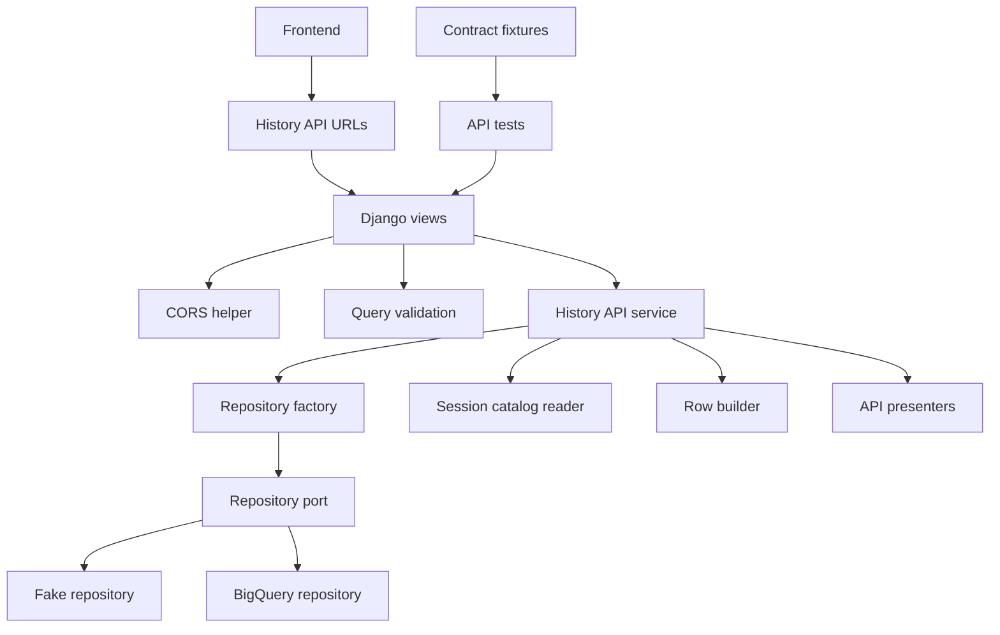
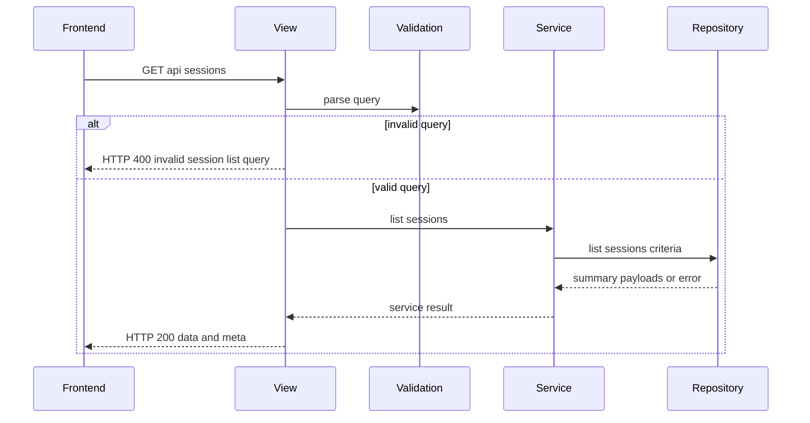
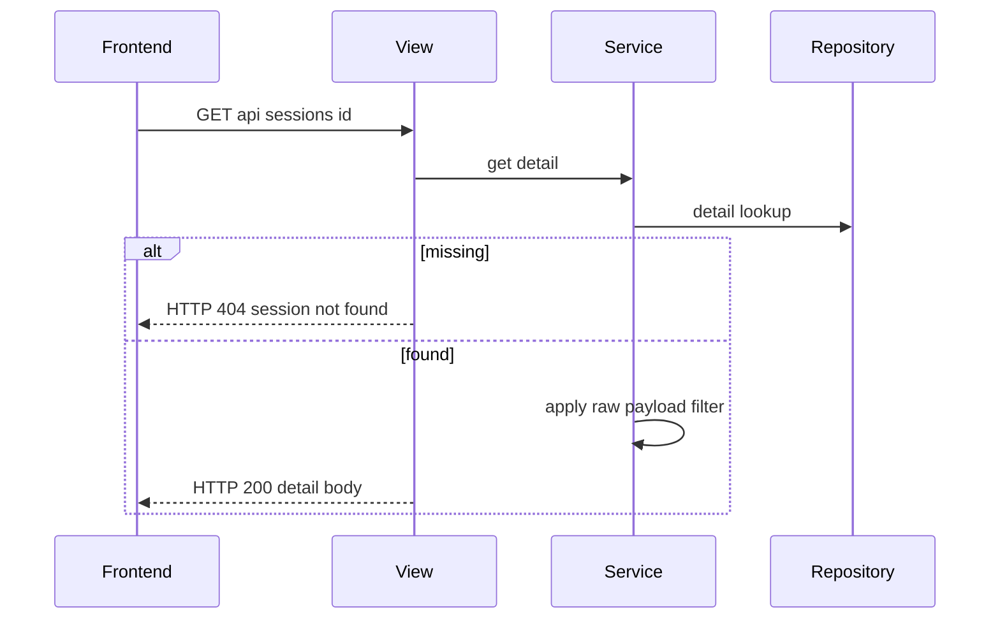
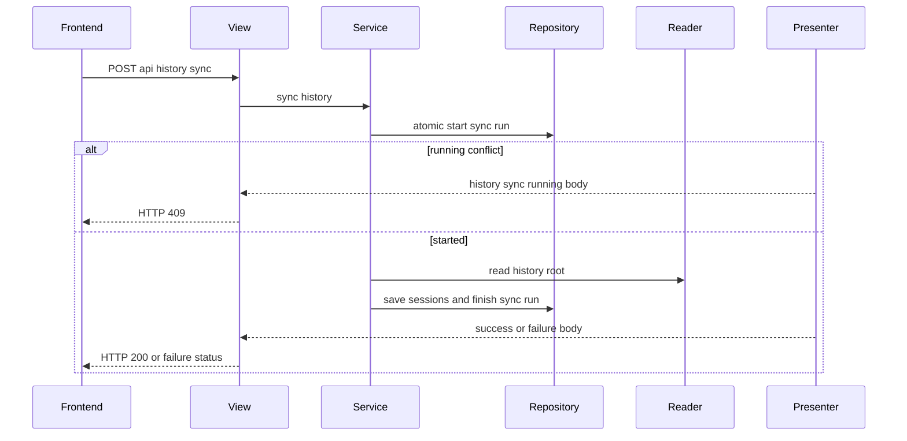

# 設計ドキュメント

## 概要

この feature は、Django backend 上で現行 frontend が利用する履歴 API endpoint を Rails 互換 contract のまま提供する。対象利用者は、履歴一覧・詳細・同期 UI を既存の API base URL で動かしたい frontend 開発者、Rails / Django 移行を検証する移行開発者、fake repository と fixture で互換性を確認するレビュー担当者である。

変更の中心は `history_api` Django app、HTTP query validation、repository / presenter orchestration、CORS response、API request tests、contract fixture tests である。保存済み read model と presenter payload は既存 specs の成果を使い、この spec は URL、HTTP status、JSON envelope、sync coordination を所有する。

### 目的

- `POST /api/history/sync`、`GET /api/sessions`、`GET /api/sessions/<session_id>`、`GET /api/sessions/<session_id>?include_raw=true` を Django URLconf に登録する。
- 保存済み BigQuery read model repository と fake repository から Rails 互換の一覧・詳細 response を返す。
- 明示同期 API で raw reader、row builder、repository、sync presenter を request 内で束ねる。
- query validation、repository failure、not found、sync conflict / failure を frontend 互換 error envelope と HTTP status に変換する。
- local frontend development origin からの CORS / preflight を許可し、BigQuery 実接続なしで主要 API tests を実行できるようにする。

### 対象外

- raw reader の新規移植、presenter response shape の再定義、BigQuery schema 作成、BigQuery repository の内部実装。
- Rails / Django 差分レポート、Rails / MySQL stack 削除、frontend UI / hook / DTO の変更。
- 認証、認可、Django admin、Django server-side session、background job、progress polling、自動 file watch。
- BigQuery を Django ORM の通常 database backend として使うこと。

## 境界の取り決め

### この仕様が所有する範囲

- 対象履歴 API endpoint の Django route、allowed methods、OPTIONS preflight、HTTP status。
- list/detail/sync request の HTTP 入力 validation と error envelope。
- `SessionReadModelRepository` port を使う list/detail read orchestration。
- `SessionCatalogReader`、`build_copilot_session_write_input`、repository sync lifecycle、`HistorySyncPresenter` を束ねる sync orchestration。
- local development frontend origin 向け CORS header。
- fake repository を使う API tests、`api-contract-fixtures` と response body / status を比較する contract tests。
- 実 BigQuery repository を使う opt-in integration test の入口。

### 境界外

- `summary_payload` / `detail_payload` の field 追加・削除・変換規則。ただし、保存済み `detail_payload` を raw opt-in に使うための raw 抑制方針と repository port contract はこの仕様で所有する。
- raw files の parsing / normalization / projection、source fingerprint の意味、BigQuery table schema / SQL / MERGE 実装。
- frontend の API client、画面構成、表示文言、状態管理。
- Rails backend との網羅的 parity report と Rails / MySQL 削除。
- 外部公開向け security hardening、user authentication、rate limit、監査ログ。

### 許可する依存

- Django foundation の Python `>=3.14,<3.15`、Django `>=5.2.8,<5.3`、pytest / pytest-django / ruff / mypy。
- `history_read_model.repository.SessionReadModelRepository`、`FakeBigQueryReadModelRepository`、`BigQuerySessionReadModelRepository`、`load_bigquery_settings`。
- `copilot_history.catalog_reader.SessionCatalogReader`、`history_read_model.repository_rows.build_copilot_session_write_input`、`copilot_history.api.presenters`。
- `.kiro/specs/api-contract-fixtures/fixtures` と `backend/tests/copilot_history/api_contract_fixtures.py`。
- frontend development origin `http://localhost:51730` / `http://127.0.0.1:51730`。

### 再検証トリガー

- 対象 URL、method、query parameter、HTTP status、error code、error details shape が変わる。
- `summary_payload` / `detail_payload`、raw 抑制方針、sync response、repository result、sync run status / counts の contract が変わる。
- BigQuery settings、integration opt-in env、repository dependency direction が変わる。
- frontend `VITE_API_BASE_URL`、development origin、CORS allowed headers / methods が変わる。
- sync が request 内完了から background job / polling / file watch へ変わる。

## アーキテクチャ

### 既存アーキテクチャ分析

Django foundation は `/up` のみを公開し、履歴 API route は未登録である。Python presenter は Rails 互換 body を生成し、BigQuery repository は保存済み `summary_payload` / `detail_payload` と sync run lifecycle を typed result で返す。現行 repository port は detail lookup に `include_raw` を持たず、running sync lookup も `started_at` を返さないため、この feature で API contract に必要な repository result を拡張する。frontend は `VITE_API_BASE_URL` から対象 URL を呼び、error envelope の `error.code`、`error.message`、`error.details` を status と組み合わせて正規化する。

この feature は既存境界を接続する extension である。view は HTTP 入出力に集中し、payload shape は presenter / 保存済み read model、data access は repository、raw parsing は reader に委譲する。

### アーキテクチャパターンと境界図



**統合方針**:

- 採用パターン: thin Django views + application service。view は method、query、status、CORS を扱い、list/detail/sync の判断は `HistoryApiService` に寄せる。
- 依存方向: `settings -> repository factory -> query validation -> service -> views -> urls -> tests`。repository / presenter / reader は `history_api` に依存しない。
- 維持する既存方針: raw files は一次ソース、read model は再生成可能な補助層、通常一覧・詳細は保存済み read model から返す。
- raw opt-in 方針: sync 時に `SessionResponseProjector.project_detail(..., include_raw=True)` で raw-capable な `detail_payload` を保存し、default detail response では API 層の `DetailPayloadRawFilter` が `raw_included=false` と raw payload 抑制済み body に変換する。`include_raw=true` では保存済み payload を raw 表示用に整形し、raw files は読まない。
- sync 排他方針: `find_running_sync_run` と `save_sync_run` の分離ではなく、repository port に atomic な `start_sync_run` を追加し、既存 running run がある場合は `sync_run_id` と `started_at` を含む conflict result を返す。
- 新規コンポーネントの理由: HTTP status と error envelope は repository / presenter の責務ではないため、API 層で明示 mapping が必要である。
- Steering 準拠: Docker Compose と frontend base URL を維持し、テストケース直前コメント規約を守る。

### 技術スタック

| 層                 | 採用技術 / version                               | この仕様での役割                               | 補足                              |
| ------------------ | ------------------------------------------------ | ---------------------------------------------- | --------------------------------- |
| Backend / Services | Python `>=3.14,<3.15`, Django `>=5.2.8,<5.3` | URLconf、view、JsonResponse、test client       | Django ORM は BigQuery に使わない |
| API Contract       | Python dataclass / Protocol / Mapping            | service result、error mapping、repository port | unsafe cast を避ける              |
| Data / Storage     | BigQuery repository / fake repository            | list/detail/sync run/read model access         | 実接続は opt-in                   |
| Runtime            | Docker Compose backend port `30000`            | frontend からの local API 接続                 | `VITE_API_BASE_URL` を維持      |
| Testing            | pytest-django, contract fixtures                 | API status/body、CORS、integration gate        | test comment 規約を適用           |

## ファイル構成計画

### ディレクトリ構成

```text
backend/
├── backend_config/
│   ├── settings.py                         # history_api app、CORS origin、repository mode settings を追加する
│   └── urls.py                             # /api/history/sync と /api/sessions routes を include する
├── history_api/
│   ├── __init__.py                         # Django app package marker
│   ├── apps.py                             # HistoryApiConfig
│   ├── urls.py                             # 対象 API route と name を定義する
│   ├── views.py                            # Django request/response、method、OPTIONS、status の入口
│   ├── cors.py                             # allowed origin 判定と CORS headers 付与を行う
│   ├── query_validation.py                 # from/to/limit/search/include_raw の HTTP query validation
│   ├── responses.py                        # JsonResponse 生成、error body/status mapping、repository error mapping
│   ├── services.py                         # list/detail/sync orchestration と typed service result
│   ├── dependencies.py                     # repository / reader / clock / settings 生成を一箇所に集約する
│   ├── detail_payloads.py                  # raw-capable detail payload の default/raw response 変換
│   └── sync_rows.py                        # sync run row と session write row の API 用 assembly
└── tests/
    └── history_api/
        ├── __init__.py
        ├── test_routes.py                  # URL resolver、method、foundation route 置換を検証する
        ├── test_cors.py                    # development origin と OPTIONS preflight を検証する
        ├── test_query_validation.py        # invalid list query と include_raw 解釈を検証する
        ├── test_session_api.py             # fake repository による list/detail/not found/repository failure
        ├── test_history_sync_api.py        # fake reader/repository による sync success/degraded/conflict/failure
        ├── test_api_contract_fixtures.py   # fixture scenario と Django response の status/body 比較
        └── test_bigquery_integration_entrypoint.py # opt-in 実 repository smoke の gate を検証する
```

### 変更する既存ファイル

- `backend/backend_config/settings.py` — `history_api` を `INSTALLED_APPS` に追加し、`HISTORY_API_ALLOWED_ORIGINS`、`HISTORY_API_REPOSITORY_BACKEND`、BigQuery settings 読込方針を定義する。settings import 時に BigQuery client は作らない。
- `backend/backend_config/urls.py` — `path("api/", include("history_api.urls"))` を追加し、`/up` は既存のまま維持する。
- `backend/history_read_model/repository.py` — `SyncRunStartResult` / `SyncRunConflict` と `start_sync_run` / `finish_sync_run` port を追加する。
- `backend/history_read_model/fake_repository.py` — raw-capable detail payload と atomic sync start conflict を fake repository で検証できるようにする。
- `backend/history_read_model/bigquery_repository.py` — API service が使う `start_sync_run` / `finish_sync_run` を実装し、conflict result に `started_at` を含める。
- `backend/history_read_model/repository_rows.py` — `detail_payload` を `project_detail(..., include_raw=True)` で保存し、search projection に raw JSON 全文を混ぜないことを保つ。
- `backend/pyproject.toml` — 原則変更しない。新規 dependency を追加しない。
- `.kiro/specs/django-history-api/spec.json` — design 生成状態、requirements approval、timestamp を更新する。

## システムフロー







## 要件トレーサビリティ

| 要件 | 概要                                   | コンポーネント                                          | インターフェース                         | フロー           |
| ---- | -------------------------------------- | ------------------------------------------------------- | ---------------------------------------- | ---------------- |
| 1.1  | 同期 endpoint を受け付ける             | URLs, Views, HistoryApiService                          | `POST /api/history/sync`               | sync flow        |
| 1.2  | 一覧 endpoint を返す                   | URLs, Views, QueryValidation, RepositoryPort            | `GET /api/sessions`                    | list flow        |
| 1.3  | 詳細 endpoint を返す                   | URLs, Views, HistoryApiService                          | `GET /api/sessions/<session_id>`       | detail flow      |
| 1.4  | raw opt-in query を維持する            | QueryValidation, HistoryApiService                      | `include_raw=true`                     | detail flow      |
| 1.5  | fixture と status/body を照合する      | ContractFixtureTests, ResponseFactory                   | fixture scenario                         | all flows        |
| 2.1  | from/to で保存済み一覧を返す           | QueryValidation, RepositoryPort                         | `SessionListCriteria`                  | list flow        |
| 2.2  | search で一覧を絞る                    | QueryValidation, RepositoryPort                         | `search_term`                          | list flow        |
| 2.3  | 一致なしを 200 empty meta にする       | HistoryApiService, ResponseFactory                      | list success body                        | list flow        |
| 2.4  | summary fields を返す                  | RepositoryPort, ResponseFactory                         | `summary_payload` passthrough          | list flow        |
| 2.5  | degraded と partial_results を保持する | HistoryApiService, ResponseFactory                      | `meta.partial_results`                 | list flow        |
| 2.6  | 一覧を read-only にする                | HistoryApiService, RepositoryPort                       | `list_sessions` only                   | list flow        |
| 3.1  | 詳細 sections を返す                   | RepositoryPort, ResponseFactory                         | `detail_payload` passthrough           | detail flow      |
| 3.2  | conversation contract を返す           | RepositoryPort, ContractFixtureTests                    | `conversation` body                    | detail flow      |
| 3.3  | activity と timeline contract を返す   | RepositoryPort, ContractFixtureTests                    | `activity`, `timeline` body          | detail flow      |
| 3.4  | raw 未指定時は raw を含めない          | QueryValidation, DetailPayloadRawFilter                 | default detail payload                   | detail flow      |
| 3.5  | raw 指定時は raw を含める              | QueryValidation, RepositoryPort, DetailPayloadRawFilter | raw detail payload                       | detail flow      |
| 3.6  | missing session を 404 にする          | HistoryApiService, ResponseFactory                      | `session_not_found`                    | detail flow      |
| 4.1  | sync を request 内で完了させる         | HistoryApiService, Reader, RepositoryPort               | sync service result                      | sync flow        |
| 4.2  | sync success を 200 data にする        | HistoryApiService, HistorySyncPresenter                 | sync success body                        | sync flow        |
| 4.3  | degraded sync を 200 success にする    | HistoryApiService, HistorySyncPresenter                 | completed with issues                    | sync flow        |
| 4.4  | running sync を 409 にする             | RepositoryPort atomic start, HistorySyncPresenter       | `history_sync_running` with started_at | sync flow        |
| 4.5  | root failure を失敗 response にする    | Reader, ResponseFactory, HistorySyncPresenter           | root failure body                        | sync flow        |
| 4.6  | 保存失敗を failure envelope にする     | RepositoryPort, ResponseFactory, HistorySyncPresenter   | `history_sync_failed`                  | sync flow        |
| 4.7  | background job 等を提供しない          | Boundary, HistoryApiService                             | request synchronous sync                 | sync flow        |
| 5.1  | error top-level shape を固定する       | ResponseFactory, ErrorPresenter                         | `error.code/message/details`           | all flows        |
| 5.2  | invalid datetime を 400 にする         | QueryValidation, ResponseFactory                        | `invalid_session_list_query`           | list flow        |
| 5.3  | invalid range を 400 にする            | QueryValidation, ResponseFactory                        | `invalid_session_list_query`           | list flow        |
| 5.4  | invalid limit を 400 にする            | QueryValidation, ResponseFactory                        | `invalid_session_list_query`           | list flow        |
| 5.5  | invalid search を 400 にする           | QueryValidation, ResponseFactory                        | `invalid_session_list_query`           | list flow        |
| 5.6  | validation details を返す              | QueryValidation, ErrorPresenter                         | `details.field/reason/value`           | list flow        |
| 5.7  | repository / reader failure を区別する | ResponseFactory, HistoryApiService                      | status/code matrix                       | all flows        |
| 6.1  | frontend base URL から到達できる       | URLs, Views, CORS                                       | HTTP response                            | all flows        |
| 6.2  | development origin を許可する          | CORS                                                    | allowed origin headers                   | all flows        |
| 6.3  | preflight に応答する                   | Views, CORS                                             | OPTIONS response                         | all flows        |
| 6.4  | auth/admin/session を要求しない        | Settings, Boundary, Views                               | stateless request                        | all flows        |
| 6.5  | frontend UI 変更を含めない             | Boundary, ContractFixtureTests                          | API-only validation                      | none             |
| 7.1  | fake repository で代表挙動を検証する   | FakeRepository, ApiTests                                | injected repository                      | all flows        |
| 7.2  | fixture response と比較する            | ContractFixtureTests                                    | fixture deep equality                    | all flows        |
| 7.3  | fixture 差分を識別する                 | ContractFixtureTests                                    | scenario/status/path                     | all flows        |
| 7.4  | BigQuery integration を opt-in にする  | Dependencies, IntegrationTests                          | env gate                                 | integration flow |
| 7.5  | credentials 不在でも主要検証を継続する | FakeRepository, ApiTests                                | no-client tests                          | all flows        |
| 7.6  | backend test comment 規約を守る        | Test Files                                              | pytest comments                          | test flow        |
| 7.7  | parity report / stack 削除を含めない   | Boundary, File Structure Plan                           | out-of-boundary                          | none             |

## コンポーネントとインターフェース

| Component              | Domain/Layer        | Intent                                                                 | Req Coverage                                | Key Dependencies              | Contracts |
| ---------------------- | ------------------- | ---------------------------------------------------------------------- | ------------------------------------------- | ----------------------------- | --------- |
| HistoryApiURLs         | Django routing      | 対象 endpoint を Django URLconf に登録する                             | 1.1, 1.2, 1.3, 6.1                          | Django URLconf P0             | API       |
| HistoryApiViews        | HTTP API            | request method、query、JsonResponse、CORS、status を扱う               | 1.1, 1.2, 1.3, 1.4, 6.3                     | Service P0, CORS P1           | API       |
| QueryValidation        | HTTP validation     | list query と include_raw を frontend 契約で検証する                   | 2.1, 2.2, 5.2, 5.3, 5.4, 5.5, 5.6           | datetime parser P0            | Service   |
| HistoryApiService      | Application service | list/detail/sync の repository / reader / presenter orchestration      | 2.3, 2.6, 3.1, 3.4, 3.5, 3.6, 4.1, 4.4, 4.7 | RepositoryPort P0, Reader P0  | Service   |
| DetailPayloadRawFilter | Service mapping     | 保存済み raw-capable detail payload を default/raw API body に変換する | 3.4, 3.5                                    | presenter payload contract P0 | Service   |
| ResponseFactory        | HTTP response       | service / repository result を status と JSON envelope に変換する      | 1.5, 5.1, 5.7                               | ErrorPresenter P0             | API       |
| CorsHelper             | HTTP integration    | local frontend origin と preflight response を制御する                 | 6.2, 6.3, 6.4                               | settings P1                   | API       |
| Dependencies           | Composition         | fake / BigQuery repository、reader、clock を遅延生成する               | 7.4, 7.5                                    | settings P0                   | Service   |
| SyncRows               | Mapping             | reader result から session row と sync run row を組み立てる            | 4.1, 4.2, 4.3, 4.6                          | RowBuilder P0                 | Service   |
| ApiContractTests       | Test                | fake repository と fixture で Rails 互換性を検証する                   | 7.1, 7.2, 7.3, 7.6                          | pytest P0, fixtures P0        | Batch     |

### Django API Layer

#### HistoryApiViews

| Field        | Detail                                                           |
| ------------ | ---------------------------------------------------------------- |
| Intent       | Django request を API service result と HTTP response へ変換する |
| Requirements | 1.1, 1.2, 1.3, 1.4, 6.1, 6.3, 6.4                                |

**責務と制約**

- 許可 method は list/detail が `GET`、sync が `POST`、preflight が `OPTIONS` である。
- request body は sync でも必須にしない。
- view は raw files を直接読まず、BigQuery client も直接生成しない。
- CORS header は対象 endpoint response にだけ付与する。

**依存関係**

- Inbound: frontend / tests — HTTP request (P0)
- Outbound: QueryValidation、HistoryApiService、ResponseFactory、CorsHelper (P0)
- External: Django `HttpRequest`, `JsonResponse` (P0)

**契約種別**: Service [ ] / API [x] / Event [ ] / Batch [ ] / State [ ]

##### API Contract

| Method  | Endpoint                       | Request                                       | Response                       | Errors                     |
| ------- | ------------------------------ | --------------------------------------------- | ------------------------------ | -------------------------- |
| GET     | `/api/sessions`              | `from`, `to`, `search`, `limit` query | `{data: [...], meta: {...}}` | 400, 500, 503              |
| GET     | `/api/sessions/<session_id>` | optional `include_raw=true`                 | `{data: {...}}`              | 404, 500, 503              |
| POST    | `/api/history/sync`          | empty body                                    | `{data: {sync_run, counts}}` | 409, 500, 503              |
| OPTIONS | target endpoints               | `Origin`, request method/headers            | empty 204 with CORS headers    | 403 when origin disallowed |

**Implementation Notes**

- Integration: `history_api.urls` を root `api/` prefix に include する。
- Validation: method mismatch、OPTIONS、CORS headers を request tests で固定する。
- Risks: Django CSRF middleware を追加した場合は sync POST の再検証が必要である。

#### QueryValidation

| Field        | Detail                                                                        |
| ------------ | ----------------------------------------------------------------------------- |
| Intent       | HTTP query string を repository criteria と frontend error details に変換する |
| Requirements | 2.1, 2.2, 5.2, 5.3, 5.4, 5.5, 5.6                                             |

**責務と制約**

- `from` / `to` は ISO datetime として parse し、片方欠落は API 契約上の validation error にする。
- `from <= to` を必須とする。
- `limit` は任意だが、指定時は正の整数かつ API で定義する上限以下にする。
- `search` は空文字を未指定として扱い、上限長と制御文字を検証する。
- `include_raw` は文字列 `true` のみ true とし、未指定は false とする。

**依存関係**

- Inbound: HistoryApiViews (P0)
- Outbound: Repository `SessionListCriteria` (P0)
- External: Python `datetime` (P0)

**契約種別**: Service [x] / API [ ] / Event [ ] / Batch [ ] / State [ ]

##### Service Interface

```python
@dataclass(frozen=True)
class ValidatedSessionListQuery:
    criteria: SessionListCriteria

@dataclass(frozen=True)
class QueryValidationError:
    field: str
    reason: str
    value: object | None

def validate_session_list_query(params: QueryDict) -> ValidatedSessionListQuery | QueryValidationError: ...
def parse_include_raw(params: QueryDict) -> bool: ...
```

- Preconditions: `params` は Django request query である。
- Postconditions: 成功時は repository に渡せる criteria を返す。
- Invariants: validation error は `invalid_session_list_query` に mapping できる `field/reason/value` を保持する。

**Implementation Notes**

- Integration: repository の `validate_session_list_criteria` は最終防衛線として残す。
- Validation: invalid datetime、range、limit、search length、control character の各 test を追加する。
- Risks: frontend が `limit` をまだ送らないため、fixture と request tests で API 側のみの contract として固定する。

### Application Service Layer

#### HistoryApiService

| Field        | Detail                                                                    |
| ------------ | ------------------------------------------------------------------------- |
| Intent       | repository / reader / presenter を束ね、view へ typed result を返す       |
| Requirements | 2.3, 2.5, 2.6, 3.1, 3.4, 3.5, 3.6, 4.1, 4.2, 4.3, 4.4, 4.5, 4.6, 4.7, 5.7 |

**責務と制約**

- list は `repository.list_sessions` だけを呼び、raw reader や write operation を呼ばない。
- detail は `repository.get_session_detail` だけを呼び、not found と repository failure を分ける。
- detail は保存済み raw-capable `detail_payload` を取得し、`include_raw` に応じて `DetailPayloadRawFilter` で raw payload を抑制または保持する。
- sync は repository の atomic `start_sync_run`、reader read、session rows build、save sessions、sync run finish を request 内で完了させる。
- atomic start が running conflict を返した場合は reader / row builder / save sessions を呼ばず、`HistorySyncPresenter` に `sync_run_id` と `started_at` を渡す。
- sync は degraded session を failure ではなく success kind `completed_with_issues` として扱う。
- root failure と persistence failure は sync meta を保持して error response へ渡す。

**依存関係**

- Inbound: HistoryApiViews (P0)
- Outbound: RepositoryPort、SessionCatalogReader、SyncRows、HistorySyncPresenter、ErrorPresenter (P0)
- External: system clock / UUID generation (P1)

**契約種別**: Service [x] / API [ ] / Event [ ] / Batch [ ] / State [x]

##### Service Interface

```python
class HistoryApiService:
    def list_sessions(self, criteria: SessionListCriteria) -> ApiServiceResult: ...
    def get_session_detail(self, session_id: str, *, include_raw: bool) -> ApiServiceResult: ...
    def sync_history(self) -> ApiServiceResult: ...
```

- Preconditions: HTTP query validation は view 境界で完了している。
- Postconditions: result は body と HTTP status に決定可能な success / error kind を持つ。
- Invariants: list/detail は read-only、sync は background job を作らない。

**Implementation Notes**

- Integration: `summary_payloads` は list response の `data`、raw 抑制後の `detail_payload` は detail response の `data` として包む。
- Validation: fake repository に read/write call counter を持たせ、list/detail が write / reader を呼ばないことを検証する。detail raw tests では同じ保存済み payload から default response と raw response の差分が `raw_included` と raw payload fields に限定されることを検証する。
- Risks: sync run row の numeric `id` と BigQuery `sync_run_id` の型差は `SyncRows` で吸収し、frontend body は existing presenter contract に合わせる。

#### DetailPayloadRawFilter

| Field        | Detail                                                                                                    |
| ------------ | --------------------------------------------------------------------------------------------------------- |
| Intent       | read model に保存された raw-capable detail payload から default detail body と raw opt-in body を生成する |
| Requirements | 3.4, 3.5                                                                                                  |

**責務と制約**

- `include_raw=false` では top-level `raw_included` を false にし、`raw_payload` は既存 presenter の raw 未指定時と同じ値に抑制する。
- `include_raw=true` では top-level `raw_included` を true にし、保存済み payload 内の raw value を保持する。
- filter は raw files を読まず、payload shape の再定義や conversation / activity / timeline の再投影を行わない。
- filter は `message_snapshots`、`activity.entries`、`timeline` の raw payload fields を対象にし、unknown field は保持する。

**依存関係**

- Inbound: HistoryApiService (P0)
- Outbound: なし (P0)
- External: 保存済み presenter payload shape (P0)

**契約種別**: Service [x] / API [ ] / Event [ ] / Batch [ ] / State [ ]

##### Service Interface

```python
def detail_payload_for_response(
    payload: Mapping[str, object],
    *,
    include_raw: bool,
) -> dict[str, object]: ...
```

- Preconditions: `payload` は sync 時に `include_raw=True` で投影された detail payload である。
- Postconditions: 返り値は API response の `data` にそのまま包める。
- Invariants: default response では raw data を出さず、raw response では保存済み raw data を再読取なしで出す。

**Implementation Notes**

- Integration: `build_copilot_session_write_input` は `project_detail(session, include_raw=True)` を保存する。`search_text` は raw payload ではなく conversation / issue の表示用 field だけから生成し、raw JSON の全文を検索 projection に混ぜない。
- Validation: contract fixture の `sessions.show.detail` と `sessions.show.detail_with_raw` を同じ fake row から生成した response で比較する。
- Risks: raw-capable detail payload は通常 detail より大きくなるため、BigQuery row size と fixture representative data を integration smoke で確認する。

#### Repository Port Extensions

| Field        | Detail                                                                        |
| ------------ | ----------------------------------------------------------------------------- |
| Intent       | API 契約に必要な detail raw と sync conflict 情報を repository 境界で表現する |
| Requirements | 3.4, 3.5, 4.4, 4.6, 5.7                                                       |

**責務と制約**

- `get_session_detail` は引数を増やさず、保存済み raw-capable `detail_payload` を返す。raw の出し分けは API service 側で行う。
- `start_sync_run` は「running lock 確認」と「running row 作成」を repository 内で atomic に扱う。
- running conflict result は `sync_run_id` と `started_at` を必ず持ち、`HistorySyncPresenter` の `history_sync_running` details に変換できる。
- `finish_sync_run` は started run を succeeded / completed_with_issues / failed に更新し、保存失敗時も failure meta を組み立てられる result を返す。

**依存関係**

- Inbound: HistoryApiService (P0)
- Outbound: FakeBigQueryReadModelRepository, BigQuerySessionReadModelRepository (P0)
- External: BigQuery query / DML または fake in-memory lock (P1)

**契約種別**: Service [x] / API [ ] / Event [ ] / Batch [ ] / State [x]

##### Service Interface

```python
@dataclass(frozen=True)
class SyncRunConflict:
    sync_run_id: str
    started_at: datetime

@dataclass(frozen=True)
class SyncRunStartResult:
    ok: bool
    started: bool
    sync_run_id: str | None = None
    started_at: datetime | None = None
    conflict: SyncRunConflict | None = None
    error: RepositoryError | None = None

class SessionReadModelRepository(Protocol):
    def start_sync_run(
        self,
        row: HistorySyncRunWriteInput,
        options: RepositoryExecutionOptions,
    ) -> SyncRunStartResult: ...

    def finish_sync_run(
        self,
        row: HistorySyncRunWriteInput,
        options: RepositoryExecutionOptions,
    ) -> SyncRunResult: ...
```

- Preconditions: `row` は `status="running"` と `started_at` を持つ sync run row である。
- Postconditions: `started=True` の場合だけ reader / session save に進む。`conflict` がある場合は HTTP 409 に変換する。
- Invariants: API service は `find_running_sync_run` と `save_sync_run` を組み合わせて排他を実装しない。

**Implementation Notes**

- Integration: 既存 `find_running_sync_run` / `save_sync_run` は repository 内部や後方互換 test helper として残してよいが、Django History API service は `start_sync_run` / `finish_sync_run` を使う。
- Validation: fake repository で同時 start を模した test を追加し、2 回目が `conflict.started_at` を返し、reader / save sessions が呼ばれないことを検証する。
- Risks: BigQuery 実装は single DML / transaction / repository 内 lock 相当のいずれかで API service から見た atomic start を保証する。これを保証できない場合、要件 4.4 未達として実装完了にしない。

#### ResponseFactory

| Field        | Detail                                                                       |
| ------------ | ---------------------------------------------------------------------------- |
| Intent       | API service result と repository error を HTTP status / JSON body に変換する |
| Requirements | 1.5, 3.6, 4.4, 4.5, 4.6, 5.1, 5.7                                            |

**責務と制約**

- success list/detail/sync は HTTP 200 を返す。
- `session_not_found` は HTTP 404 とする。
- `invalid_session_list_query` は HTTP 400 とする。
- `history_sync_running` は HTTP 409 とする。
- root unreadable / credentials / permission は service failure として status を明示する。
- 予期しない repository failure は `history_api_failed` または `history_sync_failed` の envelope に落とす。

**依存関係**

- Inbound: HistoryApiViews (P0)
- Outbound: ErrorPresenter, HistorySyncPresenter (P0)
- External: Django `JsonResponse` (P0)

**契約種別**: Service [ ] / API [x] / Event [ ] / Batch [ ] / State [ ]

##### API Contract

| Error Source               | HTTP Status | Code                                  | Details                               |
| -------------------------- | ----------- | ------------------------------------- | ------------------------------------- |
| list query validation      | 400         | `invalid_session_list_query`        | `field`, `reason`, `value`      |
| detail not found           | 404         | `session_not_found`                 | `session_id`                        |
| running sync               | 409         | `history_sync_running`              | `sync_run_id`, `started_at`       |
| root failure               | 503         | root failure code or mapped sync code | `path` and run meta                 |
| sync persistence failure   | 500         | `history_sync_failed`               | repository details and run meta       |
| repository service failure | 500 or 503  | `history_api_failed`                | `kind`, optional repository details |

**Implementation Notes**

- Integration: response body は `dict[str, object]` とし、`JsonResponse` へ渡す前に list / Mapping を JSON serializable にする。
- Validation: fixture scenario の status と body を比較する。
- Risks: repository error kind の増減は status/code matrix の再検証トリガーである。

### Infrastructure and Testing

#### Dependencies

| Field        | Detail                                                                    |
| ------------ | ------------------------------------------------------------------------- |
| Intent       | runtime dependency を settings から遅延生成し、tests で差し替え可能にする |
| Requirements | 7.1, 7.4, 7.5                                                             |

**責務と制約**

- settings import 時に BigQuery client を生成しない。
- default runtime は `BigQuerySessionReadModelRepository` を生成するが、tests は fake repository を注入できる。
- integration flag と credentials が揃う場合だけ実 BigQuery repository smoke を実行する。

**依存関係**

- Inbound: HistoryApiService / tests (P0)
- Outbound: BigQuery settings, fake repository, BigQuery client factory (P0)
- External: `google.cloud.bigquery` は factory 内だけで import (P1)

**契約種別**: Service [x] / API [ ] / Event [ ] / Batch [ ] / State [ ]

##### Service Interface

```python
class HistoryApiDependencies:
    def repository(self) -> SessionReadModelRepository: ...
    def reader(self) -> SessionCatalogReader: ...
    def now(self) -> datetime: ...
```

- Preconditions: BigQuery repository 利用時は必須 env が設定されている。
- Postconditions: tests は dependency override で fake を使える。
- Invariants: credentials 不在は fake / unit tests を妨げない。

**Implementation Notes**

- Integration: Django settings に module-level client singleton を置かない。
- Validation: settings import no-client test と integration gate test を追加する。
- Risks: compose で integration env が有効でも credentials がない場合、unit tests は skip / fake に逃がす。

#### ApiContractTests

| Field        | Detail                                                        |
| ------------ | ------------------------------------------------------------- |
| Intent       | Rails 互換 fixture と Django API response の drift を検出する |
| Requirements | 1.5, 7.1, 7.2, 7.3, 7.6                                       |

**責務と制約**

- fixture scenario ごとに method、endpoint、status、body を比較する。
- fake repository / fake reader data は scenario body と一致するように限定 fixture builder で組み立てる。
- mismatch message は scenario ID、status、field path を含める。
- 各 pytest test case の直前に `概要・目的`、`テストケース`、`期待値` コメントを置く。

**依存関係**

- Inbound: reviewer / CI (P0)
- Outbound: Django test client, `ApiContractFixtureRepository`, fake repository (P0)
- External: なし (P0)

**契約種別**: Service [ ] / API [ ] / Event [ ] / Batch [x] / State [ ]

##### Batch / Job Contract

- Trigger: `backend/bin/test`
- Input / validation: fixture manifest と fake test data が存在すること。
- Output / destination: pytest pass/fail と diff path。
- Idempotency & recovery: BigQuery credentials がなくても主要 API fixture tests は実行できる。

**Implementation Notes**

- Integration: `backend/tests/copilot_history/api_contract_fixtures.py` の helper を再利用する。
- Validation: list success/empty/degraded/search invalids/detail/raw/not found/sync success/conflict/failure を対象にする。
- Risks: fixture が代表値であり網羅ではないため、境界単体 tests も別途追加する。

## データモデル

### Domain Model

- `SessionListCriteria`: HTTP query から生成する list 条件。`from_datetime`、`to_datetime`、`search_term`、`limit` を持つ。
- `ApiServiceResult`: view が HTTP status と body を決めるための service result。success / validation / not found / conflict / failure を discriminated kind で表す。
- `HistorySyncRunRow`: repository に保存する sync lifecycle row。running、succeeded、failed、completed_with_issues を表す。
- `SyncRunStartResult`: atomic sync start の結果。started、running conflict、repository failure を表し、conflict 時は `sync_run_id` と `started_at` を持つ。
- `CopilotSessionRow`: sync で保存する read model row。`summary_payload` / raw-capable `detail_payload` を presenter-compatible shape として持つ。

### Logical Data Model

- 一覧 API は repository の `summary_payloads` を `data` 配列にし、`meta.count` と `meta.partial_results` を API service で算出する。
- 詳細 API は repository の raw-capable `detail_payload` を取得し、API service が `DetailPayloadRawFilter` で `include_raw` に応じた `data` に変換する。
- sync API は raw reader の `ReadSuccessResult` / `ReadFailureResult` を起点に、persistable session rows と sync run row を作り repository に保存する。session row の `detail_payload` は `project_detail(..., include_raw=True)` で作り、default response の raw 抑制は API service 側で行う。
- API 層は BigQuery table schema を所有しない。schema / SQL / MERGE は `history_read_model` の責務である。

### Consistency and Integrity

- list/detail は read-only であり、repository write method と reader を呼ばない。
- sync は repository の atomic start で running lock を確保し、未完了 run があれば新規 sync を拒否する。API service は lookup と insert を別々に実行して排他を作らない。
- sync 保存に失敗した場合も failure response に sync run meta と counts を含め、frontend が失敗種別を識別できる。

## Error Handling

- Validation error は fail fast で HTTP 400 とし、`details.field`、`details.reason`、`details.value` を返す。
- Not found は repository success + `found=false` として扱い、HTTP 404 `session_not_found` に変換する。
- Repository validation / missing date range が API validation を通過後に出た場合は implementation defect として `history_api_failed` に mapping し、tests で防ぐ。
- BigQuery credentials / permission / schema mismatch / query failure は `history_api_failed` または `history_sync_failed` とし、`details.kind` を保持する。
- Root failure は空成功にせず、sync failure response として返す。

## Security and CORS

- この feature は auth / admin / Django session を要求しない stateless local API とする。
- CORS は configured local development origins のみ許可し、wildcard origin は使わない。
- `Access-Control-Allow-Methods` は `GET, POST, OPTIONS`、`Access-Control-Allow-Headers` は `Accept, Content-Type` を基本にする。
- 外部公開向け CSRF、credentialed CORS、rate limiting、authentication は境界外である。

## Testing Strategy

- API route tests: `/api/history/sync`、`/api/sessions`、`/api/sessions/<id>` が解決され、method mismatch と OPTIONS が期待 status を返すことを検証する。対応: 1.1, 1.2, 1.3, 6.3。
- Session list tests: valid range/search/empty/degraded、invalid datetime/range/limit/search、read-only call pattern を fake repository で検証する。対応: 2.1, 2.2, 2.3, 2.5, 2.6, 5.2, 5.3, 5.4, 5.5, 5.6。
- Session detail tests: found、raw default、raw opt-in、not found、repository failure を検証する。同じ raw-capable fake row から default / raw response を作り、default では raw payload が抑制され、raw opt-in では保存済み raw value が返ることを検証する。対応: 3.1, 3.4, 3.5, 3.6, 5.7。
- Sync tests: success、completed_with_issues、atomic running conflict、root failure、save failure、request 内完了を fake reader/repository で検証する。atomic conflict では `sync_run_id` と `started_at` が 409 details に入り、reader / save sessions が呼ばれないことを検証する。対応: 4.1, 4.2, 4.3, 4.4, 4.5, 4.6, 4.7。
- CORS tests: allowed development origin、disallowed origin、preflight headers を検証する。対応: 6.1, 6.2, 6.3, 6.4。
- Contract fixture tests: fixture scenario の status/body deep equality と diff path を検証する。対応: 1.5, 7.1, 7.2, 7.3。
- Integration gate tests: credentials 不在では fake tests が継続し、明示 opt-in の場合だけ BigQuery repository smoke が動くことを検証する。対応: 7.4, 7.5。
- Test comment compliance: backend test case の直前に `概要・目的`、`テストケース`、`期待値` コメントを置く。対応: 7.6。
