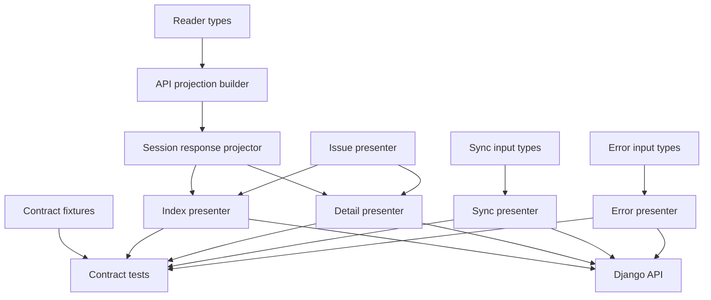
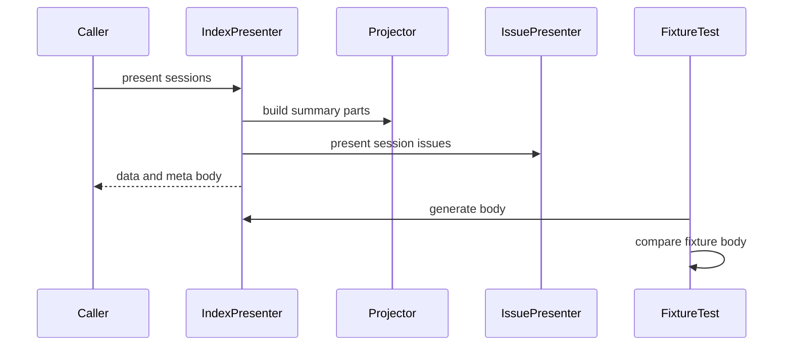
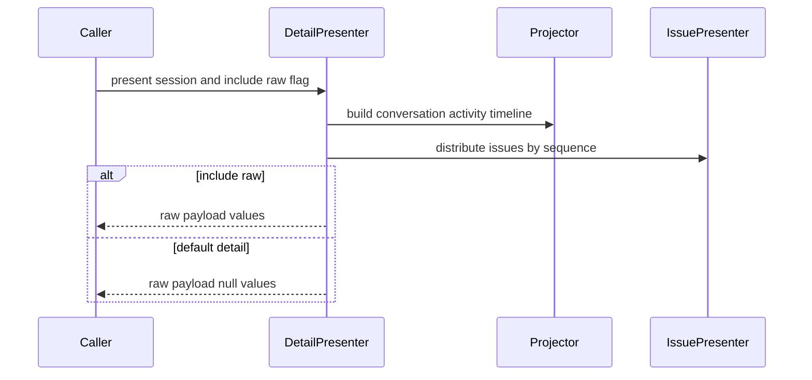

# 設計ドキュメント

## 概要
この feature は、Django 移行後の Python backend で、正規化済み Copilot history data から現行 Rails API fixture と同じ JSON response body を生成する Presenter 契約を固定する。対象利用者は、後続の BigQuery repository、Django history API、Rails / Django parity validation を実装する移行開発者である。

変更の中心は `backend/copilot_history/api/` 配下の typed input、Presenter、response projection mapper、fixture 比較 tests である。この spec は「response body の形」を所有し、raw reader、repository query、HTTP routing、status code の最終決定、frontend 表示は所有しない。

### 目的
- 一覧、詳細、履歴同期、共通エラーの response body を `api-contract-fixtures` と一致させる。
- `NormalizedSession` と Presenter 専用 projection input から、frontend DTO が期待する envelope、field、null、配列構造を生成する。
- degraded / partial issue と raw payload opt-in の表示位置を Presenter 層で検証できるようにする。
- fixture deep equality による contract tests を用意し、後続 API / repository の変更と分離して shape drift を検出する。

### 対象外
- Django view、URL route、HTTP status mapping、request params validation。
- BigQuery repository、query、upsert、sync run 永続化、staging / MERGE。
- raw file parsing、source discovery、reader normalization の変更。
- `NormalizedSession`、`NormalizedEvent`、reader projection の意味変更。
- frontend DTO / UI の変更、Rails / MySQL stack 削除。

## 境界の取り決め

### この仕様が所有する範囲
- `NormalizedSession` から session list summary response body と session detail response body を生成する Presenter。
- `NormalizedSession` / `NormalizedEvent` から API detail fixture を再現できる Presenter 専用 projection input を組み立てる mapping 規則。
- detail response の `include_raw` による `raw_included` と `raw_payload` の null / 実値切替。
- `ReadIssue` から API issue envelope を生成し、session issue と event issue を適切な response 位置へ分配する規則。
- sync response body 生成に必要な typed input DTO と HistorySync Presenter。
- not found、validation、root failure を common error envelope にする Error Presenter。
- `api-contract-fixtures` の representative response body と Presenter 出力を比較する pytest contract tests。
- Presenter 層に必要な API response projection mapper。

### 境界外
- `POST /api/history/sync`、`GET /api/sessions`、`GET /api/sessions/<session_id>` の routing / view 実装。
- HTTP status code の最終判定と Django `JsonResponse` への変換。
- session list query、session detail lookup、sync lock、sync service、repository / BigQuery client。
- `NormalizedSession`、`NormalizedEvent`、reader projection の意味変更。
- request validation result の生成。Presenter は validation result を入力として error body に写すだけである。
- fixture の shape 変更。fixture と一致しない場合は実装差分または仕様変更候補として扱う。

### 許可する依存
- `api-contract-fixtures` の manifest と response fixtures。
- `copilot-history-python-reader` の `NormalizedSession`、`NormalizedEvent`、`MessageSnapshot`、`ReadIssue`、projection 基礎型。
- Django backend foundation の Python `>=3.14,<3.15`、pytest、ruff、mypy strict。
- Python 標準 library: `dataclasses`、`datetime`、`json`、`pathlib`、`typing`。
- 既存 frontend DTO `frontend/src/features/sessions/api/sessionApi.types.ts` は互換確認の参照元として使う。

### 再検証が必要になる変更
- `api-contract-fixtures` の response body、manifest scenario、error code、raw payload 方針が変わる。
- frontend DTO の field 名、nullable、enum、raw payload 型、error envelope が変わる。
- `NormalizedSession`、`NormalizedEvent`、`ReadIssue`、tool call 型の field 名または意味が変わる。
- sync run status / counts / failure details の contract が変わる。
- Presenter が repository、Django view、HTTP request、BigQuery client、frontend component に依存し始める。

## アーキテクチャ

### 既存アーキテクチャ分析
Rails 側には `SessionIndexPresenter`、`SessionDetailPresenter`、`HistorySyncPresenter`、`ErrorPresenter`、`IssuePresenter` があり、現行 response shape は `api-contract-fixtures` に代表 fixture として保存されている。frontend は `sessionApi.types.ts` で同じ DTO を参照し、success envelope は `data` と必要な `meta`、error envelope は top-level `error` を前提にする。

Python 側には pure reader package と基礎 projection があり、`NormalizedSession` は header、events、message snapshots、issues、source paths を保持する。ただし Rails API の detail response に必要な conversation entry の tool calls、activity の `title/summary/source_path/raw_available`、tool call の `status`、timeline の `detail: null` 表現、sync result body はまだ Presenter 契約として実装されていない。

この spec では reader contract を変更しない。`response_projection.py` が `NormalizedSession` / `NormalizedEvent` から API 専用の projection input を作り、Rails fixture に必要な不足 field は `NormalizedEvent.detail`、`NormalizedEvent.mapping_status`、`NormalizedEvent.raw_payload`、`NormalizedSession.source_paths` から明示規則で導出する。導出できない fixture field は `None` / null ではなく contract test failure として扱い、reader 側の upstream contract 追加が必要な差分として切り分ける。

### アーキテクチャパターンと境界図



**統合方針**:
- 採用パターン: contract-first Presenter layer。入力は typed domain DTO、出力は JSON serializable `dict[str, object]` に限定する。
- 依存方向: `copilot_history.types -> copilot_history.api.types -> copilot_history.api.presenters -> tests -> downstream API`。Presenter は reader 型へ依存してよいが、reader は Presenter へ依存しない。
- 維持する既存方針: raw files は reader の正本、read model / API は後続境界、frontend JSON shape は互換対象として扱う。
- 新規コンポーネントの理由: Python reader の normalized event と Rails response shape の差分を API projection builder で吸収し、後続 Django API が同じ body factory を使えるようにする。
- Steering 準拠: current / legacy を共通 shape に保ち、degraded issue を隠さず、テストコメント規約を維持する。

### 技術スタック

| 層 | 採用技術 / version | この仕様での役割 | 補足 |
|-------|------------------|-----------------|-------|
| Backend / Services | Python `>=3.14,<3.15` | typed DTO、Presenter、projection mapper | Django view には依存しない |
| Backend Quality | pytest, mypy strict, ruff | fixture contract tests、型検査、lint | 既存 `backend/bin/*` を使う |
| Data / Contract | JSON fixtures, Markdown spec | expected response body と manifest | 新規 schema library は追加しない |
| Infrastructure / Runtime | Docker Compose backend | 後続検証の標準 runtime | BigQuery 接続不要 |

## ファイル構成計画

### ディレクトリ構成
```text
backend/
├── copilot_history/
│   ├── api/
│   │   ├── __init__.py                         # API presenter package marker
│   │   ├── types.py                            # sync / error / lookup Presenter input DTO
│   │   ├── response_projection.py              # NormalizedSession から API projection input と response 部品を作る mapper
│   │   └── presenters/
│   │       ├── __init__.py                     # presenter public exports
│   │       ├── issue_presenter.py              # ReadIssue を API issue envelope へ変換する
│   │       ├── session_index_presenter.py      # session list success body を生成する
│   │       ├── session_detail_presenter.py     # session detail success body を生成する
│   │       ├── history_sync_presenter.py       # sync success / failure body を生成する
│   │       └── error_presenter.py              # common error body を生成する
│   └── types.py                               # 参照のみ。reader contract は変更しない
└── tests/
    └── copilot_history/
        ├── test_api_presenter_contract.py      # fixture body と Presenter 出力の代表 contract tests
        └── test_api_presenter_boundaries.py    # raw opt-in、issue 分配、error envelope の単体境界 tests
```

### 変更する既存ファイル
- `backend/copilot_history/__init__.py` — 必要な場合のみ API presenter package の import 境界を明示する。reader public contract を変えない。
- `backend/pyproject.toml` — 原則変更しない。`copilot_history*` は既に package discovery 対象であり、新規 dependency は追加しない。
- `.kiro/specs/django-presenters-contract/spec.json` — design 生成状態、requirements approval、timestamp を更新する。

### 新規ファイル
- `backend/copilot_history/api/__init__.py` — API response contract package の marker。
- `backend/copilot_history/api/types.py` — `SessionLookupPresentationInput`、`ApiToolCallProjection`、`ApiConversationEntryProjection`、`ApiActivityEntryProjection`、`ApiTimelineEventProjection`、`HistorySyncRunPresentationInput`、`HistorySyncCountsPresentationInput`、`HistorySyncPresentationResult`、`ValidationErrorPresentationInput`、`RootFailurePresentationInput` を定義する。
- `backend/copilot_history/api/response_projection.py` — `NormalizedSession` から conversation / activity / timeline の API projection input を直接組み立て、response 部品を作り、Presenter 間の重複を避ける。
- `backend/copilot_history/api/presenters/*.py` — response body Presenter を responsibility 別に置く。
- `backend/tests/copilot_history/test_api_presenter_contract.py` — manifest の代表 fixture response body と Presenter 出力を比較する。
- `backend/tests/copilot_history/test_api_presenter_boundaries.py` — fixture deep equality だけでは見えにくい issue 分配、raw opt-in、empty conversation、error details 保持を検証する。

## システムフロー





Presenter は body だけを返す。Django API は後続 spec で body に HTTP status と `JsonResponse` を組み合わせる。

## 要件トレーサビリティ

| 要件 | 概要 | コンポーネント | インターフェース | フロー |
|-------------|---------|------------|------------|-------|
| 1.1 | fixture と同じ top-level envelope を返す | IndexPresenter, DetailPresenter, SyncPresenter, ErrorPresenter, ContractTests | response body dict | contract flow |
| 1.2 | success response の `data` / `meta` を維持する | IndexPresenter, DetailPresenter, SyncPresenter | success body | contract flow |
| 1.3 | error envelope を維持する | ErrorPresenter, SyncPresenter | error body | contract flow |
| 1.4 | frontend DTO の field / nullable / nesting を維持する | SessionResponseProjector, ContractTests | DTO-compatible dict | detail flow |
| 1.5 | routing / status / persistence / frontend を含めない | Boundary, File Structure Plan | presenter-only contract | none |
| 2.1 | session summary fields を生成する | IndexPresenter, SessionResponseProjector | summary body | index flow |
| 2.2 | current / legacy を同じ summary schema にする | IndexPresenter | `NormalizedSession.source_format` | index flow |
| 2.3 | conversation summary を返す | SessionResponseProjector | `conversation_summary` | index flow |
| 2.4 | empty conversation を fixture 表現にする | SessionResponseProjector | `has_conversation`, `preview`, counts | index flow |
| 2.5 | `meta.count` と `partial_results` を返す | IndexPresenter | index `meta` | index flow |
| 3.1 | detail header と nested sections を返す | DetailPresenter, SessionResponseProjector | detail body | detail flow |
| 3.2 | timeline event schema を返す | SessionResponseProjector, IssuePresenter | timeline entries | detail flow |
| 3.3 | activity schema を返す | SessionResponseProjector, IssuePresenter | activity entries | detail flow |
| 3.4 | raw 未要求時に raw を null にする | DetailPresenter, SessionResponseProjector | `include_raw=False` | detail flow |
| 3.5 | raw 要求時に raw value を返す | DetailPresenter, SessionResponseProjector | `include_raw=True` | detail flow |
| 4.1 | session issue envelope を session issues に返す | IssuePresenter, DetailPresenter | issue body | detail flow |
| 4.2 | event issue を対象 entry に返す | IssuePresenter, SessionResponseProjector | issue by sequence | detail flow |
| 4.3 | issue あり session を degraded にする | IndexPresenter, DetailPresenter | `degraded` | index and detail flows |
| 4.4 | entry 単位 degraded を分離する | SessionResponseProjector | entry `degraded` | detail flow |
| 4.5 | partial / unknown の読み取れた field と issue を保持する | SessionResponseProjector, IssuePresenter | timeline / activity body | detail flow |
| 5.1 | sync success body を返す | SyncPresenter | `data.sync_run`, `data.counts` | sync flow |
| 5.2 | completed_with_issues を success body にする | SyncPresenter | success body with degraded count | sync flow |
| 5.3 | running conflict error body を返す | SyncPresenter | `history_sync_running` | sync flow |
| 5.4 | root failure error body と run meta を返す | SyncPresenter | error body + meta | sync flow |
| 5.5 | persistence failure error body と meta / counts を返す | SyncPresenter | error body + meta | sync flow |
| 6.1 | session not found error を返す | ErrorPresenter | `session_not_found` | error flow |
| 6.2 | validation error details を保持する | ErrorPresenter | validation error body | error flow |
| 6.3 | history root failure details を保持する | ErrorPresenter | root failure error body | error flow |
| 6.4 | error top-level key を `error` に固定する | ErrorPresenter, SyncPresenter | error body | error flow |
| 6.5 | error details を object として保持する | ErrorPresenter, SyncPresenter | `details` mapping | error flow |
| 7.1 | fixture と生成 body を比較する | ContractTests | fixture deep equality | contract flow |
| 7.2 | 差分 scenario と field path を特定する | ContractTests | diff helper | contract flow |
| 7.3 | test comment rule を守る | ContractTests, BoundaryTests | pytest comments | quality flow |
| 7.4 | raw reader normalization を入力として扱う | Boundary, SessionResponseProjector | `NormalizedSession` input | index and detail flows |
| 7.5 | repository / handler / frontend を完了条件に含めない | Boundary, File Structure Plan | presenter-only tests | none |

## コンポーネントとインターフェース

| Component | Domain/Layer | Intent | Req Coverage | Key Dependencies | Contracts |
|-----------|--------------|--------|--------------|------------------|-----------|
| API Presentation Types | API contract | Presenter 専用 input DTO と API projection DTO を型付きで固定する | 1.4, 3.2, 3.3, 5.1, 5.2, 5.3, 5.4, 5.5, 6.2, 6.3, 6.5 | Python dataclasses P0 | Service, State |
| IssuePresenter | API contract | `ReadIssue` を fixture と同じ issue envelope に変換する | 4.1, 4.2, 4.5 | `ReadIssue` P0 | Service |
| SessionResponseProjector | API projection | session header、conversation、activity、timeline の API projection input と response 部品を作る | 2.1, 2.3, 2.4, 3.1, 3.2, 3.3, 3.4, 3.5, 4.2, 4.4, 4.5 | `NormalizedSession` P0, IssuePresenter P0 | Service |
| SessionIndexPresenter | API presenter | session list success response body を生成する | 1.1, 1.2, 2.1, 2.2, 2.5, 4.3 | SessionResponseProjector P0 | Service |
| SessionDetailPresenter | API presenter | session detail success response body を生成する | 1.1, 1.2, 3.1, 3.4, 3.5, 4.1, 4.3 | SessionResponseProjector P0 | Service |
| HistorySyncPresenter | API presenter | sync success / conflict / failure response body を生成する | 1.1, 1.2, 1.3, 5.1, 5.2, 5.3, 5.4, 5.5, 6.4, 6.5 | API Presentation Types P0 | Service |
| ErrorPresenter | API presenter | not found / validation / root failure error body を生成する | 1.1, 1.3, 6.1, 6.2, 6.3, 6.4, 6.5 | API Presentation Types P0 | Service |
| PresenterContractTests | Test | fixture body と Presenter 出力の drift を検出する | 7.1, 7.2, 7.3, 7.4, 7.5 | fixtures P0, presenters P0 | Test |

### API Contract Types

#### API Presentation Types

| Field | Detail |
|-------|--------|
| Intent | repository / API 未実装でも Presenter 契約を検証できる typed input と API projection DTO を提供する |
| Requirements | 1.4, 3.2, 3.3, 5.1, 5.2, 5.3, 5.4, 5.5, 6.2, 6.3, 6.5 |

**Responsibilities & Constraints**
- API projection DTO は frontend DTO / fixture の field set を保持し、reader の基礎 projection に存在しない `tool_call.status`、activity `title`、`summary`、`source_path`、`raw_available` を明示的に表せる。
- API projection DTO は `NormalizedSession` を置き換える domain model ではなく、`response_projection.py` 内部と tests の builder だけで使う。
- sync run と counts は fixture field に必要な値だけを持つ。
- error details は `Mapping[str, object]` とし、Presenter は key を改名しない。
- result kind は `"succeeded" | "completed_with_issues" | "conflict" | "root_failure" | "persistence_failure"` のような Literal で区別する。
- DTO は frozen dataclass とし、mypy strict で unsafe cast を不要にする。

**Dependencies**
- Inbound: HistorySyncPresenter, ErrorPresenter — input contract (P0)
- Outbound: Python dataclasses / typing — value modeling (P0)

**Contracts**: Service [x] / API [ ] / Event [ ] / Batch [ ] / State [x]

##### Service Interface
```python
@dataclass(frozen=True)
class ApiToolCallProjection:
    name: str | None
    arguments_preview: str | None
    is_truncated: bool
    status: Literal["complete", "partial"]

@dataclass(frozen=True)
class ApiConversationEntryProjection:
    sequence: int
    role: Literal["user", "assistant"]
    content: str
    occurred_at: datetime | None
    tool_calls: tuple[ApiToolCallProjection, ...]
    issues: tuple[ReadIssue, ...]

@dataclass(frozen=True)
class ApiActivityEntryProjection:
    sequence: int
    category: str
    title: str
    summary: str | None
    raw_type: str | None
    mapping_status: Literal["complete", "partial"]
    occurred_at: datetime | None
    source_path: str | None
    raw_available: bool
    raw_payload: Mapping[str, object]
    issues: tuple[ReadIssue, ...]

@dataclass(frozen=True)
class ApiConversationSummaryProjection:
    has_conversation: bool
    message_count: int
    preview: str | None
    activity_count: int
    empty_reason: Literal["no_events", "no_conversation_messages", "events_unavailable"] | None

@dataclass(frozen=True)
class ApiTimelineEventProjection:
    sequence: int
    kind: Literal["message", "detail", "unknown"]
    mapping_status: Literal["complete", "partial"]
    raw_type: str | None
    occurred_at: datetime | None
    role: str | None
    content: str | None
    tool_calls: tuple[ApiToolCallProjection, ...]
    detail: Mapping[str, object] | None
    raw_payload: Mapping[str, object]
    issues: tuple[ReadIssue, ...]

@dataclass(frozen=True)
class ApiSessionDetailProjection:
    conversation_entries: tuple[ApiConversationEntryProjection, ...]
    activity_entries: tuple[ApiActivityEntryProjection, ...]
    timeline_events: tuple[ApiTimelineEventProjection, ...]
    conversation_summary: ApiConversationSummaryProjection

@dataclass(frozen=True)
class HistorySyncRunPresentationInput:
    id: int
    status: str
    started_at: datetime | None
    finished_at: datetime | None

@dataclass(frozen=True)
class HistorySyncCountsPresentationInput:
    processed_count: int
    inserted_count: int
    updated_count: int
    saved_count: int
    skipped_count: int
    failed_count: int
    degraded_count: int

@dataclass(frozen=True)
class HistorySyncPresentationResult:
    kind: HistorySyncPresentationKind
    sync_run: HistorySyncRunPresentationInput | None
    counts: HistorySyncCountsPresentationInput | None
    error_code: str | None
    error_message: str | None
    error_details: Mapping[str, object]
```
- Preconditions: projection DTO の sequence は 1 以上、counts は負数を受け付けない。conflict では running run の `id` と `started_at` を details として生成できる入力を持つ。
- Postconditions: DTO は JSON serializable body へ変換可能な値だけを公開する。
- Invariants: DTO は repository object や Django request object を保持しない。

### Presenter Layer

#### IssuePresenter

| Field | Detail |
|-------|--------|
| Intent | reader issue を API issue envelope に変換する |
| Requirements | 4.1, 4.2, 4.5 |

**Responsibilities & Constraints**
- `source_path` は `None` を null として保持する。
- `scope` は `issue.sequence is None` の場合 `"session"`、それ以外は `"event"` にする。
- `event_sequence` は `issue.sequence` をそのまま返す。

**Dependencies**
- Inbound: SessionResponseProjector, SessionIndexPresenter, SessionDetailPresenter — issue body generation (P0)
- Outbound: `ReadIssue` — source issue contract (P0)

**Contracts**: Service [x] / API [ ] / Event [ ] / Batch [ ] / State [ ]

##### Service Interface
```python
class IssuePresenter:
    def present(self, issue: ReadIssue) -> dict[str, object]:
        ...
```
- Preconditions: `issue` は reader が生成した `ReadIssue` である。
- Postconditions: 戻り値は `code`、`severity`、`message`、`source_path`、`scope`、`event_sequence` を持つ。
- Invariants: issue code と message は改変しない。

#### SessionResponseProjector

| Field | Detail |
|-------|--------|
| Intent | `NormalizedSession` から API response 用の typed projection と nested 部品を生成する |
| Requirements | 2.1, 2.3, 2.4, 3.1, 3.2, 3.3, 3.4, 3.5, 4.2, 4.4, 4.5 |

**Responsibilities & Constraints**
- datetime は UTC offset を保持した ISO 8601 string に変換し、値がない場合は null にする。
- `work_context` は `cwd`、`git_root`、`repository`、`branch` を固定 key で返す。
- conversation summary は `has_conversation`、`message_count`、`preview`、`activity_count` を返す。
- event issue は sequence ごとに timeline / conversation / activity へ分配し、session issue には混ぜない。
- raw 未要求時は timeline、activity、message snapshot の `raw_payload` を null にする。
- reader の `ConversationProjector` / `ActivityProjector` は参考にできるが、API response の正本 mapping はこの `SessionResponseProjector` が `NormalizedEvent` から直接作る。
- API projection DTO が fixture 必須 field を表せない場合は mapper で暗黙 default を入れず、単体 test で不足を検出する。

**Dependencies**
- Inbound: SessionIndexPresenter, SessionDetailPresenter — response parts (P0)
- Outbound: `NormalizedSession`, API Presentation Types, IssuePresenter — source values, API projection input, and issue body (P0)

**Contracts**: Service [x] / API [ ] / Event [ ] / Batch [ ] / State [ ]

##### Service Interface
```python
class SessionResponseProjector:
    def summary(self, session: NormalizedSession) -> dict[str, object]:
        ...

    def project_detail(self, session: NormalizedSession) -> ApiSessionDetailProjection:
        ...

    def detail(self, session: NormalizedSession, *, include_raw: bool) -> dict[str, object]:
        ...
```
- Preconditions: `session.events` の sequence は reader contract に従い 1 以上である。
- Postconditions: 戻り値は frontend DTO と fixture の field set に一致する。
- Invariants: reader の `NormalizedSession` は変更しない。

##### Field Mapping

| API field | Source / derivation | Failure handling |
|-----------|---------------------|------------------|
| `timeline[].tool_calls[].status` | parent `NormalizedEvent.mapping_status` を tool call ごとに写す | mapping status が未知なら DTO validation で失敗 |
| `timeline[].detail` | `event.detail` が空なら null、空でなければ `category`、`title`、`body` を含む object | `detail` event で `title` が導出不能なら contract builder test で失敗 |
| `conversation.entries[].tool_calls` | message event の `event.tool_calls` を `ApiToolCallProjection` に変換 | tool call の field 欠落は nullable field と status mapping で保持 |
| `activity.entries[].category` | tool call があれば `"tool_call"`、message は role または `"message"`、detail は `event.detail["category"]`、unknown は `"unknown"` | category が空なら fallback を使う |
| `activity.entries[].title` | first tool call name、`event.detail["title"]`、role message label、`event.raw_type` の順で導出 | 全て欠落する場合は `"unknown event"` |
| `activity.entries[].summary` | `event.detail["summary"]`、`event.detail["body"]`、message content、tool call arguments preview、`event.raw_type` の順で導出 | 導出不能なら null |
| `activity.entries[].source_path` | `session.source_paths["events"]`、`session.source_paths["session"]`、`ReadIssue.source_path` の順で代表 source path を選ぶ | どれもない場合は null |
| `activity.entries[].raw_available` | `bool(event.raw_payload)` | raw payload が空なら false |
| `raw_payload` | `include_raw=True` かつ source raw payload が存在する場合だけ raw value、それ以外は null | raw 未要求時は常に null |

#### SessionIndexPresenter

| Field | Detail |
|-------|--------|
| Intent | session 一覧 success response body を生成する |
| Requirements | 1.1, 1.2, 2.1, 2.2, 2.5, 4.3 |

**Responsibilities & Constraints**
- `data` は input order を維持した summary 配列にする。
- `meta.count` は返却 session 数、`meta.partial_results` は degraded session が 1 件以上ある場合 true にする。
- current / legacy の分岐は `source_format` 値の表現だけに閉じ、schema を変えない。

**Dependencies**
- Inbound: downstream Django API — body factory (P1)
- Outbound: SessionResponseProjector — summary generation (P0)

**Contracts**: Service [x] / API [ ] / Event [ ] / Batch [ ] / State [ ]

##### Service Interface
```python
class SessionIndexPresenter:
    def present(self, sessions: Sequence[NormalizedSession]) -> dict[str, object]:
        ...
```
- Preconditions: sessions は repository / reader upstream が選択済みの表示対象である。
- Postconditions: `{ "data": [...], "meta": { "count": n, "partial_results": bool } }` を返す。
- Invariants: filtering、sorting、limit は実施しない。

#### SessionDetailPresenter

| Field | Detail |
|-------|--------|
| Intent | session 詳細 success response body を生成する |
| Requirements | 1.1, 1.2, 3.1, 3.4, 3.5, 4.1, 4.3 |

**Responsibilities & Constraints**
- `data` は session header、issues、message snapshots、conversation、activity、timeline を持つ。
- `raw_included` は `include_raw` の真偽値だけで決める。
- session level issue は `data.issues`、event level issue は該当 entry の `issues` に置く。

**Dependencies**
- Inbound: downstream Django API — body factory (P1)
- Outbound: SessionResponseProjector — detail generation (P0)

**Contracts**: Service [x] / API [ ] / Event [ ] / Batch [ ] / State [ ]

##### Service Interface
```python
class SessionDetailPresenter:
    def present(self, session: NormalizedSession, *, include_raw: bool = False) -> dict[str, object]:
        ...
```
- Preconditions: session lookup は upstream で成功している。
- Postconditions: `{ "data": { ... } }` を返す。
- Invariants: not found error は生成しない。

#### HistorySyncPresenter

| Field | Detail |
|-------|--------|
| Intent | sync result の success / error response body を生成する |
| Requirements | 1.1, 1.2, 1.3, 5.1, 5.2, 5.3, 5.4, 5.5, 6.4, 6.5 |

**Responsibilities & Constraints**
- succeeded と completed_with_issues は error envelope ではなく `{ "data": { "sync_run": ..., "counts": ... } }` を返す。
- conflict は `history_sync_running` と running run の id / started_at を details に返す。
- root failure と persistence failure は fixture と同じ error body と `meta.sync_run` / `meta.counts` を返す。

**Dependencies**
- Inbound: downstream Django API — body factory (P1)
- Outbound: API Presentation Types — sync input (P0)

**Contracts**: Service [x] / API [ ] / Event [ ] / Batch [ ] / State [ ]

##### Service Interface
```python
class HistorySyncPresenter:
    def present(self, result: HistorySyncPresentationResult) -> dict[str, object]:
        ...
```
- Preconditions: result kind と必須 field の組み合わせは DTO validation を通っている。
- Postconditions: fixture の sync response body と同じ envelope を返す。
- Invariants: HTTP status symbol / code は返さない。

#### ErrorPresenter

| Field | Detail |
|-------|--------|
| Intent | common error envelope body を生成する |
| Requirements | 1.1, 1.3, 6.1, 6.2, 6.3, 6.4, 6.5 |

**Responsibilities & Constraints**
- `from_not_found` は `session_not_found`、固定 message、`session_id` details を返す。
- `from_validation` は upstream validation result の code、message、details を保持する。
- `from_root_failure` は root failure code、message、path details を保持する。
- top-level `data` や `meta` を error body に混ぜない。ただし sync failure meta は `HistorySyncPresenter` が扱う。

**Dependencies**
- Inbound: downstream Django API, contract tests — error body factory (P1)
- Outbound: API Presentation Types — validation/root failure input (P0)

**Contracts**: Service [x] / API [ ] / Event [ ] / Batch [ ] / State [ ]

##### Service Interface
```python
class ErrorPresenter:
    def from_not_found(self, *, session_id: str) -> dict[str, object]:
        ...

    def from_validation(self, error: ValidationErrorPresentationInput) -> dict[str, object]:
        ...

    def from_root_failure(self, failure: RootFailurePresentationInput) -> dict[str, object]:
        ...
```
- Preconditions: details は JSON serializable mapping である。
- Postconditions: `{ "error": { "code": ..., "message": ..., "details": {...} } }` を返す。
- Invariants: details object が空でない場合、key を fixture と同じ名前で保持する。

## データモデル

### ドメインモデル
- `NormalizedSession`: Presenter の session success input。source format、source state、header、events、message snapshots、issues を持つ。
- `NormalizedEvent`: timeline / conversation / activity の source。sequence、kind、mapping status、raw type、role、content、tool calls、detail、raw payload を持つ。
- `ReadIssue`: degraded / partial issue の source。sequence の有無で session issue と event issue を区別する。
- `ApiSessionDetailProjection`: `NormalizedSession` から作る Presenter 専用 projection。conversation、activity、timeline が fixture / frontend DTO に必要な field set を持つことを型で固定する。
- `ApiToolCallProjection`: reader の `NormalizedToolCall` にない API field `status` を parent event の `mapping_status` から補った tool call projection。
- `HistorySyncPresentationResult`: sync response body の source。sync service / repository の lifecycle object ではなく、Presenter 入力 DTO である。

### Data Contracts & Integration

**Session Index Response**
- top-level: `data: list[SessionSummary]`, `meta.count: int`, `meta.partial_results: bool`
- `SessionSummary`: `id`、`source_format`、`created_at`、`updated_at`、`work_context`、`selected_model`、`source_state`、`event_count`、`message_snapshot_count`、`conversation_summary`、`degraded`、`issues`
- `partial_results`: summary の `degraded` が true の session を含む場合 true

**Session Detail Response**
- top-level: `data: SessionDetail`
- `SessionDetail`: header fields、`raw_included`、`issues`、`message_snapshots`、`conversation`、`activity`、`timeline`
- `conversation.entries[].tool_calls`: `ApiToolCallProjection` 由来の `name`、`arguments_preview`、`is_truncated`、`status`
- `activity.entries[]`: `ApiActivityEntryProjection` 由来の `category`、`title`、`summary`、`raw_type`、`mapping_status`、`source_path`、`raw_available`
- `timeline[].detail`: detail object がない message / unknown event は null、detail event で値がある場合は `category`、`title`、`body` を返す
- `include_raw=False`: すべての response `raw_payload` は null
- `include_raw=True`: source raw payload が存在する entry は raw value、存在しない entry は null

**Issue Envelope**
- `code: str`
- `severity: str`
- `message: str`
- `source_path: str | None`
- `scope: "session" | "event"`
- `event_sequence: int | None`

**Error Envelope**
- top-level key は `error`
- `error.code: str`
- `error.message: str`
- `error.details: dict[str, object]`
- sync failure だけは `HistorySyncPresenter` が fixture に従い top-level `meta` を併置する

## エラーハンドリング

### エラー戦略
- Presenter は例外処理や status routing を担当しない。入力 DTO が表す error を fixture と同じ body に変換する。
- 不正な DTO 組み合わせは dataclass validation で fail fast し、contract test data の誤りとして扱う。
- unknown / partial event は失敗にせず、読み取れた field と issue envelope を該当 entry に保持する。

### エラー分類と response body
- User errors: session not found、session list validation error は `ErrorPresenter` が top-level `error` body を返す。
- System errors: root failure は `ErrorPresenter` または sync failure path で root failure code と path details を保持する。
- Business conflict: sync running conflict は `HistorySyncPresenter` が `history_sync_running` と running run details を返す。
- Persistence failure: `HistorySyncPresenter` が `history_sync_failed`、failure details、sync run meta、counts を返す。

## テスト戦略

### Unit Tests
- `IssuePresenter` が session issue と event issue を `scope` / `event_sequence` で区別し、4.1、4.2、4.5 を満たす。
- `SessionResponseProjector` が empty conversation、tool-only assistant、unknown / partial event の conversation / activity / timeline shape を 2.3、2.4、3.2、3.3、4.4、4.5 に従って返す。
- `SessionResponseProjector` が `tool_calls[].status`、activity `title` / `summary` / `source_path` / `raw_available` を mapping 表に従って `ApiSessionDetailProjection` に保持し、暗黙 default で fixture 不一致を隠さないことを検証する。
- `SessionDetailPresenter` が `include_raw=False` と `include_raw=True` で `raw_included` と raw payload を 3.4、3.5 に従って切り替える。
- `ErrorPresenter` が not found、validation、root failure の details key を 6.1、6.2、6.3、6.4、6.5 に従って保持する。
- `HistorySyncPresenter` が succeeded、completed_with_issues、conflict、root_failure、persistence_failure を 5.1、5.2、5.3、5.4、5.5 に従って body 化する。

### Contract Tests
- `sessions.index.list_success`、`sessions.index.list_empty`、`sessions.index.list_degraded` の fixture body と `SessionIndexPresenter` 出力を比較し、1.1、1.2、2.1、2.2、2.5、7.1 を検証する。
- `sessions.show.detail_success`、`sessions.show.detail_without_raw`、`sessions.show.detail_with_raw` の fixture body と `SessionDetailPresenter` 出力を比較し、3.1、3.4、3.5、7.1 を検証する。
- `history_sync.*` の代表 fixture body と `HistorySyncPresenter` 出力を比較し、5.1 から 5.5、7.1 を検証する。
- `sessions.show.not_found` と session list validation fixture body を `ErrorPresenter` 出力と比較し、6.1、6.2、6.4、7.1 を検証する。
- fixture 差分 helper は scenario id と最初に差分が出た field path を出力し、7.2 を満たす。

### Integration / E2E Tests
- この spec では Django request / response integration test と frontend E2E は実施しない。`django-history-api` で Presenter body、HTTP status、URL routing、repository fake を組み合わせて再検証する。

### Test Comment Rule
- 新規 pytest の各 test case 直前に `概要・目的`、`テストケース`、`期待値` コメントを残し、7.3 と steering のテスト規約を満たす。

## セキュリティ考慮
- Presenter は raw payload を opt-in の `include_raw=True` の場合だけ response body に含める。
- Presenter は external network、BigQuery client、filesystem read を行わないため、情報取得の副作用を持たない。
- `error.details` は upstream の既知 context を保持する。secret filtering は後続 API / sync service の責務であり、この spec では新しい secret source を追加しない。

## パフォーマンスとスケーラビリティ
- Presenter は input sessions / events に対する線形変換だけを行う。
- Contract tests は代表 fixture と small typed builders を使い、BigQuery / filesystem reader に依存しない。
- 大量 session pagination、query limit、scan cost は repository / API spec の責務である。

## 移行戦略
- Phase 1: API presentation DTO、IssuePresenter、SessionResponseProjector を追加し、単体境界 tests を通す。
- Phase 2: SessionIndex / SessionDetail / Error / HistorySync Presenter を追加し、代表 fixture body と一致させる。
- Phase 3: 後続 `bigquery-session-repository` と `django-history-api` が Presenter を利用し、HTTP status と repository fake を含む API contract tests を追加する。
- Rollback: Presenter package は Django routing から独立しているため、後続 API に接続するまでは既存 Rails runtime へ影響しない。
