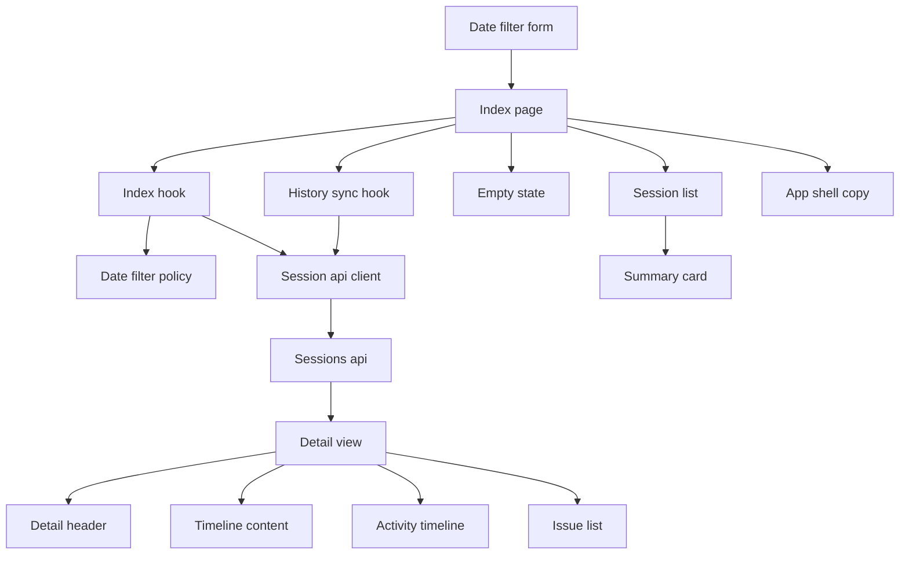
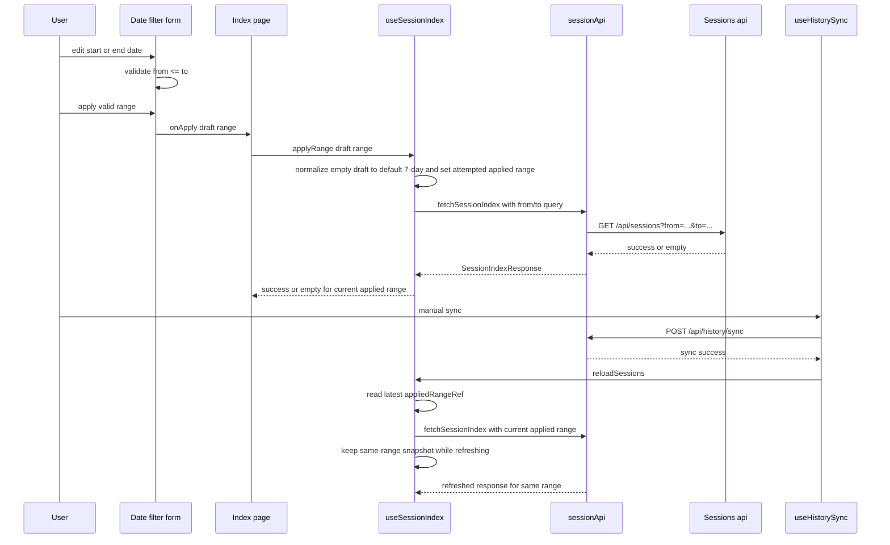
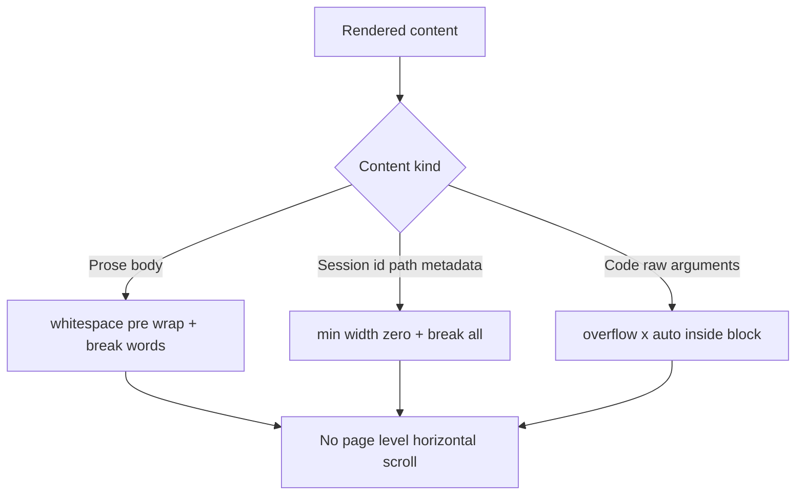

# 設計書

## 概要
この feature は、GitHub Copilot CLI のローカル会話履歴を読み返す利用者に、**セッション一覧を日付範囲で絞り込める read-only 探索体験**と、**長い値が page 全体の横スクロールを発生させない表示**を提供する。対象利用者は、直近の会話だけを見たい利用者と、特定期間の履歴を見比べたい利用者である。

変更は既存の React frontend への拡張を中心に行う。backend の `/api/sessions` はすでに `from` / `to` 契約を持つため、この spec は frontend 側で default 7-day range、両日付未入力 apply を初期表示と同じ explicit 7-day reset として扱う正規化、draft / applied filter state、invalid range validation、sync 後の same-range refresh、overflow-safe rendering を追加し、既存 read-only API をそのまま再利用する。

### 目標
- 一覧初期表示を「直近 7 日」の明示 query に切り替える。
- 開始日 / 終了日の両方・片側のみの date range を UI から適用できる。
- 無効な range を一覧取得前に検出し、理由を読み取れる形で示す。
- sync 後の一覧再取得でも current filter を維持する。
- 一覧・詳細で長い id、metadata、issue path、本文、arguments、raw payload が page 全体の横スクロールを起こさない。
- current / legacy の保存形式差分を UI へ漏らさず、同じ date filtering 体験を維持する。

### 非目標
- backend endpoint、response shape、error envelope の追加・変更。
- repository、branch、model、全文検索、並び替え、pagination、件数制限など日付以外の探索 UI。
- 履歴の編集、削除、共有、自動更新、background polling。
- filter state の URL / localStorage / backend 永続化。
- 詳細画面全体の情報設計見直しや新しい raw viewer 追加。
- Rails `Time.zone` や DB schema の変更。

## 境界コミットメント

### この spec が責務を持つもの
- frontend 一覧画面での開始日 / 終了日入力、適用操作、invalid range validation。
- frontend 初期表示の default 7-day range、両日付未入力 apply の default 7-day reset、JST 境界付き `from` / `to` query 生成。
- `useSessionIndex` における applied range、query-keyed reusable snapshot、new-range apply と same-range reload の挙動差。
- sync 後 refresh 時に current filter を保ったまま一覧状態を更新すること。
- empty state で current range を確認できる表示と、generic error state との分離。
- 一覧・詳細の overflow policy。prose、id/path/meta、pre/code/raw を content type ごとに分けて扱う。
- read-only 方針を維持した shell copy と frontend tests。

### 境界外
- `GET /api/sessions` の parser / query / presenter 実装。
- current / legacy の source 読取、normalized session、display time 決定規則。
- sync API 自体の挙動、lock、conflict、backend error 分類。
- filter state の shareable URL、browser refresh 復元、session storage への保存。
- date range 以外の search / filter / sort / pagination controls。
- タイムゾーン切替 UI や利用者ごとの locale 選択。

### 許可する依存
- backend の既存 `/api/sessions` contract (`from` / `to` / invalid_session_list_query`)。
- frontend `sessionApi.ts` / `sessionApi.types.ts` / `useHistorySync.ts` / `useSessionIndex.ts`。
- browser 標準 `input type="date"`、`Intl.DateTimeFormat`、TypeScript 6 の明示型。
- 既存の Tailwind CSS 4 utility classes、React 19 component state、Vitest / Testing Library。
- 既存 `SessionSummaryCard`、`SessionDetailHeader`、`TimelineContent`、`ActivityTimeline`、`IssueList`、`AppShell`。

### 再検証トリガー
- `/api/sessions` の query parameter 名、ISO8601 parse semantics、invalid query envelope が変わる場合。
- frontend の timestamp 表示タイムゾーンが JST 固定ではなくなる場合。
- `useHistorySync` の refresh 接点が `reloadSessions()` 以外へ変わる場合。
- 日付以外の filter / sort / pagination / URL persistence を追加する場合。
- 詳細画面に timeline raw viewer や別種の preformatted block が増える場合。

## アーキテクチャ

### 既存アーキテクチャ分析
- `SessionIndexPage` は現在 `useSessionIndex()` と `useHistorySync({ reloadSessions })` を組み合わせるだけで、filter state を持たない。
- `useSessionIndex` は query なしの fetch と client 単位の reusable snapshot を持つが、snapshot key に range を含まない。
- `sessionApiClient.fetchSessionIndex()` は `/api/sessions` を固定 URL で呼び、query string を構築しない。
- `SessionEmptyState` は「一覧全体がまだ空」の copy を持つが、current range に 0 件だったことだけを表す責務へ絞れていない。
- `SessionSummaryCard`、`SessionDetailHeader`、`IssueList`、`SessionDetailPage` 上部の session id には長い token 向け wrap policy が不足している。
- `SessionSummaryCard` の metadata は `updated_at` だけを表示し、backend 一覧絞り込みが `created_at_source` fallback を使う場合の理由が UI から読み取れない。
- `TimelineContent` と `ActivityTimeline` には block-local `overflow-x-auto` があるが、prose 系本文と issue path の token break は未整理である。
- `AppShell` の説明文には「絞り込みを提供しない」と残っており、新 feature と矛盾する。

### アーキテクチャパターンと境界マップ



**アーキテクチャ統合**:
- 採用パターン: **frontend-owned filter state on top of existing read-only API**。backend は既存 query contract を維持し、frontend が default range・empty-range reset・validation・query serialization・range-scoped empty semantics を持つ。
- 依存方向:
  - date filtering: `sessionApi.types` → `sessionDateFilter` → `sessionApi` → `useSessionIndex` → `SessionIndexPage` → leaf components
  - overflow rendering: `sessionApi.types` / `formatters` → `SessionSummaryCard` / `SessionDetailHeader` / `TimelineContent` / `ActivityTimeline` / `IssueList`
- 維持する既存パターン: feature-local files、relative import、read-only API reuse、`useHistorySync` からの callback refresh、Tailwind utility styling。
- 新規 component rationale:
  - `sessionDateFilter.ts` は date input 値、empty-range reset、JST query 境界、empty-state label を 1 か所で定義する。
  - `SessionDateFilterForm.tsx` は draft input と inline validation を page から分離し、page を state orchestration に集中させる。
  - `useSessionIndex` 拡張は filter persistence、attempted range ownership、same-range refresh policy を hook 境界に閉じる。
  - `SessionEmptyState` は current applied range の 0 件だけを表し、global empty 推論や sync outcome 判定を抱え込まない。
- ステアリング適合: read-only API、軽量 SPA、Docker / existing tests、current / legacy 共通 contract をそのまま維持する。

### 技術スタック

| レイヤー | 選択 / バージョン | feature での役割 | 備考 |
|----------|--------------------|------------------|------|
| Frontend UI | React 19 / TypeScript 6 | date filter form、applied range state、empty state、overflow-safe rendering | `any` は使わない |
| Frontend API | 既存 `sessionApi` client | `from` / `to` query serialization と same endpoint reuse | endpoint 追加なし |
| Browser Platform | `input type="date"`, `Intl.DateTimeFormat` | 日付入力と JST 日付境界の補助 | 外部 date picker 不使用 |
| Styling | Tailwind CSS 4 | wrap / break / local scroll policy の適用 | 新規 UI library なし |
| Backend | Rails 8.1 API 既存 `/api/sessions` | date range query の受け口 | parser/query 実装は変更しない |
| Tests | Vitest / Testing Library | helper、hook、page、component 振る舞いの固定 | 既存 frontend test 導線を継続 |

## ファイル構成計画

### ディレクトリ構成
```text
frontend/
├── src/
│   ├── app/
│   │   └── AppShell.tsx                             # read-only shell copy を現在の scope に合わせる
│   ├── App.test.tsx                                 # shell と index route の表示契約を固定する
│   └── features/
│       └── sessions/
│           ├── api/
│           │   ├── sessionApi.types.ts              # SessionIndexRequest / SessionIndexQuery の frontend internal contract
│           │   ├── sessionApi.ts                    # GET /api/sessions の query string 構築を担う
│           │   └── sessionApi.test.ts               # explicit default 7-day / one-sided query serialization と no-query compatibility を検証する
│           ├── presentation/
│           │   ├── sessionDateFilter.ts             # default 7-day、empty-range reset、JST query 境界、validation、range label を定義する
│           │   ├── formatters.ts                    # 一覧表示時刻の fallback と metadata 表示を filter semantics に合わせる
│           │   └── sessionDateFilter.test.ts        # helper contract と empty-range reset を固定する
│           ├── hooks/
│           │   ├── useSessionIndex.ts               # attempted applied range、query-keyed snapshot、apply/reload policy、latest-range refresh を担う
│           │   ├── useHistorySync.ts                # existing sync flow から current filter の reload を呼ぶ
│           │   └── useSessionIndex.test.tsx         # new-range loading/error、empty-range reset、same-range reload、latest-range refresh を検証する
│           ├── components/
│           │   ├── SessionDateFilterForm.tsx        # 開始日 / 終了日 input、validation、Apply action を描画する
│           │   ├── SessionDateFilterForm.test.tsx   # invalid / one-sided / valid-after-fix を検証する
│           │   ├── SessionEmptyState.tsx            # current range の 0 件を示す empty copy と sync CTA を描画する
│           │   ├── SessionEmptyState.test.tsx       # range-scoped empty と synced-empty 補助文言を検証する
│           │   ├── SessionList.tsx                  # existing session card list を現在の filter 結果へ適用する
│           │   ├── HistorySyncControl.tsx           # existing manual sync CTA を filter form と並べて再利用する
│           │   ├── HistorySyncStatus.tsx            # existing sync result banner を current filter と併存させる
│           │   ├── SessionSummaryCard.tsx           # 一覧 id / preview / metadata の wrap policy と filter-basis timestamp 表示を担う
│           │   ├── SessionDetailHeader.tsx          # 詳細 header id / metadata の wrap policy を担う
│           │   ├── TimelineContent.tsx              # prose wrap と pre/code local scroll の分岐を担う
│           │   ├── ActivityTimeline.tsx             # raw payload block の local scroll を担う
│           │   └── IssueList.tsx                    # issue path と長文メッセージの wrap policy を担う
│           └── pages/
│               ├── SessionIndexPage.tsx             # filter form・sync・list/empty/error state を統合する
│               ├── SessionIndexPage.test.tsx        # page-level filter apply / empty / sync retention を検証する
│               └── SessionDetailPage.tsx            # detail page 上部の session id overflow を抑える
```

### 変更対象ファイル
- `frontend/src/features/sessions/api/sessionApi.types.ts` — `SessionIndexRequest` と `SessionIndexQuery` を追加し、query 付き index fetch を型で表現する。
- `frontend/src/features/sessions/api/sessionApi.ts` — `fetchSessionIndex` が optional query を受け取り、未指定値を含めず URL を組み立てる。
- `frontend/src/features/sessions/api/sessionApi.test.ts` — explicit default 7-day query、one-sided query、query なし compatibility を検証する。
- `frontend/src/features/sessions/presentation/sessionDateFilter.ts` — `SessionDateRangeDraft`、empty-range reset、validation、JST-inclusive query 変換、range label helper を新設する。
- `frontend/src/features/sessions/presentation/sessionDateFilter.test.ts` — default 7-day の日付、両日付空の reset、`from > to` invalid、one-sided valid、JST end-of-day 境界を検証する。
- `frontend/src/features/sessions/hooks/useSessionIndex.ts` — applied range 初期値を default 7-day にし、valid submit 時点で attempted range を current applied range に確定する。query-keyed reusable snapshot、`applyRange()`、latest `appliedRangeRef` を使う `reloadSessions()` を実装する。
- `frontend/src/features/sessions/hooks/useSessionIndex.test.tsx` — new-range apply 時は prior different-range success を visible state に残さないこと、new-range error でも attempted range が current applied range に残ること、empty-range apply が default 7-day へ戻ること、same-range reload、sync 中の別条件 apply 後も latest range refresh を確認する。
- `frontend/src/features/sessions/components/SessionDateFilterForm.tsx` — date inputs、Apply button、validation message、current applied range 補助表示を新設する。
- `frontend/src/features/sessions/components/SessionDateFilterForm.test.tsx` — invalid range で submit 不可、修正後 submit 可、one-sided valid、両日付空 submit が reset として扱われることを確認する。
- `frontend/src/features/sessions/components/SessionEmptyState.tsx` — current range label を表示し、empty panel 自体は常に range-scoped copy を出す。`synced_empty` は補助メッセージとして併存させる。
- `frontend/src/features/sessions/components/SessionEmptyState.test.tsx` — default 7-day empty と user-selected filtered empty が current range を示すこと、`synced_empty` が empty panel の意味を変えず補助表示として出ることを確認する。
- `frontend/src/features/sessions/pages/SessionIndexPage.tsx` — filter form と current range を一覧画面へ統合し、loading / empty / error の文脈を attempted applied range と同期させる。
- `frontend/src/features/sessions/pages/SessionIndexPage.test.tsx` — 初期 7 日 fetch、start-only/end-only apply、両日付空 apply の default reset、new-range error でも attempted range が残ること、sync 中に別条件へ切替えた後も latest range で refresh されること、range-scoped empty copy を page level で検証する。
- `frontend/src/features/sessions/presentation/formatters.ts` — 一覧表示時刻を `updated_at ?? created_at` の優先順で求める helper と metadata label を追加する。
- `frontend/src/features/sessions/components/SessionSummaryCard.tsx` — long session id、preview、metadata value を `min-w-0` / `break-all` / `break-words` で収めつつ、一覧表示時刻を backend filter basis と同じ優先順で示す。
- `frontend/src/features/sessions/components/SessionDetailHeader.tsx` — detail id と metadata value の wrap policy を追加する。
- `frontend/src/features/sessions/pages/SessionDetailPage.tsx` — 上部の route session id 表示にも token break を適用する。
- `frontend/src/features/sessions/components/TimelineContent.tsx` — prose block は wrap、tool arguments / code block は local scroll の class に統一する。
- `frontend/src/features/sessions/components/ActivityTimeline.tsx` — raw payload pre block を local scroll 前提へそろえる。
- `frontend/src/features/sessions/components/IssueList.tsx` — issue message と source_path に wrap policy を追加する。
- `frontend/src/app/AppShell.tsx` — 「絞り込みを提供しない」という説明文を現在の scope に合わせて更新する。
- `frontend/src/App.test.tsx` — read-only だが date filtering は許可される shell copy を反映する。

## システムフロー





- `applyRange()` は new-range request として扱い、valid submit 時点で normalized range を current applied range に確定し、previous different-range list を current confirmed result として見せない。
- 両日付空の apply は backend の no-query fallback に戻さず、frontend で初期表示と同じ default 7-day range へ正規化する。
- `reloadSessions()` は same applied range の refresh として扱い、sync 完了時に `appliedRangeRef` から latest range を解決して UI 揺れや stale refresh を抑える。
- empty panel は API が返した「current applied range で 0 件」という事実だけを表し、履歴全体が空であるとは推論しない。
- overflow policy は component-local に閉じ、shell 全体を無差別に clip して情報を欠落させない。

## 要件トレーサビリティ

| 要件 | 要約 | コンポーネント | インターフェース | フロー |
|------|------|----------------|------------------|--------|
| 1.1 | 初期表示を直近 7 日にする | `sessionDateFilter`, `useSessionIndex`, `SessionIndexPage`, `sessionApi` | default range, `SessionIndexQuery` | date filter apply flow |
| 1.2 | 開始日と終了日の両端を含む絞り込み | `SessionDateFilterForm`, `sessionDateFilter`, `sessionApi` | JST-inclusive `from` / `to` query | date filter apply flow |
| 1.3 | 開始日だけの one-sided range | `SessionDateFilterForm`, `sessionDateFilter`, `sessionApi` | optional `from` query | date filter apply flow |
| 1.4 | 終了日だけの one-sided range | `SessionDateFilterForm`, `sessionDateFilter`, `sessionApi` | optional `to` query | date filter apply flow |
| 1.5 | 両日付未入力 apply を直近 7 日へ戻す | `sessionDateFilter`, `useSessionIndex`, `SessionDateFilterForm`, `SessionIndexPage`, `sessionApi` | resolved default range, explicit `SessionIndexQuery` | date filter apply flow |
| 1.6 | current 開始日 / 終了日を確認可能にする | `SessionDateFilterForm`, `SessionEmptyState`, `SessionIndexPage` | applied range label, date input value | date filter apply flow |
| 2.1 | 新条件に一致する結果だけを扱う | `useSessionIndex`, `SessionIndexPage` | `applyRange()` request policy | date filter apply flow |
| 2.2 | sync 後も同じ日付条件で再取得する | `useSessionIndex`, `useHistorySync`, `sessionApi` | `reloadSessions()` with applied query | sync refresh flow |
| 2.3 | 一致しないとき filtered empty を表示する | `SessionEmptyState`, `SessionIndexPage` | empty copy by applied range | date filter apply flow |
| 2.4 | filtered empty 中も current range を確認できる | `SessionDateFilterForm`, `SessionEmptyState` | applied range label | date filter apply flow |
| 2.5 | 別条件へ切替時に直前の別条件一覧を current result として見せない | `useSessionIndex`, `SessionIndexPage` | new-range loading policy | date filter apply flow |
| 3.1 | 無効な range を取得前に防ぐ | `sessionDateFilter`, `SessionDateFilterForm` | range validation | date filter apply flow |
| 3.2 | 無効な range を送信できない | `SessionDateFilterForm` | disabled Apply state | date filter apply flow |
| 3.3 | valid に修正後は適用できる | `SessionDateFilterForm`, `SessionIndexPage` | validation state transition | date filter apply flow |
| 3.4 | one-sided input は invalid 扱いしない | `sessionDateFilter`, `SessionDateFilterForm` | optional date validation | date filter apply flow |
| 3.5 | invalid 理由を取得前に読める | `SessionDateFilterForm` | inline validation message | date filter apply flow |
| 4.1 | 一覧の長い id / metadata で page 横スクロールを起こさない | `SessionSummaryCard` | wrap / break policy | overflow policy flow |
| 4.2 | 詳細の本文 / 補助情報 / arguments で page 横スクロールを起こさない | `SessionDetailHeader`, `SessionDetailPage`, `TimelineContent`, `IssueList` | wrap / local scroll policy | overflow policy flow |
| 4.3 | code / preformatted text は block 内だけで横移動できる | `TimelineContent`, `ActivityTimeline` | `overflow-x-auto` block contract | overflow policy flow |
| 4.4 | 長い内容があっても周辺文脈を同じ幅で読み続けられる | `SessionSummaryCard`, `SessionDetailHeader`, `TimelineContent`, `ActivityTimeline`, `IssueList` | content-type-specific overflow policy | overflow policy flow |
| 4.5 | 長い内容がないとき既存可読性を落とさない | `SessionSummaryCard`, `SessionDetailHeader`, `TimelineContent` | no-op styling for normal content | overflow policy flow |
| 5.1 | 追加する filter は日付範囲だけに限る | Boundary Commitments, `SessionDateFilterForm`, `SessionIndexPage` | form fields = start/end only | architecture boundary |
| 5.2 | search / repo / branch / model / sort / pagination / limit UI を追加しない | Boundary Commitments, `AppShell`, `SessionIndexPage` | scope-limited shell copy | architecture boundary |
| 5.3 | edit / delete / share / auto-refresh を追加しない | Boundary Commitments, `AppShell`, existing read-only pages | read-only UI boundary | architecture boundary |
| 5.4 | current / legacy の両形式で同じ date filtering 体験 | `sessionApi`, `useSessionIndex`, `SessionIndexPage` | shared `/api/sessions` contract | architecture boundary |
| 5.5 | read-only 体験を維持したまま date exploration を追加する | `AppShell`, `SessionIndexPage`, `useHistorySync` | read-only navigation + manual sync | architecture boundary |

## コンポーネントとインターフェース

| コンポーネント | ドメイン / 層 | 目的 | 要件カバレッジ | 主要依存 (P0/P1) | 契約 |
|----------------|---------------|------|----------------|------------------|------|
| `sessionDateFilter` | Presentation | default 7-day、empty-range reset、JST query 境界、validation、range label を定義する | 1.1-1.6, 2.3-2.4, 3.1-3.5 | `sessionApi.types` (P0) | Service |
| `sessionApi` index request builder | API client | optional `from` / `to` を既存 `/api/sessions` へ渡す | 1.1-1.5, 2.2, 5.4 | browser `fetch` (P0), backend `/api/sessions` (P0) | Service, API |
| `useSessionIndex` | Hook | attempted applied range、query-keyed snapshot、apply/reload policy、latest-range refresh を持つ | 1.1, 1.5, 1.6, 2.1-2.5 | `sessionDateFilter` (P0), `sessionApi` (P0), `useHistorySync` callback contract (P1) | Service, State |
| `SessionDateFilterForm` | UI | draft input、inline validation、apply action を描画する | 1.2-1.6, 3.1-3.5, 5.1 | `sessionDateFilter` (P0), `SessionIndexPage` (P0) | State |
| `SessionIndexPage` | Page | filter form、sync control、list/empty/error state を統合する | 1.1-2.5, 5.1-5.5 | `useSessionIndex` (P0), `useHistorySync` (P0), `SessionEmptyState` (P1) | State |
| `SessionEmptyState` | UI | current applied range に対する empty state を示し、sync outcome の補助文言を併存させる | 1.6, 2.3, 2.4, 5.5 | `SessionIndexPage` (P0), `useHistorySync` state (P1), `sessionDateFilter` (P1) | State |
| `SessionSummaryCard`, `SessionDetailHeader`, `SessionDetailPage`, `TimelineContent`, `ActivityTimeline`, `IssueList` | UI | overflow-safe rendering と一覧表示時刻の filter-basis 整合を content type ごとに担う | 1.6, 4.1-4.5, 5.4 | `formatters` (P0), existing DTOs (P0) | State |
| `AppShell` | App shell | read-only scope を新しい feature 境界に沿って説明する | 5.2, 5.3, 5.5 | `react-router` (P1) | State |

### Presentation / API

#### `sessionDateFilter`

| Field | Detail |
|-------|--------|
| Intent | date input 値、empty-range reset、JST 境界、validation、range label を一貫した pure helper として定義する |
| Requirements | 1.1, 1.2, 1.3, 1.4, 1.5, 1.6, 2.3, 2.4, 3.1, 3.2, 3.3, 3.4, 3.5 |

**Responsibilities & Constraints**
- `YYYY-MM-DD` または空文字だけを受ける draft 型を定義する。
- default range は JST の「今日を含む直近 7 日」を返す。
- `from=''` かつ `to=''` の apply は initial load と同じ default 7-day range へ正規化する。
- `from > to` 以外は invalid にしない。
- query 変換は JST 開始 / 終了境界を offset 付き ISO8601 で返し、backend default 30 日へ依存しない。

**Dependencies**
- Inbound: `useSessionIndex` — applied range 初期値と query key 生成に使用する (P0)
- Inbound: `SessionDateFilterForm` — validation と label 表示に使用する (P0)
- Outbound: `sessionApi.types` — `SessionIndexQuery` へ変換する (P0)

**Contracts**: Service [x] / API [ ] / Event [ ] / Batch [ ] / State [ ]

##### Service Interface
```typescript
interface SessionDateRangeDraft {
  from: string
  to: string
}

type SessionDateRangeValidation =
  | { kind: 'valid' }
  | { kind: 'invalid'; field: 'range'; message: string }

interface SessionDateFilterService {
  buildDefaultRange(now?: Date): SessionDateRangeDraft
  resolveAppliedRange(range: SessionDateRangeDraft, now?: Date): SessionDateRangeDraft
  validateRange(range: SessionDateRangeDraft): SessionDateRangeValidation
  toSessionIndexQuery(range: SessionDateRangeDraft): SessionIndexQuery
  formatRangeLabel(range: SessionDateRangeDraft): string
  buildQueryKey(range: SessionDateRangeDraft): string
}
```
- Preconditions:
  - `from` / `to` は空文字または `YYYY-MM-DD`
- Postconditions:
  - default range は 7 calendar days 分の start/end を持つ
  - `resolveAppliedRange` は両日付空を default range へ変換し、それ以外は入力 range を維持する
  - invalid は `from` と `to` の両方が存在し、`from > to` の場合だけ返す
  - `to` 境界は `23:59:59.999999+09:00` を使う
- Invariants:
  - query key は resolved range 値だけから決まり、client 実装差分を含まない

**Implementation Notes**
- Integration: range label は empty state と form 補助文言の両方で再利用し、empty-range reset も同じ helper で決める。
- Validation: helper unit test で default 7-day、empty-range reset、one-sided、invalid、JST 境界を固定する。
- Risks: browser locale に依存した表示文字列を作らず、input value そのものを使って deterministic に組み立てる。

#### `sessionApi` index request builder

| Field | Detail |
|-------|--------|
| Intent | existing `/api/sessions` を変えずに optional date query を送る |
| Requirements | 1.1, 1.2, 1.3, 1.4, 1.5, 2.2, 5.4 |

**Responsibilities & Constraints**
- `fetchSessionIndex` は query 未指定時も既存 endpoint を使う。
- `from` / `to` は空値を送らず、defined value だけ query string に含める。
- feature の一覧取得フローでは `useSessionIndex` が resolved range を必ず渡し、backend default 30 日 fallback を通常動線で使わない。
- response / error normalization は既存実装を保つ。

**Dependencies**
- Inbound: `useSessionIndex` — current applied range を request に渡す (P0)
- Outbound: backend `/api/sessions` — existing JSON contract (P0)
- External: browser `fetch` — HTTP client (P0)

**Contracts**: Service [x] / API [x] / Event [ ] / Batch [ ] / State [ ]

##### Service Interface
```typescript
interface SessionIndexRequest {
  signal?: AbortSignal
  query?: SessionIndexQuery
}

interface SessionApiClient {
  fetchSessionIndex(request?: SessionIndexRequest): Promise<SessionApiResult<SessionIndexResponse>>
}
```

##### API Contract
| Method | Endpoint | Request | Response | Errors |
|--------|----------|---------|----------|--------|
| GET | `/api/sessions` | `query.from?: ISO8601`, `query.to?: ISO8601` | `SessionIndexResponse` | existing backend/config/network errors |

**Implementation Notes**
- Integration: `URLSearchParams` で query を構築し、parameter 順は stable にする。
- Validation: unit test で explicit default 7-day、from-only、to-only、from+to、no-query compatibility を固定する。
- Risks: empty string をそのまま送ると backend parser へ余計な条件が入るため、serialize 前に除外する。

### Hooks / Pages

#### `useSessionIndex`

| Field | Detail |
|-------|--------|
| Intent | applied range と index fetch lifecycle を所有し、new-range apply と same-range reload を区別する |
| Requirements | 1.1, 1.5, 1.6, 2.1, 2.2, 2.5, 3.3, 5.4 |

**Responsibilities & Constraints**
- mount 時に default 7-day range を current applied range として fetch する。
- `applyRange(nextRange)` は valid submit の時点で normalized range を current applied range として state / ref に確定し、loading / empty / error はその attempted range を主語にする。
- `applyRange(nextRange)` は両日付空の draft を resolved default 7-day range へ正規化してから request する。
- `applyRange(nextRange)` は previous different-range success を visible confirmed result として残さない。
- `reloadSessions()` は same applied range の refresh として previous success / empty snapshot を維持できる。
- `reloadSessions()` は closure ではなく latest `appliedRangeRef` を参照し、sync 中に別条件が apply されても新しい条件で再取得する。
- reusable snapshot は `client + queryKey` で再利用し、別 range の result を混ぜない。
- same query key の refresh error だけは previous reusable snapshot を残して返し、different query key の error は attempted range の error state をそのまま表示する。

**Dependencies**
- Inbound: `SessionIndexPage` — apply/reload を呼ぶ (P0)
- Inbound: `useHistorySync` — `reloadSessions()` callback を利用する (P1)
- Outbound: `sessionDateFilter` — default range、query key、query serialization (P0)
- Outbound: `sessionApi` — fetch 実行 (P0)

**Contracts**: Service [x] / API [ ] / Event [ ] / Batch [ ] / State [x]

##### Service Interface
```typescript
interface UseSessionIndexResult {
  state: SessionIndexState
  appliedRange: SessionDateRangeDraft
  isRefreshing: boolean
  applyRange(range: SessionDateRangeDraft): Promise<SessionIndexSettledState>
  reloadSessions(): Promise<SessionIndexSettledState>
}
```
- Preconditions:
  - `applyRange` に渡す range は `SessionDateFilterForm` で validation 済み
- Postconditions:
  - `applyRange` 呼び出し開始時点で normalized `appliedRange` と current query key が更新される
  - `applyRange` が error で終了しても `appliedRange` は attempted range のまま残る
  - `reloadSessions` は latest `appliedRangeRef` で再取得する
- Invariants:
  - `appliedRange` は valid apply 後に両日付空のまま保持しない
  - different-range result を same snapshot key へ保存しない
  - error state は reusable snapshot として保存しない

##### State Management
- State model:
  - `loading` — initial load または new-range apply 中
  - `success` / `empty` — current applied range の settled result
  - `error` — current applied range の load error
- Persistence & consistency:
  - module-scope reusable snapshot は `client + queryKey` だけを key にする
  - applied range は state と ref の両方で保持し、非同期 callback は ref から latest value を読む
  - `lastReusableSnapshot` は same-range refresh 用の補助であり、current applied range そのものを置き換えない
- Concurrency strategy:
  - active request は request id + `AbortController` で管理し、stale response を無視する
  - sync 完了時の refresh は `appliedRangeRef` を読み直して stale closure を回避する

**Implementation Notes**
- Integration: `useHistorySync` からは `reloadSessions` だけを受け、filter state を二重管理しない。
- Validation: hook test で remount reuse、same-range reload、new-range loading、empty-range reset、new-range error 時の attempted range 保持、stale request 無視、sync 中の別条件 apply 後も latest range が使われることを確認する。
- Risks: page draft state と applied range は意図的に分かれるため、confirmed result / loading / error label は常に `appliedRange` を使う。

#### `SessionDateFilterForm`

| Field | Detail |
|-------|--------|
| Intent | start/end date input、validation message、apply action を page から切り出す |
| Requirements | 1.2, 1.3, 1.4, 1.5, 1.6, 3.1, 3.2, 3.3, 3.4, 3.5, 5.1 |

**Responsibilities & Constraints**
- field は開始日 / 終了日の 2 つだけを描画する。
- invalid range message を field 群の近くに表示し、Apply を disabled にする。
- 両日付空の submit は invalid にせず、「直近 7 日へ戻す」 apply として扱う。
- current applied range を補助テキストとして見せ、draft と confirmed result を混同させない。

**Dependencies**
- Inbound: `SessionIndexPage` — draft state と apply handler を渡す (P0)
- Outbound: `sessionDateFilter` — validation / label helper を使う (P0)

**Contracts**: Service [ ] / API [ ] / Event [ ] / Batch [ ] / State [x]

##### State Management
- State model:
  - draft start / end value
  - validation state
  - apply in-flight disabled state
- Persistence & consistency:
  - component local stateは持たず、page から controlled props を受け取る
- Concurrency strategy:
  - `isApplying` 中は重複 apply を防ぐ

**Implementation Notes**
- Integration: sync control より上に配置し、list/empty/error のどの state でも current range を確認できるようにする。
- Validation: invalid range、one-sided valid、両日付空 submit の component test を書く。
- Risks: browser native date input の locale 表示差はあるが、value contract は `YYYY-MM-DD` で固定する。

#### `SessionEmptyState`

| Field | Detail |
|-------|--------|
| Intent | current applied range に対する 0 件を示し、sync outcome とは責務を分ける |
| Requirements | 1.6, 2.3, 2.4, 5.5 |

**Responsibilities & Constraints**
- empty panel は「current applied range に一致する session が 0 件」であることだけを表し、履歴全体が存在しないとは断定しない。
- current applied range label を title または補助文言の近くに表示し、利用者が条件を見直せる状態を保つ。
- `synced_empty` は empty panel と矛盾しない補助文言として扱い、panel の意味自体は range-scoped のまま維持する。
- fetch failure は既存 error panel に分離し、empty copy へ流し込まない。

**Dependencies**
- Inbound: `SessionIndexPage` — current applied range label と sync action を渡す (P0)
- Inbound: `useHistorySync` — `synced_empty` 補助文言に使用する (P1)
- Outbound: `StatusPanel` — empty visual shell を再利用する (P0)

**Contracts**: Service [ ] / API [ ] / Event [ ] / Batch [ ] / State [x]

##### State Management
- State model:
  - `range_empty` — current applied range に 0 件
  - `range_empty_with_synced_hint` — `synced_empty` 補助文言を伴う 0 件
- Persistence & consistency:
  - component local state は持たず、page から controlled props を受け取る
- Concurrency strategy:
  - syncing 中も current applied range label を維持し、action disabled だけを切り替える

**Implementation Notes**
- Integration: empty panel の copy は `sessionDateFilter.formatRangeLabel()` を再利用し、form と同じ表現で current range を示す。
- Validation: default 7-day empty、user-selected filtered empty、`synced_empty` 補助文言の 3 パターンを component / page test で固定する。
- Risks: global empty を推論する copy を入れると API contract と乖離するため、この component では扱わない。

### UI Rendering Surfaces

#### Overflow-sensitive components

| Field | Detail |
|-------|--------|
| Intent | 長い token は wrap、preformatted content は local scroll とし、page 全体の横スクロールを防ぐ |
| Requirements | 4.1, 4.2, 4.3, 4.4, 4.5 |

**Responsibilities & Constraints**
- `SessionSummaryCard` / `SessionDetailHeader` / `SessionDetailPage` は session id と metadata value に `min-w-0` と token break を適用する。
- `SessionSummaryCard` の timestamp 表示は `updated_at ?? created_at` の優先順で一覧絞り込み根拠と合わせる。
- `IssueList` は message を wrap し、`source_path` は monospaced でも token break 可能にする。
- `TimelineContent` は prose text と detail body を wrap し、code / arguments preview は `overflow-x-auto` block に統一する。
- `ActivityTimeline` は raw payload pre block も同じ local scroll policy にそろえる。

**Dependencies**
- Inbound: existing DTO fields (`id`, `work_context`, `detail`, `raw_payload`, `source_path`) (P0)
- Outbound: Tailwind utility classes (P0)

**Contracts**: Service [ ] / API [ ] / Event [ ] / Batch [ ] / State [x]

**Implementation Notes**
- Integration: page root clip ではなく component-local policy で対処する。
- Validation: component test では long string fixture を使い、意図した class と rendering branch を確認する。
- Risks: prose と code の class を混ぜると requirement 4.3 を損ねるため、`TimelineContent` の branch ごとに class を分けて管理する。

## データモデル

### ドメインモデル
- `SessionDateRangeDraft`
  - `from`: `YYYY-MM-DD` または空文字
  - `to`: `YYYY-MM-DD` または空文字
  - invariant: 送信前 validation は `from > to` だけを invalid とする
- `SessionIndexQuery`
  - `from?: string`
  - `to?: string`
  - invariant: 値があるときだけ送信し、JST-inclusive ISO8601 を使う
- `AppliedSessionRange`
  - `draft`: form 入力中の range
  - `resolved`: current request / loading / empty / error を説明する normalized range
  - invariant: valid apply の開始後、`resolved` は attempted range を表し続ける
- `QueryScopedSnapshot`
  - `client`
  - `queryKey`
  - `state` (`success` or `empty`)
  - invariant: error は保存しない

### 論理データモデル
- filter state は frontend memory のみで保持する。
- `draftRange` は form 入力中の値、`appliedRange` は empty-range reset を解決済みの current request 条件として分ける。
- `appliedRange` は valid apply 開始時点で更新され、request error 時も attempted range のまま残る。
- snapshot key は resolved range の `from=<value>|to=<value>` で表現する。
- empty panel は `appliedRange + SessionIndexResponse.data.length === 0` から導出し、global empty は推論しない。
- backend response の data model (`SessionSummary`, `SessionIndexMeta`) は変更しない。

### Data Contracts & Integration

**API Data Transfer**
- Request:
  - `GET /api/sessions`
  - `from`: optional ISO8601 string, e.g. `2026-05-01T00:00:00+09:00`
  - `to`: optional ISO8601 string, e.g. `2026-05-07T23:59:59.999999+09:00`
- Validation rules:
  - frontend では `from > to` を送らない
  - 両日付空の apply は frontend で default 7-day range へ解決してから送る
  - one-sided range はそのまま送る
- Response:
  - existing `SessionIndexResponse`
  - `meta.count`, `meta.partial_results` は既存どおり扱う
  - `count=0` は current applied range で 0 件だったことだけを意味し、global empty flag には使わない

Skip: physical persistence changes, event schemas, cross-service synchronization.

## エラーハンドリング

### Error Strategy
- **User error**: `from > to` は request 前に `SessionDateFilterForm` で inline message を表示し、Apply を disabled にする。
- **System error**: backend / network / config error は既存 error panel を再利用し、empty state と混同しない。
- **Query error ownership**: new-range load error は attempted `appliedRange` を維持したまま表示し、same-range refresh error だけ previous snapshot を残す。
- **Refresh error after sync**: 既存 `useHistorySync` の `refresh_error` を維持しつつ、`reloadSessions()` は latest applied range を使う。

### Error Categories and Responses
- **User Errors**: invalid range → field-level message と submit disabled
- **System Errors**: `root_missing`, network, config → generic error panel
- **Business Logic Errors**: existing `invalid_session_list_query` は原則 frontend validation で回避するが、直接 URL 呼び出しや将来の回帰時は backend error として扱う

### Monitoring
- 新しい runtime logging は追加しない。
- 回帰防止は helper / hook / page / component tests で担保する。

## テスト戦略

### Unit Tests
- `sessionDateFilter.test.ts`
  - default 7-day range が JST の今日を含む 7 日であること
  - 両日付空の apply が default 7-day range へ解決されること
  - `from > to` だけを invalid とし、one-sided range は valid であること
  - `to` query が `23:59:59.999999+09:00` を使うこと
- `sessionApi.test.ts`
  - index fetch が explicit default 7-day と `from` / `to` を URL に直列化すること
  - undefined query を送らないこと
- `useSessionIndex.test.tsx`
  - remount 時は same query key の snapshot だけ即時再利用すること
  - empty-range apply が default 7-day を current applied range とすること
  - new-range apply 中は previous different-range success を current confirmed state にしないこと
  - new-range error 後も attempted range が current applied range として残ること
  - same-range reload は previous snapshot を維持すること
  - sync 中に別条件が apply された場合でも refresh は latest applied range を使うこと

### Integration Tests
- `SessionIndexPage.test.tsx`
  - 初期 mount で default 7-day range が使われること
  - start-only / end-only filter apply がそれぞれ one-sided query になること
  - 両日付空 apply が explicit default 7-day reset になること
  - filtered empty が current range を示し、error panel と別であること
  - new-range error でも attempted range label が残ること
  - sync 後 refresh が same applied range を再利用し、sync 中の条件変更後は latest applied range を使うこと
- `App.test.tsx`
  - read-only shell が date filtering を許容する説明文へ更新されること

### E2E / UI Tests
- `SessionDateFilterForm.test.tsx`
  - invalid range message が表示され、修正すると Apply 可能に戻ること
  - 両日付空 submit が reset として許可されること
- `SessionEmptyState.test.tsx`
  - default 7-day empty と filtered empty が current range を示すこと
  - `synced_empty` が empty panel の意味を変えず補助文言として切り替わること
- overflow-sensitive component tests
  - `SessionSummaryCard` / `SessionDetailHeader` / `IssueList` / `TimelineContent` / `ActivityTimeline` に長い token を渡して、wrap/local-scroll branch が維持されること
  - `SessionSummaryCard` が created-only session に対しても filter basis timestamp を表示すること

## Supporting References
- 詳細な調査根拠、採用しなかった option、JST 境界の判断理由は `research.md` を参照する。
