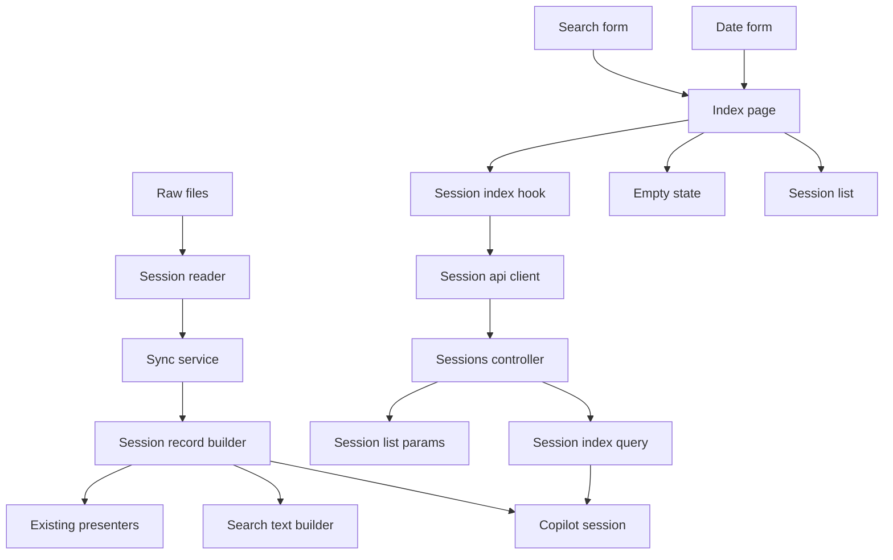
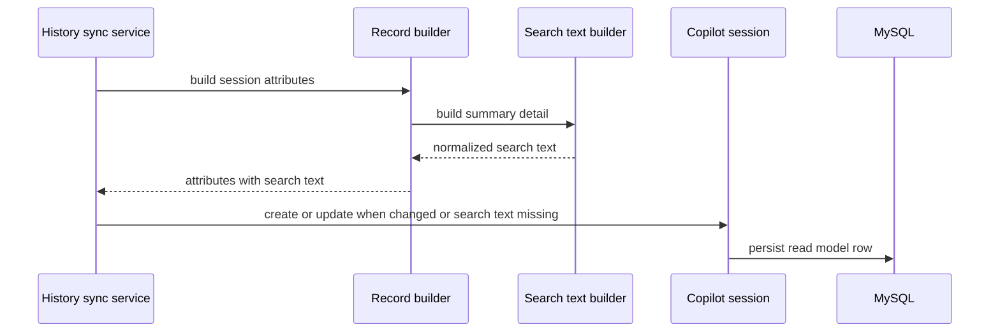
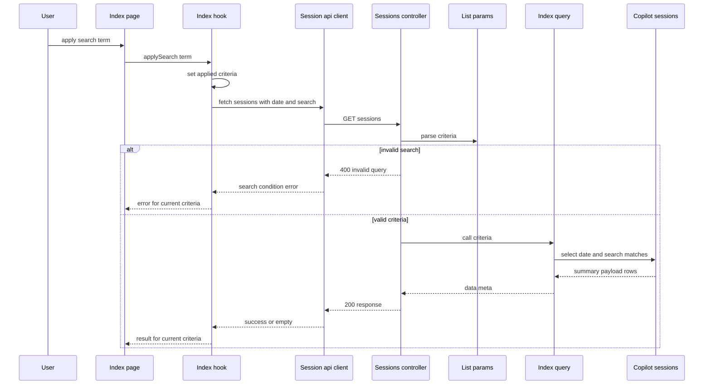
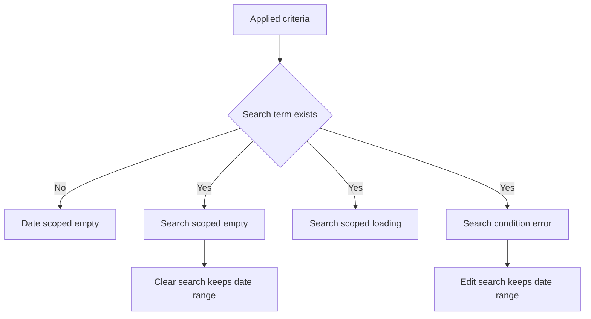

# 設計書

## 概要
この feature は、GitHub Copilot CLI のローカル会話履歴を読み返す利用者に、保存済みセッションを覚えている語句で絞り込める read-only 一覧探索を提供する。利用者は会話本文、会話 preview、issue code / message などの断片から目的のセッションを探せる。

影響範囲は、同期時に作る検索対象テキスト、`GET /api/sessions` の検索条件、frontend 一覧画面の検索入力・適用・解除・状態表示に限定する。検索は既存の日付範囲条件と併用され、通常表示と検索表示のどちらも保存済み `CopilotSession` read model を参照する。

### 目標
- 明示同期で保存または更新されたセッションに、再生成可能な検索対象テキストを保存する。
- `GET /api/sessions` が `search` query param と日付範囲の両方を満たす session summary を返す。
- 一覧画面で検索語の入力、適用、解除、検索中、検索空状態、検索条件エラーを扱う。
- 既存の response shape、degraded / issue 表示、read-only 閲覧体験、手動同期後 refresh を維持する。

### 非目標
- 外部検索サービス、semantic search、ベクトル検索、検索結果スコアリング、検索語ハイライト。
- tool call、activity、作業コンテキスト、repository / branch / model を既定の本文検索対象に含めること。
- repository / branch / model の専用 filter、並び替え UI、pagination、詳細画面内検索。
- 履歴の編集、削除、共有、自動同期、認証、認可。
- raw files の直接検索、API request 時の raw files 再読取。
- 検索条件の URL / localStorage / backend 永続化。

## 境界コミットメント

### この spec が責務を持つもの
- `CopilotSession` read model に保存する検索対象テキストの schema、validation、再生成 contract。
- `SessionRecordBuilder` から呼ばれる検索対象テキスト構築境界。
- 既存 read model row の検索 projection version が古い場合に、明示同期で update 対象にする skip 判定。
- `GET /api/sessions` の `search` query param parsing、validation、date range との合成 query。
- 検索条件を含んでも既存一覧 response shape、件数 meta、degraded / issue payload を維持すること。
- frontend 一覧画面の検索語 draft / applied state、適用、解除、sync 後 same-criteria refresh。
- 検索条件付き loading、検索結果 context、検索空状態、検索条件 client error の表示。
- backend / frontend tests による検索対象、API contract、UI state の固定。

### 境界外
- raw reader、normalizer、projector、既存 presenter の payload shape 変更。
- detail API、詳細画面内検索、検索語ハイライト、match snippet 生成。
- repository / branch / model の構造化 filter や検索結果 sort / pagination。
- search index 専用サービス、background reindex job、自動 file watch。
- 履歴編集・削除・共有、認証・認可、外部公開向け hardening。
- 既存 read model を一次ソースにすること。raw files は引き続き正本である。

### 許可する依存
- `CopilotSession` ActiveRecord model、`copilot_sessions` table、保存済み `summary_payload` / `detail_payload`。
- `CopilotHistory::Persistence::SessionRecordBuilder` と既存 API presenters が作る payload contract。
- `CopilotHistory::Api::SessionListParams`、`SessionIndexQuery`、`ErrorPresenter`、`SessionsController`。
- frontend `sessionApi.ts` / `sessionApi.types.ts` / `useSessionIndex.ts` / `useHistorySync.ts`。
- 既存 date filter helpers、`SessionDateFilterForm`、`SessionEmptyState`、`StatusPanel`、`SessionList`。
- Rails 8.1 API mode、ActiveRecord、MySQL 9.7、React 19、TypeScript 6、Vite、Vitest、RSpec。

### 再検証トリガー
- `summary_payload` / `detail_payload` の field 名、nesting、issue / conversation contract が変わる。
- tool call、activity、作業コンテキスト、repository / branch / model を既定検索へ含める要求が追加される。
- `CopilotSession` の保存 lifecycle、upsert 判定、read model 再生成方針が変わる。
- `GET /api/sessions` の response envelope、error envelope、date range semantics が変わる。
- 検索方式を literal substring match から FULLTEXT、ranking、semantic search、外部 search index へ変更する。
- 検索条件を URL persistence、pagination、sort、専用 structured filters と統合する。
- raw files を検索時に直接参照する要件が追加される。

## アーキテクチャ

### 既存アーキテクチャ分析
backend は `SessionRecordBuilder` が同期時に `summary_payload` と `detail_payload` を作り、`CopilotSession` に保存する。`GET /api/sessions` は `SessionListParams` で date / limit を正規化し、`SessionIndexQuery` が DB read model から `summary_payload` を返す。controller は HTTP status と error rendering に集中している。

frontend は `SessionIndexPage` が `useSessionIndex` と `useHistorySync` を組み合わせ、`SessionDateFilterForm` で date range を適用している。`useSessionIndex` は applied range、query-keyed reusable snapshot、AbortController による stale request 抑止、sync 後の same-range reload をすでに持つ。

この spec では、既存境界を維持したまま「検索語」を一覧 criteria に追加する。検索対象は同期・保存境界で作り、一覧 API は保存済み `search_text` を DB 条件として参照し、UI は date range と search term を 1 つの applied criteria として扱う。

### アーキテクチャパターンと境界マップ



**アーキテクチャ統合**:
- 採用パターン: read model search extension。同期時に検索対象を保存し、一覧 query では保存済み text と date range を合成する。
- 依存方向:
  - backend persistence/sync: `NormalizedSession` / presenters → `SessionSearchTextBuilder` → `SessionRecordBuilder` → `HistorySyncService` → `CopilotSession`
  - backend API: `SessionListParams` → `SessionIndexQuery` → `CopilotSession` → `SessionsController`
  - frontend: `sessionApi.types` → criteria helpers → `sessionApi` → `useSessionIndex` → `SessionIndexPage` → leaf components
- 維持する既存パターン: Rails controller は薄く保つ。raw files は同期時だけ読む。frontend は feature slice 内で API / hook / presentation / component を近接配置する。
- 新規 component rationale: `SessionSearchTextBuilder` は検索対象を payload 構築から分離し、`SessionSearchForm` は検索語入力と解除を date form から分離する。criteria helper は date range と search term の query key / label を一貫させる。
- ステアリング適合: DB read model は再生成可能な補助層であり、通常表示と検索表示は read-only API を通じて MySQL を参照する。

### 技術スタック

| レイヤー | 選択 / バージョン | feature での役割 | 備考 |
|----------|--------------------|------------------|------|
| Backend / Services | Ruby 4 / Rails 8.1 API mode | migration、model validation、search text builder、param parser、query object、error envelope | 新規 gem なし |
| Data / Storage | MySQL 9.7 / ActiveRecord | `copilot_sessions.search_text` の保存と一覧検索条件 | `MEDIUMTEXT`、初期は literal substring match、外部 index なし |
| Frontend UI | React 19 / TypeScript 6 | search form、applied criteria state、検索状態表示 | `any` は使わない |
| Frontend API | 既存 session API client | `search` query serialization | endpoint 追加なし |
| Tests | RSpec / Vitest / Testing Library | builder、request、hook、component、page behavior の固定 | Docker Compose 標準を維持 |

## ファイル構成計画

### ディレクトリ構成
```text
backend/
├── app/
│   ├── controllers/
│   │   └── api/
│   │       └── sessions_controller.rb                  # search criteria を index query へ渡す
│   └── models/
│       └── copilot_session.rb                          # search_text と search_text_version の contract を追加する
├── db/
│   ├── migrate/
│   │   ├── YYYYMMDDHHMMSS_add_search_text_to_copilot_sessions.rb
│   │   └── YYYYMMDDHHMMSS_add_search_text_version_to_copilot_sessions.rb
│   └── schema.rb
├── lib/
│   └── copilot_history/
│       ├── api/
│       │   ├── session_index_query.rb                  # date range と search_text 条件を合成する
│       │   ├── session_list_params.rb                  # search param を正規化する
│       │   └── presenters/
│       │       └── error_presenter.rb                  # search validation error を既存 envelope で返す
│       ├── persistence/
│       │   ├── session_record_builder.rb               # search_text を保存 attributes に含める
│       │   └── session_search_text_builder.rb          # 会話 payload と issue から検索対象を構築する
│       └── sync/
│           └── history_sync_service.rb                 # search_text_version が古い row を update 対象にする
└── spec/
    ├── requests/
    │   └── api/
    │       └── sessions_spec.rb
    ├── models/
    │   └── copilot_session_spec.rb
    └── lib/
        └── copilot_history/
            ├── api/
            │   ├── session_index_query_spec.rb
            │   └── session_list_params_spec.rb
            ├── persistence/
            │   └── session_search_text_builder_spec.rb
            └── sync/
                └── history_sync_service_spec.rb

frontend/
└── src/
    └── features/
        └── sessions/
            ├── api/
            │   ├── sessionApi.types.ts
            │   ├── sessionApi.ts
            │   └── sessionApi.test.ts
            ├── presentation/
            │   ├── sessionIndexCriteria.ts
            │   └── sessionIndexCriteria.test.ts
            ├── hooks/
            │   ├── useSessionIndex.ts
            │   └── useSessionIndex.test.tsx
            ├── components/
            │   ├── SessionSearchForm.tsx
            │   ├── SessionSearchForm.test.tsx
            │   ├── SessionEmptyState.tsx
            │   └── SessionEmptyState.test.tsx
            └── pages/
                ├── SessionIndexPage.tsx
                └── SessionIndexPage.test.tsx
```

### 変更対象ファイル
- `backend/db/schema.rb` — migration 実行後の schema snapshot を反映する。
- `backend/app/models/copilot_session.rb` — `search_text` の nil 不可と `search_text_version` の non-negative integer contract を validation に追加する。空セッションの検索対象は空文字になり得るため、`search_text` には `presence` validation は使わない。
- `backend/lib/copilot_history/persistence/session_record_builder.rb` — `SessionSearchTextBuilder` を呼び、保存 attributes に `search_text` を含める。
- `backend/lib/copilot_history/sync/history_sync_service.rb` — 既存 row の `search_text_version` が現行 version と異なるなら、source fingerprint が同じでも update 対象として保存 attributes を再生成する。
- `backend/lib/copilot_history/api/session_list_params.rb` — optional `search` param を trim / normalize し、空文字は未指定、長すぎる値や制御文字は invalid とする。
- `backend/lib/copilot_history/api/session_index_query.rb` — `search_text` 条件を date candidate scope に合成し、既存 sort / limit / payload passthrough を維持する。
- `backend/lib/copilot_history/api/presenters/error_presenter.rb` — 必要に応じて `details.field == "search"` の invalid query を既存 `invalid_session_list_query` envelope で表現できるようにする。
- `backend/app/controllers/api/sessions_controller.rb` — criteria の `search_term` を `SessionIndexQuery` へ渡す。
- `backend/spec/requests/api/sessions_spec.rb` — `search` 単独、date + search、empty success、invalid search、response shape 維持を検証する。
- `backend/spec/models/copilot_session_spec.rb` — `search_text` validation を検証する。
- `backend/spec/lib/copilot_history/api/session_list_params_spec.rb` — search param の trim、blank、max length、control character error を検証する。
- `backend/spec/lib/copilot_history/api/session_index_query_spec.rb` — literal match、escaped wildcard、date range 併用、degraded / issue payload 維持を検証する。
- `backend/spec/lib/copilot_history/sync/history_sync_service_spec.rb` — fingerprint 不変でも `search_text_version` が古い row を update することを検証する。
- `frontend/src/features/sessions/api/sessionApi.types.ts` — `SessionIndexQuery` に `search?: string` を追加し、criteria helper と API client の型を明示する。
- `frontend/src/features/sessions/api/sessionApi.ts` — `search` query param を未指定値なしで URL に追加する。
- `frontend/src/features/sessions/api/sessionApi.test.ts` — search serialization、date + search serialization、blank search omission を検証する。
- `frontend/src/features/sessions/hooks/useSessionIndex.ts` — applied criteria、`applySearch()`、`clearSearch()`、criteria-keyed snapshot、latest criteria reload を実装する。
- `frontend/src/features/sessions/components/SessionEmptyState.tsx` — 検索語ありの 0 件と日付条件だけの 0 件を区別する props / copy を追加する。
- `frontend/src/features/sessions/pages/SessionIndexPage.tsx` — search form、criteria label、検索 loading / search empty / search condition error を統合する。
- `frontend/src/features/sessions/**/*.test.*` — hook、form、empty state、page の検索条件維持と stale result 抑止を検証する。

### 作成するファイル
- `backend/db/migrate/YYYYMMDDHHMMSS_add_search_text_to_copilot_sessions.rb` — `copilot_sessions.search_text` を `MEDIUMTEXT` として追加する。既存 rows は migration 内 backfill で空文字の再生成可能補助情報を持たせる。
- `backend/db/migrate/YYYYMMDDHHMMSS_add_search_text_version_to_copilot_sessions.rb` — `copilot_sessions.search_text_version` を追加し、既存 rows の `search_text` を会話本文・会話 preview・issue 中心に backfill する。
- `backend/lib/copilot_history/persistence/session_search_text_builder.rb` — 保存済み conversation payload と issue から正規化済み検索対象テキストを構築する。
- `backend/spec/lib/copilot_history/persistence/session_search_text_builder_spec.rb` — 要件1.2、1.3、1.4 の検索対象 coverage を固定する。
- `frontend/src/features/sessions/presentation/sessionIndexCriteria.ts` — 既存 `sessionDateFilter.ts` を使い、検索語を含む一覧 criteria を扱う。
- `frontend/src/features/sessions/presentation/sessionIndexCriteria.test.ts` — query key、label、blank search、invalid search を固定する。
- `frontend/src/features/sessions/components/SessionSearchForm.tsx` — 検索操作専用 component。
- `frontend/src/features/sessions/components/SessionSearchForm.test.tsx` — input apply、Enter submit、clear、invalid message を固定する。

### 参照する既存ファイル
- `frontend/src/features/sessions/presentation/sessionDateFilter.ts` — date range の default / validation / query 境界を継続利用する。
- `frontend/src/features/sessions/components/SessionDateFilterForm.tsx` — date range UI として維持し、検索 UI と criteria を合成する。
- `frontend/src/features/sessions/components/SessionList.tsx` — 検索後も既存 session summary list rendering を再利用する。
- `frontend/src/features/sessions/components/StatusPanel.tsx` — loading / error / empty panel の既存表示 primitive として再利用する。
- `frontend/src/features/sessions/hooks/useHistorySync.ts` — sync 成功後に `reloadSessions()` を呼ぶ既存接点として維持する。

## システムフロー







- `applySearch()` は現在の date range を維持し、検索語だけを変更した criteria で request を開始する。
- `clearSearch()` は現在の date range を維持し、検索語なしの criteria で request を開始する。
- `reloadSessions()` は sync 後に latest applied criteria を使うため、検索語と日付範囲を保ったまま結果を更新する。
- 別 criteria の request が遅れて返っても、hook は request id と criteria key を確認し、current result として採用しない。

## 要件トレーサビリティ

| 要件 | 要約 | コンポーネント | インターフェース | フロー |
|------|------|----------------|------------------|--------|
| 1.1 | 明示同期で検索可能にする | `HistorySyncService`, `SessionRecordBuilder`, `SessionSearchTextBuilder`, `CopilotSession` | `search_text` | sync search text flow |
| 1.2 | 会話本文・会話要約・issue を含める | `SessionSearchTextBuilder` | text collection whitelist | sync search text flow |
| 1.3 | current / legacy を同じ検索体験で扱う | `SessionSearchTextBuilder`, `SessionIndexQuery` | saved payload contract | sync/search flow |
| 1.4 | degraded / issue を検索対象から失わせない | `SessionSearchTextBuilder`, `CopilotSession` | issue code/message collection | sync search text flow |
| 1.5 | raw files 正本方針を維持する | Boundary, `CopilotSession` | regenerable read model field | architecture |
| 1.6 | tool/activity/metadata を既定検索対象に含めない | `SessionSearchTextBuilder` | exclusion whitelist | sync search text flow |
| 2.1 | 検索語一致 session だけ一覧対象 | `SessionListParams`, `SessionIndexQuery` | `search` query param | search request flow |
| 2.2 | 検索語と日付範囲を併用 | `SessionListParams`, `SessionIndexQuery`, `useSessionIndex` | `SessionIndexCriteria` | search request flow |
| 2.3 | 検索語なしは日付範囲のみ | `SessionListParams`, `SessionIndexQuery` | blank search normalization | search request flow |
| 2.4 | 既存 response shape と meta を維持 | `SessionsController`, `SessionIndexQuery` | `{ data, meta }` | search request flow |
| 2.5 | 一致なしは 200 empty | `SessionIndexQuery`, `SessionEmptyState` | empty success response | search request flow |
| 2.6 | 不正検索条件は client error | `SessionListParams`, `ErrorPresenter`, `SessionIndexPage` | 400 invalid query | search request flow |
| 3.1 | 一覧画面に検索語入力を提供 | `SessionSearchForm`, `SessionIndexPage` | search draft state | UI criteria flow |
| 3.2 | 検索適用時に日付範囲を維持 | `useSessionIndex`, `SessionIndexPage` | `applySearch()` | UI criteria flow |
| 3.3 | 検索解除時に日付範囲を維持 | `useSessionIndex`, `SessionSearchForm` | `clearSearch()` | UI criteria flow |
| 3.4 | 検索語と日付範囲を確認可能 | `SessionSearchForm`, `SessionIndexPage`, `SessionEmptyState` | criteria label | UI criteria flow |
| 3.5 | 同期後も検索語と日付範囲を維持 | `useHistorySync`, `useSessionIndex` | `reloadSessions()` | sync refresh flow |
| 3.6 | 別検索語の結果を確定結果として残さない | `useSessionIndex` | request id, criteria key | UI criteria flow |
| 4.1 | 検索条件付き loading を識別 | `SessionIndexPage`, `StatusPanel` | criteria-aware loading copy | UI criteria flow |
| 4.2 | 検索結果の条件を確認可能 | `SessionSearchForm`, `SessionIndexPage` | applied criteria label | UI criteria flow |
| 4.3 | 検索空状態を通常空と区別 | `SessionEmptyState` | `searchTerm` prop | search empty flow |
| 4.4 | 検索条件 client error を区別 | `SessionIndexPage`, `SessionSearchForm` | search condition error state | search request flow |
| 4.5 | 取得失敗時は read-only retry / 条件見直しに留める | `SessionIndexPage`, `StatusPanel` | no destructive action | UI criteria flow |
| 5.1 | 検索語を一覧絞り込み条件として追加 | `SessionListParams`, `SessionIndexQuery`, `SessionSearchForm` | `search` query param | search request flow |
| 5.2 | ranking / highlight / semantic / vector / external search を必須にしない | Boundary, search design | literal substring match | architecture |
| 5.3 | 専用 filter / sort / pagination / detail search を追加しない | Boundary, `SessionIndexPage` | scope-limited UI | architecture |
| 5.4 | edit / delete / share / auth / auto sync を追加しない | Boundary, `SessionIndexPage` | read-only controls | architecture |
| 5.5 | 検索時に raw files を直接検索しない | `SessionIndexQuery`, `CopilotSession` | saved `search_text` | search request flow |
| 5.6 | 既存 read-only 閲覧体験を維持 | `SessionsController`, `SessionIndexPage`, `SessionList` | existing list/detail navigation | UI criteria flow |

## コンポーネントとインターフェース

| コンポーネント | ドメイン / レイヤー | 意図 | 要件 coverage | 主要依存 | Contract |
|----------------|----------------------|------|---------------|----------|----------|
| `SessionSearchTextBuilder` | Backend persistence | 保存済み conversation payload と issue から検索対象テキストを作る | 1.1-1.6 | summary/detail payload P0 | Service |
| `CopilotSession` | Backend persistence | `search_text` と `search_text_version` を read model row として保持する | 1.1, 1.5, 5.5 | ActiveRecord P0, MySQL P0 | State |
| `SessionRecordBuilder` | Backend persistence | 同期時 attributes に `search_text` を含める | 1.1, 1.5 | `SessionSearchTextBuilder` P0 | Service |
| `HistorySyncService` | Backend sync | 古い検索 projection version の row を skip せず再保存する | 1.1, 1.5 | `SessionRecordBuilder` P0, `CopilotSession` P0 | Batch |
| `SessionListParams` | Backend API | date / limit / search param を正規化し invalid を返す | 2.1, 2.2, 2.3, 2.6, 5.1 | Rails params P0 | Service |
| `SessionIndexQuery` | Backend API Query | date range と search_text 条件で summary payload を取得する | 2.1-2.5, 5.1, 5.5 | `CopilotSession` P0 | Service |
| `SessionsController` | Backend API | criteria parsing、query result、error envelope を HTTP に接続する | 2.4, 2.5, 2.6, 5.6 | parser/query/error presenter P0 | API |
| `sessionIndexCriteria` | Frontend presentation | date range と search term の query / key / label を統一する | 3.2-3.5, 4.1-4.4 | `sessionDateFilter` P0 | Service |
| `useSessionIndex` | Frontend hook | applied criteria、request lifecycle、snapshot、reload を所有する | 3.2-3.6, 4.1, 4.4 | API client P0 | State |
| `SessionSearchForm` | Frontend component | 検索語入力、適用、解除、validation 表示を担う | 3.1-3.4, 4.4 | criteria helper P0 | State |
| `SessionEmptyState` | Frontend component | date empty と search empty を区別して示す | 2.5, 4.3, 4.5 | sync state P1 | State |
| `SessionIndexPage` | Frontend page | date/search/sync/list state を統合する | 3.1-3.6, 4.1-4.5, 5.3, 5.4, 5.6 | hook/form/list P0 | State |

### Backend Persistence

#### `SessionSearchTextBuilder`

| Field | Detail |
|-------|--------|
| Intent | 一覧検索用の正規化済み全文テキストを構築する |
| Requirements | 1.1, 1.2, 1.3, 1.4, 1.5 |

**責務と制約**
- `summary_payload` と `detail_payload` から、会話本文、会話 preview、issue code / message だけを収集する。
- tool call 名 / arguments preview、activity title / summary、cwd / git_root / repository / branch、selected model は既定の本文検索対象に含めない。
- current / legacy の payload 差分は key whitelist と safe traversal で吸収し、存在しない field は空として扱う。
- `raw_payload`、source fingerprint、内部 timestamp、DB row metadata は検索対象に含めない。
- 前後空白の trim と空白 collapse を行い、空セッションでも空文字を返す。

**Dependencies**
- Inbound: `SessionRecordBuilder` — 保存 attributes 構築時に呼ぶ (P0)
- Outbound: summary/detail payload — 既存 presenter が生成した保存 payload (P0)

**Contracts**: Service [x] / API [ ] / Event [ ] / Batch [ ] / State [ ]

##### Service Interface
```ruby
module CopilotHistory
  module Persistence
    class SessionSearchTextBuilder
      VERSION = 2

      def call(summary_payload:, detail_payload:, metadata:)
        # returns String
      end
    end
  end
end
```
- Preconditions: `summary_payload` と `detail_payload` は Hash。`metadata` は互換性のため受け取るが既定検索対象には使わない。
- Postconditions: 戻り値は正規化済み String。`nil` は返さない。
- Invariants: raw files は読まない。保存 payload を変更しない。検索対象外 field を副作用で追加しない。

#### `CopilotSession`

| Field | Detail |
|-------|--------|
| Intent | 保存済み session read model と検索対象テキストの永続化境界 |
| Requirements | 1.1, 1.5, 5.5 |

**責務と制約**
- `search_text` と `search_text_version` を `summary_payload` / `detail_payload` と同じ read model row に保持する。
- `search_text` は再生成可能な補助情報であり、raw files の正本性を変更しない。
- `search_text` は `nil` を許可しないが、空セッションや migration backfill では空文字を許可する。Rails model では `presence` ではなく nil 不可 / string contract を検証する。
- 既存 rows は migration 時に本文検索用 `search_text` と現行 `search_text_version` へ backfill される。明示同期時にも version が古い row は再生成される。

**Contracts**: Service [ ] / API [ ] / Event [ ] / Batch [ ] / State [x]

##### State Management
- State model: `copilot_sessions.search_text` は session row に属する normalized text。DB 型は MySQL `MEDIUMTEXT`、null 不可、DB default なしとする。`copilot_sessions.search_text_version` は projection 生成規則の integer version で、null 不可、default 0 とする。
- Persistence & consistency: 同期時の create/update と同じ transaction 境界で更新される。
- Concurrency strategy: 既存 `session_id` unique / sync service upsert 方針に従う。

#### `HistorySyncService`

| Field | Detail |
|-------|--------|
| Intent | 明示同期時に検索 projection version が古い既存 row を再保存する |
| Requirements | 1.1, 1.5 |

**責務と制約**
- 既存 row の source fingerprint が不変でも、`search_text_version` が現行 version と異なるなら update 対象として扱う。
- update 時は `SessionRecordBuilder` を通じて summary/detail/search text を同じ保存 attributes として再生成する。
- fingerprint 不変かつ `search_text_version` が現行 version の row は既存どおり skip する。
- raw files 読取 contract、root failure、degraded handling、running lock は既存同期責務を維持する。

**Dependencies**
- Inbound: `POST /api/history/sync` — 明示同期の orchestration 入口 (P0)
- Outbound: `SessionRecordBuilder` — 保存 attributes 再生成 (P0)
- Outbound: `CopilotSession` — 既存 row の検索 projection 状態確認と保存 (P0)

**Contracts**: Service [ ] / API [ ] / Event [ ] / Batch [x] / State [ ]

##### Batch / Job Contract
- Trigger: 利用者または UI が既存 `POST /api/history/sync` を実行する。
- Input / validation: 既存 `SessionCatalogReader` の normalized sessions と既存 `CopilotSession` row。
- Output / destination: `search_text` と `search_text_version` を含む `CopilotSession` row update、既存 sync run counts。
- Idempotency & recovery: `search_text_version` が現行 version で fingerprint 不変の再実行は skip に戻る。

### Backend API

#### `SessionListParams`

| Field | Detail |
|-------|--------|
| Intent | 一覧 query params を正規化済み criteria または client error に変換する |
| Requirements | 2.1, 2.2, 2.3, 2.6, 5.1 |

**責務と制約**
- `search` を optional string として受け取り、trim 後空なら未指定として扱う。
- 前後空白の trim と空白 collapse 後、最大 200 文字を超える値は invalid とする。
- NUL や表示不能な制御文字は invalid とする。通常の空白は collapse 対象として許可する。
- `from` / `to` / `limit` の既存 validation と error code を維持する。

**Contracts**: Service [x] / API [ ] / Event [ ] / Batch [ ] / State [ ]

##### Service Interface
```ruby
Result = Data.define(:from_time, :to_time, :limit, :search_term)

def call(params:, now: Time.current)
  # returns Result or Types::SessionIndexResult::Invalid
end
```
- Preconditions: Rails params compatible object。
- Postconditions: `search_term` は `nil` または normalized String。
- Invariants: invalid search は query 実行前に返す。

#### `SessionIndexQuery`

| Field | Detail |
|-------|--------|
| Intent | `CopilotSession` から date range と検索語に一致する一覧 payload を取得する |
| Requirements | 2.1, 2.2, 2.3, 2.4, 2.5, 5.1, 5.5 |

**責務と制約**
- `search_term` がある場合のみ `search_text` の literal substring 条件を追加する。
- `%`、`_`、escape 文字は wildcard として扱わず、利用者が入力した文字として一致させる。
- date range、display time sort、tie-break、limit、payload passthrough、`partial_results` meta は既存 contract を維持する。
- raw files、presenter、detail API は呼ばない。

**Contracts**: Service [x] / API [ ] / Event [ ] / Batch [ ] / State [ ]

##### Service Interface
```ruby
def call(from_time: nil, to_time: nil, limit: nil, search_term: nil)
  # returns Types::SessionIndexResult::Success
end
```
- Preconditions: `search_term` は `SessionListParams` で正規化済み。
- Postconditions: 既存 `{ data:, meta: { count:, partial_results: } }` semantics を維持する。
- Invariants: 検索条件に一致しない場合も 200 相当の empty success を返す。

#### `SessionsController`

| Field | Detail |
|-------|--------|
| Intent | read-only session list API の HTTP 入出口 |
| Requirements | 2.4, 2.5, 2.6, 5.6 |

**Contracts**: Service [ ] / API [x] / Event [ ] / Batch [ ] / State [ ]

##### API Contract
| Method | Endpoint | Request | Response | Errors |
|--------|----------|---------|----------|--------|
| GET | `/api/sessions` | optional `from`, `to`, `limit`, `search` | `{ data: SessionSummary[], meta: { count, partial_results } }` | 400 `invalid_session_list_query` |

- `search` 未指定または blank は検索語なしとして扱う。
- invalid search の error details は `{ field: "search", reason: "..." }` を含む。
- response payload の session summary shape は変更しない。

### Frontend

#### `sessionIndexCriteria`

| Field | Detail |
|-------|--------|
| Intent | date range と search term を 1 つの一覧 criteria として扱う |
| Requirements | 3.2, 3.3, 3.4, 3.5, 4.1, 4.2, 4.3, 4.4 |

**Contracts**: Service [x] / API [ ] / Event [ ] / Batch [ ] / State [ ]

##### Service Interface
```typescript
export interface SessionIndexCriteria {
  range: SessionDateRangeDraft
  searchTerm: string
}

export type SessionSearchValidation =
  | { kind: 'valid' }
  | { kind: 'invalid'; message: string }

export function toSessionIndexQuery(criteria: SessionIndexCriteria): SessionIndexQuery
export function buildCriteriaKey(criteria: SessionIndexCriteria): string
export function formatCriteriaLabel(criteria: SessionIndexCriteria): string
export function validateSearchTerm(value: string): SessionSearchValidation
```
- Preconditions: `range` は既存 date filter helper が扱う draft range。
- Postconditions: blank search は query に含めない。
- Invariants: TypeScript で `any` を使わない。

#### `useSessionIndex`

| Field | Detail |
|-------|--------|
| Intent | 一覧 criteria と request lifecycle の authoritative frontend state |
| Requirements | 3.2, 3.3, 3.5, 3.6, 4.1, 4.4 |

**責務と制約**
- 初期 criteria は既存 default 7-day range + search blank。
- `applyRange(range)` は現在の search term を維持する。
- `applySearch(term)` と `clearSearch()` は現在の date range を維持する。
- `reloadSessions()` は latest applied criteria を使い、sync 後に検索語と日付範囲を維持する。
- criteria key が異なる snapshot は current result として再利用しない。

**Contracts**: Service [ ] / API [ ] / Event [ ] / Batch [ ] / State [x]

##### State Management
```typescript
export type SessionIndexState =
  | { status: 'loading' }
  | { status: 'empty' }
  | { status: 'success'; sessions: readonly SessionSummary[]; meta: SessionIndexMeta }
  | { status: 'error'; error: SessionApiError }

export interface UseSessionIndexResult {
  state: SessionIndexState
  appliedCriteria: SessionIndexCriteria
  isRefreshing: boolean
  applyRange(range: SessionDateRangeDraft): Promise<SessionIndexSettledState>
  applySearch(searchTerm: string): Promise<SessionIndexSettledState>
  clearSearch(): Promise<SessionIndexSettledState>
  reloadSessions(): Promise<SessionIndexSettledState>
}
```
- Persistence & consistency: reusable snapshot は client + criteria key 単位。
- Concurrency strategy: active request abort、request id、criteria key で stale response を破棄する。

#### `SessionSearchForm`

| Field | Detail |
|-------|--------|
| Intent | 一覧画面の検索入力、適用、解除、検索条件エラー表示 |
| Requirements | 3.1, 3.2, 3.3, 3.4, 4.4 |

**責務と制約**
- draft search term を input に表示し、submit で `onApply` を呼ぶ。
- applied search term がある場合は解除 action を表示し、date range は変更しない。
- frontend validation は backend と同じ max length / control character rule を使う。
- backend から `details.field === "search"` の client error が返った場合、一覧取得失敗とは別に条件修正を促す。

**Contracts**: Service [ ] / API [ ] / Event [ ] / Batch [ ] / State [x]

#### `SessionEmptyState` と `SessionIndexPage`

| Field | Detail |
|-------|--------|
| Intent | 検索条件付きの一覧状態を read-only に表示する |
| Requirements | 2.5, 3.4, 4.1, 4.2, 4.3, 4.5, 5.3, 5.4, 5.6 |

**責務と制約**
- loading copy は検索語がある場合に「検索条件を含む一覧取得」であることを示す。
- success 画面では現在の検索語と日付範囲を確認できる。
- empty state は検索語ありなら検索空、検索語なしなら既存 date-scoped empty として示す。
- generic network/backend error では履歴編集・削除・共有を提示せず、再試行または条件見直しに留める。

## データモデル

### Domain Model
- `SessionSearchDocument`: 1 session から派生する検索対象テキスト。`CopilotSession` に属し、raw files から再生成できる。
- `SessionIndexCriteria`: frontend / backend API が共有する一覧条件概念。date range、limit、search term を含む。
- `SearchTerm`: 利用者入力を trim / normalize / validate した文字列。blank は検索条件なし。

### Logical Data Model
- `CopilotSession` は 1 session 1 row を維持する。
- `search_text` は `summary_payload` / `detail_payload` と同じ session row に属する。
- `search_text` は検索対象の denormalized projection であり、表示 payload ではない。
- `search_text` の生成元は保存済み conversation payload と issue であり、raw files path の直接読取ではない。
- `search_text_version` は検索 projection の生成規則を表す version であり、既存 row の再生成判断に使う。

### Physical Data Model
| Table | Column | Type | Null | Notes |
|-------|--------|------|------|-------|
| `copilot_sessions` | `search_text` | `MEDIUMTEXT` | false | DB default は置かず、migration backfill で既存 rows に `""` を設定し、明示同期で再生成する |
| `copilot_sessions` | `search_text_version` | `INTEGER` | false | default 0。本文検索用 projection へ移行した rows は現行 version を保存する |

- 初期実装では専用 index を追加しない。literal substring match は B-tree index の主用途ではないため、性能最適化は後続 spec の対象とする。
- `TEXT` は 64KB 上限で、実データの検索対象推定がこれを超えるため採用しない。
- `MEDIUMTEXT` は約 16MB まで保持でき、現在の実データでは whitelist 検索対象の最大推定約 683KB、広めの文字列収集でも最大推定約 1.39MB のため初期実装の余裕を持つ。
- `LONGTEXT` は現時点では過剰とし、`MEDIUMTEXT` で不足する実データが確認された場合だけ別 migration で拡張する。

## エラー処理

- `search` が長すぎる場合: 400 `invalid_session_list_query`, details `{ field: "search", reason: "too_long", max_length: 200 }`。
- `search` が制御文字を含む場合: 400 `invalid_session_list_query`, details `{ field: "search", reason: "invalid_character" }`。
- 検索一致 0 件: 200 `{ data: [], meta: { count: 0, partial_results: false } }`。
- network / server failure: frontend は既存 error state を使い、検索語ありの場合も read-only の再試行または条件見直しだけを提示する。

## セキュリティ・プライバシー

- 検索はローカル DB read model 内で完結し、外部検索サービスへ履歴本文を送らない。
- SQL wildcard は escape し、利用者入力を SQL 文字列へ直接連結しない。
- raw payload や source fingerprint など表示対象外の内部情報を検索対象に含めない。
- 認証・認可はこの spec では追加しない。

## パフォーマンス

- 初期対象はローカル履歴であり、外部 search index は導入しない。
- `search_text` は同期時に構築し、一覧 request ごとに payload JSON 全体を走査しない。
- date range 条件を先に scope 化し、その候補に search condition を合成する。
- 大量履歴で応答遅延が確認された場合、`search_text` を維持したまま MySQL FULLTEXT index、prefix index、別 search projection のいずれかを別 spec で検討する。

## テスト戦略

### Backend
- `SessionSearchTextBuilder` spec: 会話本文、会話 preview、issue code / message、current / legacy 差分、degraded / issue、tool call / activity / metadata / raw payload 非包含、whitespace normalization を検証する。
- model / migration spec: `search_text` が nil 不可で、空文字は有効な検索 projection として保存可能であり、`search_text_version` が non-negative integer として保存可能であることを検証する。
- `HistorySyncService` spec: source fingerprint が同じでも `search_text_version` が古い row を update し、現行 version の row は既存どおり skip することを検証する。
- `SessionListParams` spec: blank search、trim、max length、invalid control character、date range との同時指定を検証する。
- `SessionIndexQuery` spec: search-only、date + search、no-search date-only、literal `%` / `_` match、empty success、degraded meta 維持を検証する。
- request spec: `GET /api/sessions?search=...` の response shape、400 invalid search、raw reader 非呼び出しを検証する。

### Frontend
- `sessionIndexCriteria` tests: query serialization、criteria key、criteria label、blank search omission、validation を検証する。
- `sessionApi` tests: `search` query param と date + search の URL を検証する。
- `useSessionIndex` tests: `applySearch` が date range を維持すること、`clearSearch` が date range を維持すること、sync reload が latest criteria を使うこと、別検索語の stale response を current result にしないことを検証する。
- `SessionSearchForm` tests: input submit、解除、invalid message、backend search condition error 表示を検証する。
- `SessionIndexPage` tests: 検索 loading、検索結果 criteria label、検索空状態、通常空状態、検索条件 error、generic error の区別を検証する。

## 実装・移行ノート

- migration は `search_text` を `MEDIUMTEXT` として追加し、既存 rows は migration 内 backfill で空文字を設定したうえで null 不可にする。MySQL text 系 column の DB default には依存しない。
- 追加 migration は `search_text_version` を導入し、既存 rows の `search_text` を会話本文、会話 preview、issue code / message 中心に再 backfill する。
- 空文字は有効な検索 projection なので、`search_text` validation は `presence` を使わず nil 不可 / string contract に留める。
- 実装後、既存 read model だけがある開発環境では手動同期を実行すると、fingerprint 不変の row でも `search_text_version` が古ければ update される。
- `search_text` backfill を自動 job として導入しない。必要になった場合は sync / reindex 境界の別 spec で扱う。
- UI copy は read-only を維持し、検索結果が空でも編集・削除・共有操作を提示しない。
